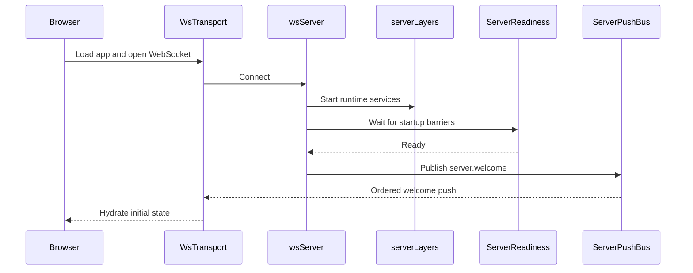
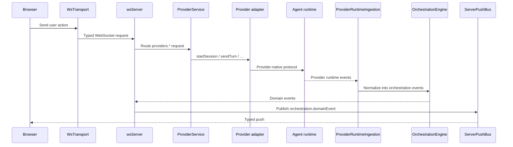
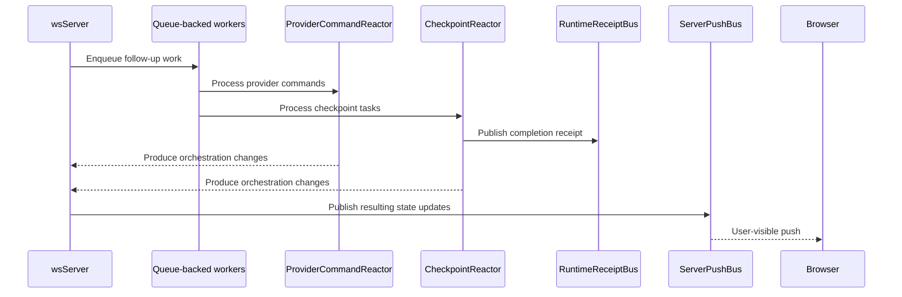

# Architecture

Kata Code is a **Node.js WebSocket server** (`apps/server`) that serves the React web app, orchestrates chat/git/terminal state, and routes agent work to **pluggable provider drivers** (Codex, Claude, Cursor, Grok, OpenCode, Pi). Clients use one typed API; each driver wraps its own agent runtime.

For driver details, see [provider architecture](/architecture/providers.md). For hosted clients vs where the server runs, see the [hosted web diagram](/diagrams/hosted-remote-stack.html).

```
┌─────────────────────────────────┐
│  Client (apps/web)              │
│  wsTransport · wsNativeApi      │
└──────────┬──────────────────────┘
           │ WebSocket (NativeApi)
┌──────────▼──────────────────────┐
│  apps/server                    │
│  WebSocket + HTTP               │
│  ServerPushBus · ServerReadiness│
│  OrchestrationEngine            │
│  ProviderService                │
│  CheckpointReactor              │
│  RuntimeReceiptBus              │
└──────────┬──────────────────────┘
           │ per provider instance
     ┌─────┴─────┬─────────┬──────────┐
     ▼           ▼         ▼          ▼
 codex      claudeAgent  cursor/   opencode
 app-server    SDK       grok ACP   server
```

## Components

- **Client app** (`apps/web`, plus desktop/mobile shells): Renders session state, owns the WebSocket transport, and treats typed push events as the boundary between server runtime details and UI state.

- **Server** (`apps/server`): Main coordinator. Serves the web app when embedded, accepts WebSocket requests, waits for startup readiness before welcoming clients, and sends all outbound pushes through a single ordered push path.

- **Provider layer**: `ProviderService` routes `providers.*` calls to a **provider instance adapter** selected by thread/settings. Built-in drivers include Codex (`codex app-server` over stdio), Claude Agent SDK, Cursor/Grok (ACP subprocesses), and OpenCode. Adapters emit canonical `ProviderRuntimeEvent` streams consumed by orchestration. See [provider architecture](/architecture/providers.md).

- **Background workers**: Long-running async flows such as runtime ingestion, command reaction, and checkpoint processing run as queue-backed workers. This keeps work ordered, reduces timing races, and gives tests a deterministic way to wait for the system to go idle.

- **Runtime signals**: The server emits lightweight typed receipts when important async milestones finish, such as checkpoint capture, diff finalization, or a turn becoming fully quiescent. Tests and orchestration code wait on these signals instead of polling internal state.

## Event Lifecycle

### Startup and client connect



1. The browser boots [`WsTransport`][1] and registers typed listeners in [`wsNativeApi`][2].
2. The server accepts the connection in [`wsServer`][3] and brings up the runtime graph defined in [`serverLayers`][7].
3. [`ServerReadiness`][4] waits until the key startup barriers are complete.
4. Once the server is ready, [`wsServer`][3] sends `server.welcome` from the contracts in [`ws.ts`][6] through [`ServerPushBus`][5].
5. The browser receives that ordered push through [`WsTransport`][1], and [`wsNativeApi`][2] uses it to seed local client state.

### User turn flow



1. A user action in the browser becomes a typed request through [`WsTransport`][1] and the browser API layer in [`nativeApi`][12].
2. [`wsServer`][3] decodes that request using the shared WebSocket contracts in [`ws.ts`][6] and routes it to the right service.
3. [`ProviderService`][8] resolves the thread's **provider instance** and delegates to that instance's adapter (Codex app-server, Claude SDK, ACP CLI, OpenCode, …).
4. Provider-native events are pulled back into the server by [`ProviderRuntimeIngestion`][9], which converts them into orchestration events.
5. [`OrchestrationEngine`][10] persists those events, updates the read model, and exposes them as domain events.
6. [`wsServer`][3] pushes those updates to the browser through [`ServerPushBus`][5] on channels defined in [`orchestration.ts`][11].

### Async completion flow



1. Some work continues after the initial request returns, especially in [`ProviderRuntimeIngestion`][9], [`ProviderCommandReactor`][13], and [`CheckpointReactor`][14].
2. These flows run as queue-backed workers using [`DrainableWorker`][16], which helps keep side effects ordered and test synchronization deterministic.
3. When a milestone completes, the server emits a typed receipt on [`RuntimeReceiptBus`][15], such as checkpoint completion or turn quiescence.
4. Tests and orchestration code wait on those receipts instead of polling git state, projections, or timers.
5. Any user-visible state changes produced by that async work still go back through [`wsServer`][3] and [`ServerPushBus`][5].

## Related

- [Provider architecture](/architecture/providers.md) — drivers, instances, adapters, built-in runtimes
- [Remote architecture](/architecture/remote.md) — where `katacode serve` runs vs client shells
- [Hosted web diagram](/diagrams/hosted-remote-stack.html)

[1]: ../apps/web/src/wsTransport.ts
[2]: ../apps/web/src/wsNativeApi.ts
[3]: ../apps/server/src/wsServer.ts
[4]: ../apps/server/src/wsServer/readiness.ts
[5]: ../apps/server/src/wsServer/pushBus.ts
[6]: ../packages/contracts/src/ws.ts
[7]: ../apps/server/src/serverLayers.ts
[8]: ../apps/server/src/provider/Layers/ProviderService.ts
[9]: ../apps/server/src/orchestration/Layers/ProviderRuntimeIngestion.ts
[10]: ../apps/server/src/orchestration/Layers/OrchestrationEngine.ts
[11]: ../packages/contracts/src/orchestration.ts
[12]: ../apps/web/src/nativeApi.ts
[13]: ../apps/server/src/orchestration/Layers/ProviderCommandReactor.ts
[14]: ../apps/server/src/orchestration/Layers/CheckpointReactor.ts
[15]: ../apps/server/src/orchestration/Layers/RuntimeReceiptBus.ts
[16]: ../packages/shared/src/DrainableWorker.ts
