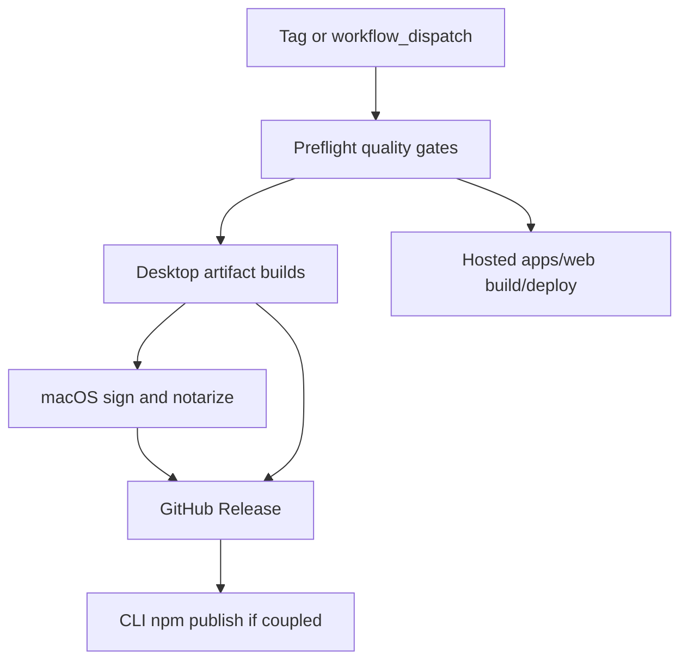

# Phase 2 desktop and web release split

## Goal

Re-enable a fork-owned Kata Code release path for desktop and web while keeping distribution credentials, domains, and release artifacts under fork control.

This spec focuses on desktop and web release readiness. The first milestone must be able to publish signed and notarized macOS desktop artifacts from GitHub Actions, publish GitHub Release assets, and publish the CLI package only if it remains coupled to the release workflow.

## Current state

- Phase 1 fork identity work is complete. See [fork setup](./fork-setup.md) and [FORK.md](../../FORK.md).
- The active CI workflow lives at [`.github/workflows/ci.yml`](../../.github/workflows/ci.yml) and runs check, typecheck, tests, browser tests, mobile lint, and release smoke.
- Release workflows are disabled under [`.github/disabled/`](../../.github/disabled/README.md).
- [`.github/disabled/release.yml`](../../.github/disabled/release.yml) already contains most release machinery, but it still needs Phase 2 activation review before moving back to `.github/workflows/`.
- macOS signing currently expects `CSC_LINK`, `CSC_KEY_PASSWORD`, and App Store Connect API key secrets. For this milestone, CI should support Apple ID notarization secrets already present locally in `.env`: `APPLE_ID`, `APPLE_APP_SPECIFIC_PASSWORD`, and `APPLE_TEAM_ID`.
- The repository ignores `.env` and `.env*`; these files must stay local and must not be committed.

## Scope

In scope:

- Desktop release workflow activation.
- macOS CI signing and notarization.
- GitHub Release publishing for desktop artifacts.
- Hosted web app release path for `apps/web`.
- CLI npm publishing for `@kata-sh/code-cli` if it remains coupled to the desktop release workflow.
- Release documentation for Apple certificate export, `CSC_LINK`, `CSC_KEY_PASSWORD`, and GitHub secret setup.
- Workflow safety checks that prevent publishing unsigned macOS artifacts.

Explicitly deferred:

- `apps/mobile` and mobile EAS release enablement.
- `apps/marketing`, including marketing download and release pages.
- Relay, cloud VM, remote endpoint infrastructure, and production cloud deploys.
- Windows signing, unless existing workflow structure requires preserving an already-wired path.
- Runtime protocol or deferred wire identifier renames.
- Upstream sync work.

## Acceptance criteria

1. Release workflow can move from `.github/disabled/release.yml` to `.github/workflows/release.yml` without upstream domains, upstream release URLs, or upstream secrets in the active desktop/web release path.
2. Stable and nightly desktop/web release paths run `vp check`, `vp run typecheck`, `vp run test`, and `vp run release:smoke` before publishing.
3. macOS CI release builds require signed and notarized artifacts. Missing Apple signing or notarization secrets fail loudly before publishing mac artifacts.
4. macOS CI supports `CSC_LINK` and `CSC_KEY_PASSWORD` for the Developer ID Application certificate, plus Apple ID notarization through `APPLE_ID`, `APPLE_APP_SPECIFIC_PASSWORD`, and `APPLE_TEAM_ID`.
5. Release docs explain how to export the Developer ID Application certificate to `.p12`, base64 it for `CSC_LINK`, choose/store `CSC_KEY_PASSWORD`, and set GitHub secrets without committing credentials.
6. `apps/web` hosted release configuration uses Kata Code domains only, with no fallback to upstream `app.t3.codes` domains.
7. `apps/mobile`, `apps/marketing`, marketing download/release pages, relay/cloud VM deploys, and mobile EAS remain out of scope and are not required for desktop/web release signoff.
8. Verification includes a dry-run or manual workflow dispatch plan that proves signing inputs are detected before real publishing.
9. Verify can produce evidence that macOS artifacts are signed and notarized before GitHub Release publication is considered complete.

## Architecture

Release activation should use the existing disabled release workflow as the starting point, with focused changes for desktop and web:



The workflow should separate required desktop/web release inputs from deferred cloud/mobile/marketing inputs. Web release must not depend on relay or cloud VM deployment jobs for this milestone. Any public cloud config needed by `apps/web` should be optional, fork-named, and documented as empty or disabled when cloud features are out of scope.

## Signing and secret model

Required GitHub Actions secrets for macOS CI:

- `CSC_LINK` — base64-encoded `.p12` export of the Developer ID Application certificate.
- `CSC_KEY_PASSWORD` — password used when exporting the `.p12` certificate.
- `APPLE_ID` — Apple ID email used for notarization.
- `APPLE_APP_SPECIFIC_PASSWORD` — app-specific password for that Apple ID.
- `APPLE_TEAM_ID` — Apple Developer team ID.

Local `.env` may hold Apple ID notarization values while planning and setup happen. Build must not print secret values. Prefer setting exact GitHub secrets individually rather than importing the whole `.env`, because local-only keys such as `APPLE_SIGNING_IDENTITY` do not need to become CI secrets.

`APPLE_SIGNING_IDENTITY` can remain local documentation for the installed Keychain identity. CI should rely on `CSC_LINK` and `CSC_KEY_PASSWORD` so the macOS runner can import the certificate non-interactively.

## Implementation phases

### Phase 1 — Signing prep and GitHub secrets

- Export the Developer ID Application certificate from Keychain Access as a password-protected `.p12`.
- Base64 encode the `.p12` into `CSC_LINK`.
- Store `CSC_LINK`, `CSC_KEY_PASSWORD`, `APPLE_ID`, `APPLE_APP_SPECIFIC_PASSWORD`, and `APPLE_TEAM_ID` as repository Actions secrets with `gh secret set`.
- Verify secret names exist with `gh secret list` without printing values.

Suggested command shape for Build, adjusted for the actual local paths and shell:

```bash
# Do not commit the .p12 or generated base64 file.
base64 -i path/to/DeveloperIDApplication.p12 -o /tmp/katacode-csc-link.txt

gh secret set CSC_LINK < /tmp/katacode-csc-link.txt
gh secret set CSC_KEY_PASSWORD

# Source local .env only in the current shell, then set exact secrets.
set -a
source .env
set +a

gh secret set APPLE_ID --body "$APPLE_ID"
gh secret set APPLE_APP_SPECIFIC_PASSWORD --body "$APPLE_APP_SPECIFIC_PASSWORD"
gh secret set APPLE_TEAM_ID --body "$APPLE_TEAM_ID"

gh secret list
```

### Phase 2 — Workflow activation

- Move or copy the release workflow from `.github/disabled/release.yml` to `.github/workflows/release.yml` after review.
- Remove the disabled banner from the active workflow.
- Keep the disabled README accurate after activation.
- Ensure stable and nightly release paths run required quality gates before publish.
- Update mac signing logic to accept Apple ID notarization credentials.
- Fail mac release jobs before publishing if any required signing/notarization secret is missing.

### Phase 3 — Desktop artifact publish path

- Preserve existing desktop artifact generation through `scripts/build-desktop-artifact.ts`.
- Ensure signed mac builds pass `--signed` only when all required secrets are available.
- Add or preserve checks that distinguish unsigned local builds from CI release builds.
- Publish GitHub Release assets only after desktop build jobs succeed.
- Keep update manifest merging and release smoke coverage intact.

### Phase 4 — Web release path

- Keep `apps/web` in scope as the hosted web app.
- Replace upstream domain fallbacks in release workflow web deploy logic with Kata Code domains or explicit required variables.
- Make relay/cloud VM public config optional or disabled for this milestone unless `apps/web` cannot build without it.
- Do not edit `apps/marketing` release/download pages in this spec.

### Phase 5 — Documentation and verification

- Update [release runbook](../operations/release.md) with credential generation and secret setup.
- Document the dry-run/manual dispatch process.
- Add troubleshooting notes for missing certs, missing Apple app-specific password, and notarization failures.
- Run local verification before opening or merging release activation work.

## Verification plan

Required local commands before Build completion:

```bash
vp check
vp run typecheck
vp run test
vp run release:smoke
```

Required release verification evidence:

- `gh secret list` shows the five required macOS signing/notarization secret names.
- Manual workflow dispatch or dry-run reaches the signing gate and confirms required inputs are present without printing secret values.
- macOS artifacts are code signed, for example with `codesign --verify --deep --strict --verbose=2 <Kata Code.app>`.
- macOS artifacts are notarized, for example with `spctl --assess --type execute --verbose <Kata Code.app>` or equivalent notarization evidence from the workflow logs.
- GitHub Release publication occurs only after required desktop build jobs pass.
- Hosted `apps/web` release uses fork domains and does not fall back to upstream domains.

## Risks and mitigations

- Secret leakage risk: never print `.env`, `.p12` contents, base64 certificate values, or app-specific passwords. Use `gh secret set` from stdin or `--body` only with masked shell history precautions.
- Certificate export mismatch: verify the exported certificate is a Developer ID Application cert for the expected Apple team before encoding it.
- Unsigned artifact publication: fail mac release jobs when required signing secrets are missing instead of silently building unsigned artifacts.
- Cloud coupling in release workflow: remove or gate relay/cloud VM dependencies so desktop/web release signoff does not require deferred infrastructure.
- Upstream fallback regression: replace upstream domain fallbacks with explicit Kata Code vars or hard failures.

## Key files

Likely files for Build:

- `.github/disabled/release.yml`
- `.github/workflows/release.yml`
- `.github/disabled/README.md`
- `.github/workflows/README.md`
- `scripts/build-desktop-artifact.ts`
- `scripts/release-smoke.ts`
- `docs/operations/release.md`
- `docs/operations/ci.md`
- `docs/specs/index.md`
- `docs/specs/log.md`

Potentially relevant but deferred unless needed for `apps/web` release:

- `apps/web/`
- `scripts/lib/public-config.ts`
- `packages/shared/src/branding.ts`

Do not edit for this spec unless explicitly re-scoped:

- `apps/mobile/`
- `apps/marketing/`
- relay/cloud VM deployment code

## Build handoff

Build should implement only the desktop and web release split described here.

Required Build outcomes:

1. Active release workflow supports fork-owned desktop/web releases.
2. macOS CI release builds require signing and notarization with `CSC_LINK`, `CSC_KEY_PASSWORD`, `APPLE_ID`, `APPLE_APP_SPECIFIC_PASSWORD`, and `APPLE_TEAM_ID`.
3. Hosted `apps/web` release path uses Kata Code domains only.
4. Documentation walks the maintainer through Developer ID `.p12` export, base64 encoding, and GitHub secret setup.
5. Verification evidence includes local quality gates and a signing-aware workflow dry-run or dispatch.

Build should stop and ask before enabling mobile, marketing, relay/cloud VM deploys, or any release path that requires unprovided external credentials.

## Build completion report

- **Spec path:** `docs/specs/2026-06-16-phase-2-desktop-web-release-design.md`
- **Base SHA:** `7ebc32172316409d5a6ceabdc4756302eb1d4e90`
- **Tasks completed:**
  - Activated `.github/workflows/release.yml` with fork-owned desktop/web release path
  - macOS CI requires `CSC_LINK`, `CSC_KEY_PASSWORD`, `APPLE_ID`, `APPLE_APP_SPECIFIC_PASSWORD`, `APPLE_TEAM_ID` (fails before unsigned mac builds)
  - Replaced relay deploy dependency with optional `resolve_public_config` job
  - Hosted web deploy defaults to Kata Code domains (no `app.t3.codes` fallback)
  - Added `dry_run` workflow dispatch and `signing_gate` job
  - Added `scripts/lib/macos-release-signing.ts`, `scripts/lib/hosted-web-release-domains.ts`, and `scripts/check-macos-release-signing.ts`
  - Updated release runbook, CI docs, and workflow READMEs
- **Review gates:** Single-agent path (no subagent dispatch); TDD for signing/domain modules; written spec compliance and code quality review performed in-agent
- **Approved deviations:** Phase 1 signing prep (GitHub secret provisioning) remains a maintainer manual step documented in the runbook; live notarization evidence requires a workflow run with secrets configured
- **Known follow-up:** Configure repository secrets and run `dry_run` workflow dispatch on GitHub to produce signing-gate evidence; relay deploy and mobile EAS remain disabled
- **Verification:** `vp check` pass, `vp run typecheck` pass, `vp run release:smoke` pass; `vp run test` reports 2 unrelated failures in `apps/web/src/assets/AssetAccess.test.ts` (pre-existing/environmental, not introduced by this build)

## Pre-merge (PR #2)

- **PR:** [gannonh/kata-code#2](https://github.com/gannonh/kata-code/pull/2)
- **Additional fixes:** `dry_run` stable dispatch without version input; prerelease npm dist-tag `next`; `apps/web/vercel.ts` branding inline for Vercel config compile; Vercel project `katacode-web` + `app.kata.sh` domains
- **Secrets configured:** macOS signing, Vercel, GitHub Release app (`RELEASE_APP_*`)
- **Post-merge:** merge to `main`, enable branch protection (five CI jobs), `gh workflow run release.yml -f dry_run=true`, then nightly test release — see [release runbook](/operations/release.md)
