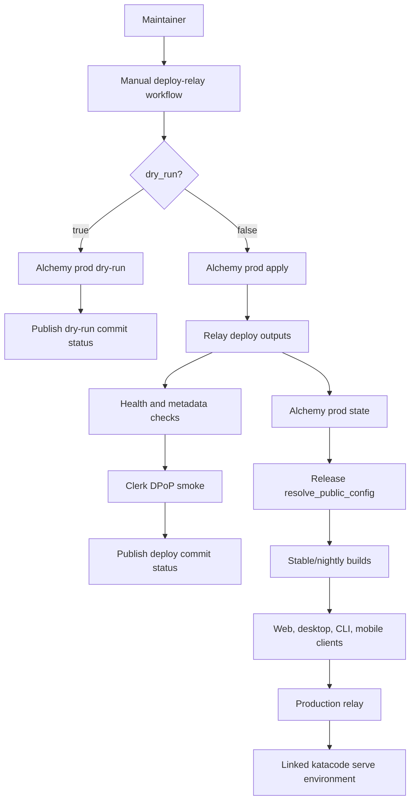

# Relay Deploy

## Grounding context

Relay is the hosted control plane for Kata Code Connect. It lets a signed-in user link a running `katacode serve` environment to their Kata account, discover that environment from another client, and connect through an approved endpoint. It also supports mobile push notifications and Live Activities for agent activity.

Relay is not in the hot path for normal agent traffic. After a client connects, HTTP and WebSocket traffic flows directly between the client and the selected environment endpoint. The relay manages discovery, credentials, endpoint metadata, managed tunnel provisioning, mobile registration, and activity delivery.

From a user-facing perspective, Relay enables this path:

1. A user signs into Kata Code Connect.
2. The user links an environment running `katacode serve`.
3. The relay stores that link under the user's cloud identity.
4. Web, desktop, or mobile clients can list that user's linked environments.
5. A client asks relay for connection metadata and a short-lived credential.
6. The client connects to the environment through the returned endpoint.
7. If enabled, the environment publishes agent activity to relay for push notifications or Live Activity updates.

The environment remains the execution boundary. It owns projects, threads, terminals, providers, files, git state, and agent execution. Relay gives users a hosted account-backed way to find and reach those environments.

Key components:

- `infra/relay` contains the deployable relay Worker and Alchemy stack.
- `infra/relay/alchemy.run.ts` defines the stack outputs used by deploy and release flows.
- `infra/relay/scripts/deploy.ts` wraps Alchemy deploy, dry-run, GitHub outputs, GitHub env-file output, and state reads.
- `packages/contracts/src/relay.ts` defines the typed relay HTTP API.
- `packages/client-runtime/src/managedRelay.ts` contains shared client relay calls.
- `apps/server/src/relay/AgentAwarenessRelay.ts` publishes sanitized agent activity from an environment to relay.
- `apps/server/src/cloud/*` handles Connect config, environment linking, managed endpoint runtime, and relay tracing.
- `.github/disabled/deploy-relay.yml` is the disabled production deploy workflow that this spec will re-enable after fork-owned infra is ready.

The deploy stack provisions Cloudflare Worker resources, Cloudflare queues, DNS/custom domains, managed endpoint tunnel/DNS bindings, PlanetScale Postgres, Cloudflare Hyperdrive, Axiom trace datasets and scoped ingest tokens, Clerk auth validation, and APNs delivery infrastructure.

## Goal

Enable a fork-owned, manual production relay deployment path for Kata Code Connect, then make stable/nightly production releases fail loudly when required Connect public config is missing.

The outcome should let a maintainer deploy the production relay, verify its public API and Clerk token exchange, and produce user-path UAT evidence that a released or production-configured build can use Kata Code Connect to link and connect to a real environment.

## Current state

- Relay code exists under `infra/relay` and deploys through Alchemy.
- The relay deploy workflow is disabled at `.github/disabled/deploy-relay.yml`.
- The disabled workflow is already fork-branded and uses `@kata-sh/code-relay`.
- Current disabled workflow trigger is `workflow_dispatch`.
- Upstream deploys relay automatically on every push to `main`; Kata Code should start manual-only.
- `release.yml` currently derives only `relay_url` from GitHub variables and does not read full relay public/tracing config from Alchemy state.
- Stable/nightly release builds can still proceed with missing Connect public config.
- `docs/specs/deferred-work.md` now tracks deferred work that should survive beyond individual specs.

## Constraints

- Do not reuse upstream cloud secrets or upstream deploy targets.
- Production deploy is manual-only for this milestone.
- GitHub Actions deploy scope is production-only. Developer relay stages remain local CLI-only.
- Missing required production config must fail loudly.
- Production stable/nightly releases must fail if required Connect config is missing after this milestone lands.
- No workflow bypass input should allow production releases without Connect config.
- APNs remains required. This spec does not make notification delivery optional.
- The full environment link/connect user path is required as manual UAT evidence, not as an automated deploy workflow gate.

## Out of scope

- Mobile EAS workflow enablement.
- Marketing site deployment or Connect marketing pages.
- CI-managed developer relay stages.
- APNs optionalization.
- Fully automated CI smoke for real environment link/connect.
- General changes to relay contracts or Connect product behavior outside what deploy and release verification require.

## Acceptance criteria

### User-path UAT criteria

1. A released or production-configured stable/nightly build with production Connect config exposes Kata Code Connect UI instead of hiding it due to missing config.
2. A signed-out approved test user can start the Kata Code Connect sign-in path from the app without a missing-config error; a signed-out unapproved test user can start the Clerk waitlist path when the production Clerk app is configured for waitlist access.
3. A signed-in Clerk-approved beta test user can open Connections and see relay-backed Connect state, either an empty linked-environments state or existing linked environments.
4. A CLI user can run `katacode connect --help` from a released or production-configured build; the command group is present and does not fail with “missing Kata Code Connect public configuration.”
5. A maintainer can run `katacode connect login` from a production-configured build and complete Clerk authorization through the loopback callback path.
6. A maintainer can run `katacode connect link` for a test `katacode serve` environment and create a relay-backed environment link.
7. The signed-in app shows the linked test environment under Connections with the expected environment label or identifier.
8. The app can connect to that linked environment through the relay-managed endpoint and reaches a usable environment state, such as loading environment metadata, projects, or an authenticated connected status from the environment server.
9. `katacode connect unlink` removes the relay link and the app no longer lists that environment as linked after refresh or reconnect.
10. UAT evidence includes terminal output, screenshots, workflow URLs, and cleanup confirmation for the Connect UI, CLI, link/connect, connected-state, and unlink paths.

### System and configuration gates

1. `.github/disabled/deploy-relay.yml` is moved to `.github/workflows/deploy-relay.yml` with a manual `workflow_dispatch` trigger and a `dry_run` input.
2. Relay Deploy CI scope is production-only: the workflow deploys only Alchemy stage `prod` and does not expose a stage input for developer deployments.
3. `dry_run=true` runs a non-mutating relay deployment plan and publishes a successful commit status without applying infrastructure changes.
4. `dry_run=false` applies the production relay deployment and publishes a successful commit status only after post-deploy checks pass.
5. Post-deploy checks verify `GET /health`, `GET /.well-known/oauth-authorization-server`, and `GET /.well-known/oauth-protected-resource` against the deployed relay URL.
6. Post-deploy Clerk smoke uses a documented CI token-minting mechanism that mints a fresh token during the workflow from production GitHub environment secrets, records the exact secret names in the relay setup runbook, and verifies DPoP token exchange through `/v1/client/dpop-token`; Build must stop and ask if safe CI minting is not possible without storing a long-lived bearer token.
7. APNs configuration is required for production relay deploy; missing APNs vars or secrets fail the deploy.
8. Stable and nightly release preflight reads production relay URL and client tracing config from Alchemy state, not manually copied GitHub vars; Clerk public config remains sourced from the GitHub `production` environment.
9. Stable and nightly releases fail before build, publish, or deploy if relay URL, Clerk public config, or relay client tracing config is missing.
10. Release workflow has no bypass input for missing relay or Connect config.
11. `.github/workflows/README.md`, `.github/disabled/README.md`, `infra/relay/README.md`, and release/setup runbooks document Relay Deploy as an active manual production workflow with dry-run-before-apply operator guidance.
12. The OKF specs roadmap links this Relay Deploy spec under Active / next and does not mark Relay Deploy complete until implementation finishes.
13. Verification includes `vp check`, `vp run typecheck`, targeted tests for changed helper scripts, and a documented manual UAT evidence bundle for the Connect UI, CLI login, link, connect, and unlink path.

## Architecture



The deploy workflow stays focused on production infrastructure deployment and low-cost public checks. It does not create a real environment link in CI.

Release preflight becomes the fail-loud bridge between deployed relay infrastructure and shipped clients. The release workflow should read Alchemy `prod` state to obtain relay URL and client tracing outputs, then combine those values with Clerk public config from the GitHub `production` environment. Missing required values stop the release before build or publish work begins.

Manual UAT validates the full user path after deployment and before signoff. It uses a real production-configured build, Clerk auth, a running `katacode serve` environment, link, connect, and unlink cleanup.

## Workflow design

### Deploy workflow

Move the disabled workflow with `git mv`:

```text
.github/disabled/deploy-relay.yml -> .github/workflows/deploy-relay.yml
```

Keep `workflow_dispatch` and add a boolean `dry_run` input. Do not add a `stage` input.

Dry-run mode:

1. Checkout.
2. Setup Vite+.
3. Validate required production environment variables and secrets are present.
4. Run `vp run --filter @kata-sh/code-relay deploy --stage prod --dry-run`.
5. Publish commit status for `Relay deploy / production` with a dry-run success description.

Apply mode:

1. Checkout.
2. Setup Vite+.
3. Validate required production environment variables and secrets are present.
4. Run `vp run --filter @kata-sh/code-relay deploy --stage prod --yes --github-output`.
5. Resolve the deployed relay URL from deploy output.
6. Verify `/health`.
7. Verify OAuth authorization-server metadata.
8. Verify OAuth protected-resource metadata.
9. Mint a fresh Clerk CI smoke token using dedicated production environment secrets.
10. Build a DPoP proof and exchange the Clerk token at `/v1/client/dpop-token`.
11. Publish commit status for `Relay deploy / production` after all checks pass.

The exact Clerk token minting method is a Build-time dependency decision that must be resolved before the workflow can satisfy acceptance. It must use a fresh token minted during the workflow, and the implementation must document the required GitHub production secret names. If Clerk cannot support a safe CI minting pattern for this app, Build must stop and ask rather than storing a long-lived bearer token.

### Release workflow

Update `release.yml` `resolve_public_config` so production releases read relay config from Alchemy state:

1. Checkout and setup Vite+ or a minimal package filter needed by `@kata-sh/code-relay`.
2. Run relay deploy wrapper in state-read mode for `prod`.
3. Export relay URL and relay client tracing values through job outputs.
4. Read Clerk public config from the GitHub `production` environment.
5. Fail when any required Connect value is missing.

Required release values:

- `KATACODE_RELAY_URL`
- `KATACODE_RELAY_CLIENT_OTLP_TRACES_URL`
- `KATACODE_RELAY_CLIENT_OTLP_TRACES_DATASET`
- `KATACODE_RELAY_CLIENT_OTLP_TRACES_TOKEN`
- `KATACODE_CLERK_PUBLISHABLE_KEY`
- `KATACODE_CLERK_JWT_TEMPLATE`
- `KATACODE_CLERK_CLI_OAUTH_CLIENT_ID`

The implementation must mask tracing tokens in logs. It should not echo secret values. `CLERK_JWT_AUDIENCE` is a relay deploy/runtime value, while release builds need the client-facing Clerk values listed above.

## GitHub environment and secrets

Required repository or production environment variables are expected to include the existing relay deploy set:

- `CLOUDFLARE_ACCOUNT_ID`
- `PLANETSCALE_ORGANIZATION`
- `AXIOM_ORG_ID`
- `RELAY_API_ZONE_NAME`
- `RELAY_TUNNEL_ZONE_NAME`
- `RELAY_DOMAIN` if overriding the derived production domain
- `CLERK_PUBLISHABLE_KEY`
- `CLERK_JWT_AUDIENCE`
- `CLERK_JWT_TEMPLATE`
- `CLERK_CLI_OAUTH_CLIENT_ID`
- `APNS_ENVIRONMENT`
- `APNS_TEAM_ID`
- `APNS_KEY_ID`
- `APNS_BUNDLE_ID`

Required secrets are expected to include:

- `CLOUDFLARE_API_TOKEN`
- `PLANETSCALE_API_TOKEN_ID`
- `PLANETSCALE_API_TOKEN`
- `AXIOM_TOKEN`
- `CLERK_SECRET_KEY`
- `APNS_PRIVATE_KEY`
- Clerk smoke-token minting secrets. Build must identify the Clerk-supported CI minting pattern, choose exact secret names, and document those names in the relay setup runbook before the Clerk DPoP smoke acceptance gate can pass.

Keep private credential setup details outside the repo. Repo docs should list names, purpose, and validation behavior, not secret values.

## Implementation phases

### Phase 1 - deploy workflow activation

- Move `.github/disabled/deploy-relay.yml` to `.github/workflows/deploy-relay.yml`.
- Add `dry_run` input.
- Keep production-only stage behavior.
- Add explicit config validation.
- Add dry-run and apply branches.
- Add commit status publication for both modes.

Likely files:

- `.github/workflows/deploy-relay.yml`
- `.github/disabled/README.md`
- `.github/workflows/README.md`

### Phase 2 - relay smoke scripts

- Add or update scripts for public endpoint checks.
- Add Clerk DPoP smoke support.
- Ensure logs mask tokens.
- Add tests for script behavior where practical.

Likely files:

- `infra/relay/scripts/*`
- `infra/relay/scripts/*.test.ts`
- `packages/shared/src/relayAuth.ts`
- `packages/shared/src/relaySigning.ts`

### Phase 3 - release config state read

- Update `release.yml` `resolve_public_config` to read Alchemy `prod` state.
- Export relay URL and client tracing outputs.
- Make Connect config required for stable/nightly releases.
- Remove GitHub-var relay URL derivation as the source of truth for releases.

Likely files:

- `.github/workflows/release.yml`
- `infra/relay/scripts/deploy.ts`
- release-related tests if helper logic changes

### Phase 4 - docs and UAT guide

- Update relay README deploy wording for Kata's manual production flow.
- Fix stale relay docs paths.
- Update release and CI/runbook guidance.
- Update OKF roadmap and deferred-work registry.
- Document manual UAT steps and evidence expectations.

Likely files:

- `infra/relay/README.md`
- `docs/operations/release.md`
- `docs/operations/release-setup.md`
- `docs/operations/ci.md`
- `docs/specs/index.md`
- `docs/specs/deferred-work.md`
- `docs/specs/log.md`
- `docs/log.md`

### Phase 5 - verification and signoff evidence

- Run local gates.
- Run deploy workflow dry-run.
- Run deploy workflow apply.
- Run release dry-run/preflight showing Alchemy state config resolution.
- Run manual UAT with real environment link/connect/unlink.
- Capture screenshots, terminal output, workflow URLs, and cleanup notes.

## Verification plan

Local verification:

```sh
vp check
vp run typecheck
```

Targeted checks should include any tests added for:

- relay deploy wrapper output parsing
- GitHub output/env serialization
- health/metadata smoke helper
- Clerk DPoP smoke helper
- release public-config resolution helper

GitHub verification:

1. Dispatch `deploy-relay.yml` with `dry_run=true`.
2. Confirm no infrastructure mutation occurs.
3. Confirm dry-run commit status is published.
4. Dispatch `deploy-relay.yml` with `dry_run=false`.
5. Confirm deploy succeeds.
6. Confirm health, metadata, and DPoP smoke steps pass.
7. Confirm apply commit status is published.
8. Dispatch `release.yml` dry-run and confirm Connect config is resolved from Alchemy state before build/publish jobs.

Manual UAT:

1. Use a production-configured stable/nightly build or released artifact.
2. Confirm Connect UI is visible and no missing-config message appears.
3. Confirm a signed-out approved test user can start sign-in; if waitlist is enabled, confirm a signed-out unapproved test user can start the waitlist path.
4. Sign in as a Clerk-approved beta test user and open Connections.
5. Start a test environment with `katacode serve` and record the environment label or identifier used for verification.
6. Run `katacode connect --help` and confirm the command group is available.
7. Run `katacode connect login` and complete Clerk authorization through the loopback callback.
8. Run `katacode connect link` and confirm the relay link is created.
9. Confirm the signed-in app lists the linked environment with the expected label or identifier.
10. Connect to the linked environment through the relay-managed endpoint and record a usable connected state, such as loaded environment metadata, project data, or an authenticated connected status.
11. Run `katacode connect unlink` and confirm cleanup in CLI and app state after refresh or reconnect.

## Risks and mitigations

- **Unsafe Clerk smoke credential pattern:** Build must prove fresh CI token minting is possible. If not, stop and ask.
- **Secret leakage in logs:** Mask tracing and smoke tokens. Avoid printing raw token values.
- **Partial relay deployment:** Required config validation and post-deploy checks fail the workflow before success status publication.
- **Release builds detached from deployed relay state:** Read Alchemy state during release preflight and fail when unavailable.
- **Manual process drift:** Update runbooks and workflow indexes in the same change as workflow activation.
- **External dependency flakiness:** Keep automated deploy checks small and deterministic. Use manual UAT for the full user path.

## Explicitly deferred work

These items must be recorded or updated in [deferred work registry](/specs/deferred-work.md) during Build:

1. CI automation for full environment link/connect smoke.
   - Rationale: full link/connect requires a live environment process, Clerk identity, DNS/tunnel provisioning, signed-in client, and cleanup.
   - Revisit trigger: after first successful manual production Relay Deploy UAT.
2. CI-managed developer relay stages.
   - Rationale: initial GitHub Actions scope is production-only.
   - Revisit trigger: when multiple maintainers need shared non-production relay stages.
3. Mobile EAS release enablement.
   - Rationale: relay deploy should be verifiable independently from Expo release infrastructure.
   - Revisit trigger: after production Relay Deploy is complete or before mobile release planning.
4. Marketing Connect pages.
   - Rationale: Connect marketing surfaces are product launch work, not production relay deploy plumbing.
   - Revisit trigger: before public Connect launch or marketing site release work.
5. APNs optionalization.
   - Rationale: current stack expects APNs config and this milestone requires full existing relay stack deployment.
   - Revisit trigger: if product direction requires non-mobile relay deployments.

## Build handoff

Approved scope:

- Enable manual production Relay Deploy workflow with dry-run and apply modes.
- Add fail-loud production config validation.
- Add health, metadata, and Clerk DPoP deploy checks.
- Make stable/nightly release preflight read relay URL and client tracing config from Alchemy state.
- Make stable/nightly releases fail when required Connect config is missing.
- Update runbooks, workflow indexes, OKF roadmap, and deferred-work registry.
- Provide UAT steps and evidence requirements for real link/connect/unlink.

Non-goals:

- Do not enable mobile EAS.
- Do not add CI-managed dev stages.
- Do not automate full environment link/connect in GitHub Actions.
- Do not add a release bypass for missing Connect config.
- Do not make APNs optional.

Required verification:

- `vp check`
- `vp run typecheck`
- targeted relay/release tests for changed helpers
- OKF validation if docs are changed
- deploy workflow dry-run evidence
- deploy workflow apply evidence
- release dry-run/preflight evidence
- manual UAT evidence for Connect UI, CLI login, link, connect, unlink, and cleanup

Blocking questions for Build:

1. Which Clerk-supported CI credential pattern can mint a fresh smoke token for `/v1/client/dpop-token` without storing a long-lived bearer token?
2. Which minimal credentials are needed for release preflight to read Alchemy `prod` state without applying infrastructure changes?
