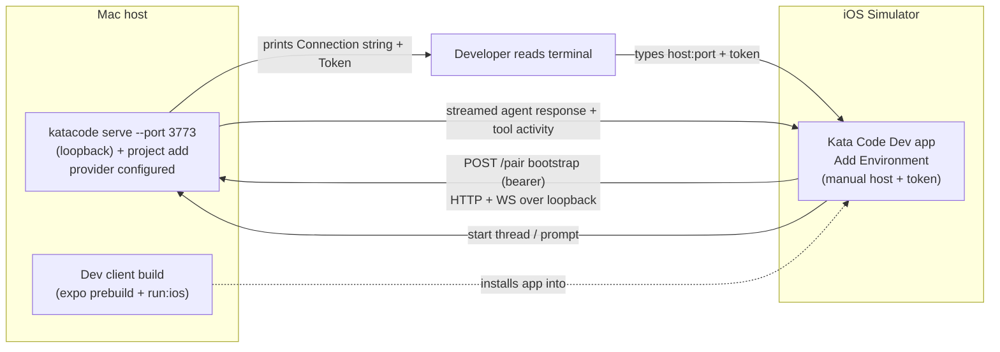

# Mobile local dev slice — iOS Simulator end-to-end

## Goal

Prove the first meaningful end-to-end mobile slice: a developer can build the Kata Code mobile app as a dev client on the iOS Simulator, pair it to a locally running `katacode` server over loopback, start a new thread from the phone, and see a real agent respond. Produce a repeatable dev runbook for the flow. This is a bring-up-and-verify slice over existing code, not new feature development. Distribution comes in a later phase.

## Source of truth

- Roadmap: [/specs/index.md](/specs/index.md) (mobile is a named future phase, not indefinitely deferred).
- Connection model: [/architecture/remote.md](/architecture/remote.md) — saved environments, advertised endpoints, pairing.
- Deferred distribution work: [/specs/deferred-work.md](/specs/deferred-work.md) (Mobile EAS preview and production release).
- This slice deliberately decouples from upstream sync; see [Sequencing](#sequencing).

## Verified current state

The entire local pairing loop already exists in source on both sides. This slice exercises and hardens it; it does not build it from scratch.

Server (`apps/server`, bin `katacode`):

- `katacode serve` runs the server headless and prints pairing details — `apps/server/src/cli/server.ts:26` (`serveCommand`, `startupPresentation: "headless"`).
- `apps/server/src/startupAccess.ts` — `resolveHeadlessConnectionString` (host+port → `http://host:PORT`), `buildPairingUrl` (adds `/pair#token=...`), `renderTerminalQrCode`, and `formatHeadlessServeOutput` (prints `Connection string`, `Token`, `Pairing URL`, QR).
- `apps/server/src/serverRuntimeStartup.ts:441` prints `formatHeadlessServeOutput(accessInfo)`.
- One-time pairing tokens: `apps/server/src/auth/PairingGrantStore.ts`; issuance via `apps/server/src/auth/EnvironmentAuth.ts` (`issueStartupPairingCredential`).
- Bind/host flags: `apps/server/src/cli/config.ts` (`--host`, `--port`, `--tailscale-serve`). Default port `3773` (`apps/server/src/config.ts:17`). For loopback bind the connection string resolves to `localhost`.

Mobile (`apps/mobile`, `@kata-sh/code-mobile`, dev variant scheme `katacode-dev`, bundle id `com.katacode.dev`):

- Add-Environment screen has **manual Host + Pairing-code text fields** (placeholder `192.168.1.100:8080`) plus an optional QR scanner toggle — `apps/mobile/src/app/connections/new.tsx`. The manual fields are the Simulator pairing path (no camera).
- Pairing URL parse/build: `apps/mobile/src/features/connection/pairing.ts`.
- Bearer bootstrap (no relay/Clerk): `apps/mobile/src/lib/connection.ts` (`bootstrapRemoteConnection` → `bootstrapRemoteBearerSession` + `fetchRemoteEnvironmentDescriptor` from `@kata-sh/code-client-runtime`; `resolveRemotePairingTarget` from `@kata-sh/code-shared/remote`).
- Connection state: `apps/mobile/src/state/use-remote-environment-registry` (`useRemoteConnections`).
- Cleartext to loopback allowed: `apps/mobile/app.config.ts` sets `NSAppTransportSecurity.NSAllowsArbitraryLoads: true`.
- Local native modules `apps/mobile/modules/t3-terminal` and `apps/mobile/modules/t3-review-diff`, plus `react-native-nitro-markdown` (`apps/mobile/deps/`) and `expo-widgets` (AgentActivity) — these compile during prebuild and are the main feasibility risk.
- Dev build commands: `apps/mobile/package.json` — `dev:client` (Metro for dev client), `ios:dev` (`expo prebuild --clean --platform ios && expo run:ios`). `/ios` and `/android` are gitignored; prebuild generates them.
- README marks the app "in development, not distributed yet" (`apps/mobile/README.md`).

Branding/source notes (not blockers for this slice): mobile source carries no `@t3tools/` / `T3CODE_` product-surface references; the `t3-terminal` / `t3-review-diff` directory names are internal native module ids left upstream-shaped (renaming is out of scope here).

## Constraints

- iOS Simulator only. No physical device, no Apple provisioning/signing.
- Local-only transport: loopback between Simulator and the host `katacode` server. For a deterministic runbook, start the server with `--port 3773` bound to loopback; otherwise `serve` runs in `web` mode and picks an available port via `findAvailablePort(DEFAULT_PORT)` (`apps/server/src/cli/config.ts`), so the printed port can drift on collision. Use the server's printed host:port, not a hard-coded value. No relay, no Clerk, no Kata Code Connect sign-in.
- Pairing via the manual Host + Pairing-code fields (Simulator has no camera).
- Branch off current `main`; do not depend on the abandoned upstream bulk-merge branch.
- Assume the dev server already has ≥1 working provider configured (the same setup used for desktop/web and the existing E2E suite). The spec does not pin or provision a provider.
- Fix-forward only what blocks the loop. Do not refactor adjacent code or rename native modules.

## Out of scope

- Physical iOS device, QR camera-scan pairing.
- EAS builds, Expo project ownership, App Store Connect identity (the stale `ascAppId` in `eas.json`), code signing, any distribution.
- Cloud Connect: relay, Clerk auth, hosted pairing, DPoP/relay-managed connections.
- Android (emulator or device).
- The two pending upstream mobile commits (typography unification `e29ad7604b`, Shiki bump `ae2b523503`) — optional future surgical cherry-picks.
- Renaming `apps/mobile/modules/t3-terminal` / `t3-review-diff`.
- CI integration for mobile E2E.

## Acceptance criteria

1. **Build:** Building the dev client to the iOS Simulator (`vp run ios:dev`, or the exact equivalent recorded in the runbook) compiles all native modules and launches the app to the home screen with no redbox. Evidence: a Simulator screenshot of the home screen and the successful build command output.
2. **Pairing:** With a local `katacode` server running (loopback, `--port 3773`) and ≥1 provider configured, entering the server's **printed** host:port (expected `localhost:3773`) and pairing token into Add Environment results in a saved environment whose connection status reaches "ready" (green `ConnectionStatusDot`). Evidence: Simulator screenshot of the connected environment row.
3. **Full loop:** Creating a new thread on the Simulator and sending a prompt renders the agent's streamed text response on the phone, and the same thread is observable server-side (server logs or the web/desktop client). Tool/activity updates render when the agent emits them; if the test prompt is chosen to force a tool call (recommended), at least one tool/activity update must render. Evidence: a screen recording of prompt → streamed response.
4. **Local-only proof:** Criteria 1–3 complete with Kata Code Connect signed-out / no Clerk session — the saved connection uses the bearer path (`authenticationMethod: "bearer"`, not `relayManaged`/`dpop`). Evidence: confirmation that no Connect sign-in occurred and the connection is bearer (e.g. inspected connection state or absence of relay credentials).
5. **Runbook:** A committed guide under `docs/guides/` (OKF frontmatter) documents the exact server command, the dev-client build command, and the manual pairing steps, including the loopback host/port and where to read the token. A second person (or a clean shell) following it reproduces criteria 1–3. Cross-linked from `docs/guides/index.md`.
6. **No regressions:** On the branch, `vp run --filter @kata-sh/code-mobile typecheck` and `vp run --filter @kata-sh/code-mobile test` pass. Any pre-existing failure that cannot be made to pass is recorded explicitly (failing assertion + cause + resolution path), not silently skipped.
7. **Server invocation resolved:** The runbook records a single documented startup procedure that yields **both** headless pairing output **and** a runnable project + provider. No single existing `katacode` command does both (see Risks: `serve` forces auto-bootstrap off; `start` auto-bootstraps but prints no pairing). The expected procedure is two steps — `katacode serve --port 3773` (pairing output) plus `katacode project add <path>` (`apps/server/src/cli/project.ts`) to register a runnable project — both captured in the runbook.

## Architecture

The slice wires three existing units over loopback. No new transport or protocol.

Boundaries:

- **Server (`katacode serve`)** owns pairing-token issuance, the HTTP `/pair` bootstrap, the WebSocket session, and the provider/agent run. Reached at `http://localhost:3773` from the Simulator.
- **Pairing input (`connections/new.tsx` + `pairing.ts`)** turns a host string + token into a pairing URL and hands it to `bootstrapRemoteConnection`.
- **Connection (`lib/connection.ts`)** performs the bearer bootstrap and persists a `SavedRemoteConnection` (bearer, not relay-managed).

## Implementation phases

### Phase 0 — Build feasibility gate (highest uncertainty)

Get the dev client to compile and launch on the iOS Simulator. Resolve native prebuild failures (the `t3-terminal` / `t3-review-diff` modules, nitro-markdown, expo-widgets, deployment target 18.0). Do not touch connection logic until the app launches clean. Likely commands: `vp run dev:client` (Metro) + `vp run ios:dev`. Ties to AC 1.

### Phase 1 — Local server + manual pairing

Document the two-step local startup: `katacode serve --port 3773` (loopback bind, prints pairing output) plus `katacode project add <path>` to register a runnable project (`serve` will not auto-create one). Read the printed `Connection string` and `Token`; enter the printed host:port + token in Add Environment; confirm the environment reaches "ready". Ties to AC 2, 7.

### Phase 2 — Full loop

Start a new thread on the Simulator, send a prompt, confirm the streamed agent response and tool activity render on the phone and the thread is visible server-side. Fix-forward any mobile-side rendering or session breakage that blocks the response. Ties to AC 3, 4.

### Phase 3 — Dev runbook + checks

Write the `docs/guides/` runbook (OKF frontmatter, cross-linked from the guides index). Run mobile `typecheck` and `test`; record results. Capture UAT evidence (screenshots + screen recording). Ties to AC 5, 6.

## Sequencing

- Branch off `main` now. The upstream bulk-merge effort (`upstream-sync-2026-06-20`) is abandoned in favor of surgical cherry-picking, so this slice does not wait on it. The two pending upstream mobile commits are optional later cherry-picks and are not preconditions.
- Phases are ordered by risk: Phase 0 front-loads the only deep unknown (native build). Phases 1–2 are sequential (pairing precedes the loop). Phase 3 closes out docs + evidence.
- Related follow-up (not in this slice): the roadmap's "Active: Upstream sync (first merge)" row and ADR 0003 are now stale given the strategy change; update them separately. See [Explicitly deferred work](#explicitly-deferred-work).

## Verification

- AC 1: build command output + Simulator home-screen screenshot.
- AC 2: connected-environment screenshot (green status dot).
- AC 3: screen recording of prompt → streamed response; server-side thread visible.
- AC 4: connection is bearer with Connect signed-out.
- AC 5: runbook committed and reproducible by a clean shell / second person.
- AC 6: `vp run --filter @kata-sh/code-mobile typecheck` and `... test` output.
- AC 7: runbook names one server command yielding pairing output + runnable project/provider.

## Risks and mitigations

- **Native prebuild fails on the fork (highest risk).** Custom native modules + widgets may not compile clean. Mitigation: Phase 0 is a hard gate; surface and fix before connection work. If a module blocks the build and is not needed for the thread loop, record the blocker and the minimal fix; do not silently disable functionality.
- **`serve` will not bootstrap a project (stronger than it looks).** `serveCommand` sets `forceAutoBootstrapProjectFromCwd: false` (`apps/server/src/cli/server.ts:33`), and that option has highest precedence in `resolveServerConfig` (`apps/server/src/cli/config.ts`) — so `--auto-bootstrap-project-from-cwd` and `KATACODE_AUTO_BOOTSTRAP_PROJECT_FROM_CWD` cannot re-enable it. `serve` therefore never auto-creates a project. Conversely `start` auto-bootstraps but prints no headless pairing output (output is gated on `startupPresentation === "headless"`). Mitigation: use the two-step `katacode serve --port 3773` + `katacode project add <path>` procedure (AC 7); do not waste a cycle on flag/env overrides.
- **Simulator cannot reach the server.** If the server binds to a non-loopback host or a firewall blocks it. Mitigation: bind loopback and use the printed host:port (expected `localhost:3773`); the Simulator shares the host network namespace.
- **Mobile source drift vs client-runtime.** The mobile app depends on `@kata-sh/code-client-runtime` / `@kata-sh/code-shared`; if those changed since mobile was last exercised, the bootstrap path may break. Mitigation: Phase 2 fix-forward; keep changes surgical.
- **Pre-existing mobile test/typecheck failures.** Mitigation: AC 6 records them explicitly with cause and resolution path rather than skipping.

## Key files

- Server: `apps/server/src/cli/server.ts`, `apps/server/src/startupAccess.ts`, `apps/server/src/serverRuntimeStartup.ts`, `apps/server/src/auth/PairingGrantStore.ts`, `apps/server/src/auth/EnvironmentAuth.ts`, `apps/server/src/cli/config.ts`, `apps/server/src/config.ts`.
- Mobile: `apps/mobile/src/app/connections/new.tsx`, `apps/mobile/src/features/connection/pairing.ts`, `apps/mobile/src/lib/connection.ts`, `apps/mobile/src/state/use-remote-environment-registry.*`, `apps/mobile/app.config.ts`, `apps/mobile/package.json`, `apps/mobile/modules/t3-terminal`, `apps/mobile/modules/t3-review-diff`.
- Dev: `scripts/dev-runner.ts`, root `package.json` (`dev:server`).
- New: `docs/guides/<mobile-local-dev>.md` (runbook), `docs/guides/index.md` (link).

## Explicitly deferred work

- Physical device + QR-scan pairing — next mobile slice.
- EAS / Expo project ownership / App Store Connect identity (stale `ascAppId`) / signing / distribution — `docs/specs/deferred-work.md` (Mobile EAS preview and production release).
- Cloud Connect on mobile (relay + Clerk) — future slice.
- Android bring-up.
- Renaming `t3-terminal` / `t3-review-diff` native modules.
- Roadmap + ADR 0003 update reflecting the abandoned bulk-merge / surgical-cherry-pick strategy change — separate docs task.

## Build handoff

**Approved scope:** Phase 0 (build feasibility), Phase 1 (local server + manual pairing), Phase 2 (full loop), Phase 3 (runbook + checks + evidence). iOS Simulator only; local loopback only; bearer pairing only.

**Non-goals:** physical device, QR scan, EAS/distribution, Connect/relay/Clerk, Android, native-module renames, upstream cherry-picks.

**Required verification before done:** AC 1–7 all pass with the cited evidence; runbook committed and cross-linked; mobile typecheck + test results recorded.

**Blocking questions for Build:** none at spec time. The server-invocation question is pre-resolved to the two-step `katacode serve --port 3773` + `katacode project add <path>` procedure; if that procedure fails to produce a runnable paired thread, Build records what was tried and asks. If Phase 0 surfaces a native module that cannot build without removing functionality needed for the thread loop, Build stops and asks.
