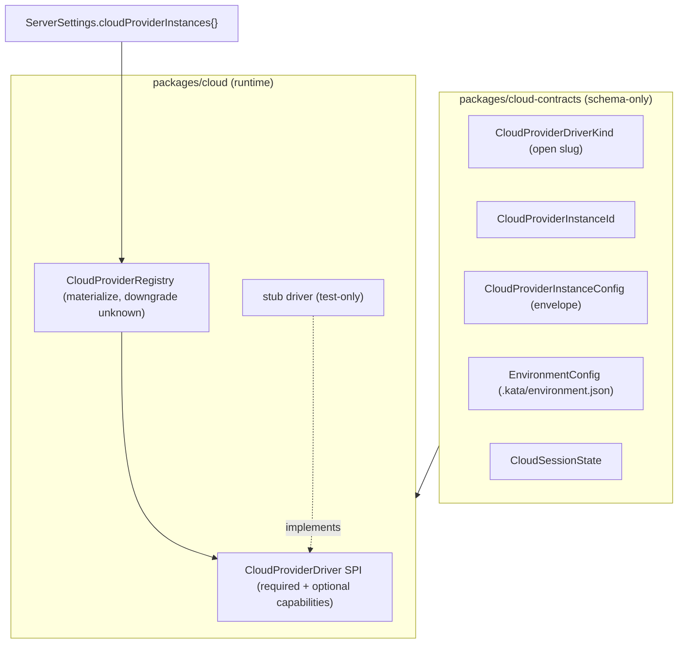

# Kata Cloud Phase 0 — cloud-provider foundations

## Status

Draft

## Goal

Establish the modular cloud-provider substrate with no user-facing surface. Phase 0 ships the
schema-only contracts, the capability-based driver SPI, a registry that materializes instances
from settings and downgrades unknown drivers gracefully, the `cloudProviderInstances` settings
field, a test-only stub driver, and a recorded Vercel feasibility spike. No production driver
is registered; the server boots unchanged.

This is the first per-phase spec under the [Kata Cloud roadmap](/specs/2026-06-27-kata-cloud-roadmap-design.md).
It implements roadmap Phase 0 and freezes the SPI shape that every later phase depends on.

## Source of truth

- Master roadmap: [2026-06-27-kata-cloud-roadmap-design.md](/specs/2026-06-27-kata-cloud-roadmap-design.md)
  (Phase 0 requirements, AC-0.1…AC-0.5; capability-based SPI; reachability axis).
- Existing provider-instance pattern to mirror: `packages/contracts/src/providerInstance.ts`
  (`ProviderDriverKind` open slug, `ProviderInstanceId`, `ProviderInstanceConfig` envelope,
  `defaultInstanceIdForDriver`), `packages/contracts/src/settings.ts`
  (`providerInstances` map, whole-map patch).
- Secret-storage infra to reuse: `apps/server/src/auth/ServerSecretStore.ts` (out-of-band
  `0o600` file store), `apps/server/src/serverSettings.ts`
  (`materializeProviderEnvironmentSecrets` / `persistProviderEnvironmentSecrets` redaction).
- Prior-art SPI shape: AgentBox `packages/core/src/cloud-backend.ts`
  (`/Volumes/EVO/repos/agentbox`; pattern reference only, do not copy code).
- Vercel SDK for the spike: vendored skill `.agents/skills/vercel-sandbox`; live
  `@vercel/sandbox` API.

## Locked decisions (from roadmap + planning)

1. **New packages, no server wiring.** Phase 0 adds `packages/cloud-contracts` and
   `packages/cloud`, plus `cloudProviderInstances` in `ServerSettings`. No `cloud.*` RPCs, no
   registry wiring into running server layers. The server boots unchanged (AC-0.4).
2. **Distinct from `apps/server/src/cloud/`.** That directory is **Kata Code Connect** (relay
   CLI state, endpoints, environment keys) — a different concern. Phase 0 does not touch it.
   The new packages are `@kata-sh/code-cloud-contracts` and `@kata-sh/code-cloud`.
3. **Capability-based SPI.** Required primitives + optional capabilities; registry checks
   presence and degrades gracefully. Frozen in this spec (see SPI section).
4. **Secret-storage bar reuses existing infra.** Cloud credentials and env secrets use the
   same `sensitive` + `valueRedacted` envelope and `ServerSecretStore` out-of-band file path
   as `providerInstances`. No plaintext in settings JSON. This resolves the roadmap's open
   secret-storage question for all later phases. **Precision:** the existing
   `materializeProviderEnvironmentSecrets` / `persistProviderEnvironmentSecrets` helpers in
   `serverSettings.ts` are hardcoded to iterate `settings.providerInstances`; Phase 1
   generalizes them to also walk `cloudProviderInstances` (extract to a shared helper — no
   duplication, per AGENTS.md). Phase 0 only fixes the contract shape so that generalization is
   mechanical. Phase 0 ships no writer for the cloud env field, so the "no plaintext in
   settings" bar is a contract decision here, not yet an enforced/tested invariant.
5. **Vercel spike is a throwaway script + recorded findings.** Lives under
   `scripts/cloud-spike/`, not shipped as product code. Findings recorded in this spec.

## Current state (verified)

- `ServerSettings` (`packages/contracts/src/settings.ts`) already carries
  `providerInstances: Record<ProviderInstanceId, ProviderInstanceConfig>` with a whole-map
  patch field, and decodes unknown driver kinds without loss (documented invariant in
  `providerInstance.ts`).
- `ServerSecretStore` persists secrets as `<secretsDir>/<name>.bin` (dir `0o700`, files
  `0o600`, atomic temp-write+rename) and is already used to back provider-instance sensitive
  env vars via redaction-on-read/persist in `serverSettings.ts`.
- Packages use subpath `exports` pointing at `src/*.ts`, `tsgo --noEmit` for typecheck,
  `vite-plus` (`vp test`) for tests, and `effect` from the workspace catalog. New packages
  follow the same conventions. `pnpm-workspace.yaml` already globs `packages/*`.
- `apps/server/src/cloud/` exists and is Kata Code Connect; it is out of scope here.

## Architecture

Two new packages, mirroring the AgentBox split (contracts vs scaffolding) and the existing
Kata provider layering (schema-only contracts vs runtime registry).



### `packages/cloud-contracts` (schema-only)

Mirrors `providerInstance.ts` discipline: no runtime logic, open branded slugs, unknown
drivers round-trip. Exports (each as a subpath export):

- `CloudProviderDriverKind` — open branded slug (same slug rules as `ProviderDriverKind`:
  starts with a letter, `[a-zA-Z0-9_-]`, 1..64 chars). **Not** a closed union; unknown kinds
  parse successfully and the registry marks them unavailable.
- `CloudProviderInstanceId` — user-defined routing-key slug, branded separately.
- `defaultInstanceIdForDriver(kind)` — canonical back-compat instance id (mirrors the provider
  helper).
- `CloudProviderInstanceConfig` — envelope: `{ driver, displayName?, enabled?, environment?,
  config? }` where `config` is `Schema.Unknown` (driver owns its schema) and `environment`
  reuses the **same** `ProviderInstanceEnvironment` shape (`name`, `value`, `sensitive`,
  `valueRedacted?`) so the existing secret redaction path applies unchanged.
- `CloudProviderInstanceConfigMap` — `Record<CloudProviderInstanceId, CloudProviderInstanceConfig>`.
- `EnvironmentConfig` — schema for `.kata/environment.json`: `{ build?: { dockerfile, context? },
  snapshot?, install?, start?, terminals? }`. All fields optional; unknown fields tolerated
  (forward-compat). Schema only; no resolver logic here (resolver is Phase 2).
- `CloudSessionState` — literal union: `provisioning | ready | error | disposed`
  (plus `unknown` for forward-compat). Used by later phases; defined now so the contract is
  stable.
- `CloudReachabilityKind` — literal union `public-route | ssh-tunnel | worker-proxied`.

The `environment` field reuses the provider env shape deliberately: it lets Phase 1
_generalize_ the existing `materializeProviderEnvironmentSecrets`-style logic to also walk the
cloud map (those helpers are currently hardcoded to `settings.providerInstances`). No second
redaction implementation. **`packages/cloud-contracts` depends on `@kata-sh/code-contracts`**
to import `ProviderInstanceEnvironment` rather than redefine it — this keeps the redaction
contract single-sourced (declared in the scaffold step below).

### `packages/cloud` (runtime SPI + registry)

#### CloudProviderDriver SPI (frozen shape)

Required (every driver implements):

| Member | Signature (indicative) | Purpose |
| --- | --- | --- |
| `kind` | `CloudProviderDriverKind` | Driver identity. |
| `validate` | `(config) => Effect<ValidateResult, CloudProviderError>` | Credential/connectivity check ("Test connection"). |
| `provision` | `(req) => Effect<CloudHandle, CloudProviderError>` | Create/boot a VM, apply base image/snapshot, run `install`. |
| `exec` | `(handle, cmd, opts?) => Effect<CloudExecResult, CloudProviderError>` | Run a command in the VM. |
| `reachability` | `(handle, port) => Effect<CloudReachability, CloudProviderError>` | Resolve how the client reaches a port, per the driver's `describe().reachabilityKind`. |
| `dispose` | `(handle) => Effect<void, CloudProviderError>` | Tear down the VM. |
| `describe` | `() => CloudProviderDescriptor` | Capabilities, `reachabilityKind`, limits, which optional members exist. |

Optional (driver may omit; registry exposes presence via `describe()` and callers guard with
capability checks):

| Member | Purpose | Used by |
| --- | --- | --- |
| `createSnapshot` / `deleteSnapshot` / `snapshotExists` | VM snapshot lifecycle. | Phase 5 |
| `renewTimeout` | Extend session before idle/timeout death. | Phase 3/4 |
| `signedPreviewUrl` | Browser-bound signed URL where the route model needs one. | Phase 4 |
| `networkPolicy` | Native egress control. | later |
| `pause` / `resume` | Cold-store lifecycle where the provider supports it. | later |

`describe()` returns a `CloudProviderDescriptor`: `{ kind, reachabilityKind, maxLifetimeMs?,
supportsSnapshot, supportsRenewTimeout, baseImages? }`. Each boolean capability flag is `true`
only when **all** of that capability's methods are present (e.g. `supportsSnapshot` requires
`createSnapshot` AND `deleteSnapshot` AND `snapshotExists`). The flags must agree with method
presence (asserted in tests).

`CloudProviderError` is a tagged error (Effect `Schema.TaggedError`) with a `reason` and
optional `cause`, so failures are explicit (no silent fallback — roadmap constraint).

This SPI is **frozen by this spec**. Later phases may add optional capabilities but must not
change required signatures without a spec amendment.

#### CloudProviderRegistry

- Built from a `CloudProviderInstanceConfigMap` plus a set of registered drivers (keyed by
  `CloudProviderDriverKind`).
- `materialize()` produces, per instance id, either an **available** materialized instance
  (driver found, config decodes) or an **unavailable** record carrying the reason
  (`unknown-driver` | `disabled` | `invalid-config`). Never throws on unknown driver
  (mirrors `ProviderInstanceRegistry` behavior and the contract invariant).
- `get(instanceId)` returns the materialized instance or an unavailable marker.
- `list()` returns all materialized instances (available + unavailable) for UI/diagnostics.
- No process/resource lifecycle in Phase 0 (no real driver runs); the registry is pure
  resolution over config + driver set.

#### Stub driver (test-only)

An in-memory driver implementing the full required SPI plus a configurable subset of optional
capabilities, used to test the registry and capability-presence logic. It is **not** declared
in `package.json#exports` at all — it lives under `packages/cloud/src/testing/` and is
imported only via a relative path from co-located tests. Keeping it out of `exports` is what
actually prevents accidental production registration (a subpath export would remain importable
in production).

### `ServerSettings.cloudProviderInstances`

Add to `ServerSettings` (and `ServerSettingsPatch` as a whole-map optional field, matching
`providerInstances`):

```
cloudProviderInstances: Schema.Record(CloudProviderInstanceId, CloudProviderInstanceConfig)
  .pipe(Schema.withDecodingDefault(Effect.succeed({})))
```

Decoding an unknown driver kind in this map must succeed and round-trip the envelope verbatim
(AC-0.2). No server-layer reads this field yet (AC-0.4).

### Secret storage (decision, no new code in Phase 0)

Phase 0 only fixes the contract: the `environment` field on `CloudProviderInstanceConfig`
reuses the provider env-var shape, so Phase 1 reuses the existing
`materializeProviderEnvironmentSecrets` / `persistProviderEnvironmentSecrets` +
`ServerSecretStore` path verbatim. The bar for all later phases: **sensitive values live in
`ServerSecretStore` (out-of-band `0o600` files), settings JSON stores only
`{ sensitive: true, valueRedacted: true, value: "" }`.** No plaintext secrets in settings, no
new encryption module.

### Vercel feasibility spike (gates Phase 3)

A throwaway script `scripts/cloud-spike/vercel-reachability.ts` (run manually with Vercel
credentials from env per the `vercel-cli-with-tokens` skill) that:

1. Provisions a sandbox via `@vercel/sandbox`.
2. Starts a trivial listener (HTTP + WebSocket) on a port inside the sandbox.
3. Exposes/obtains the public route URL for that port.
4. Opens a `wss` connection through that route and exchanges a message.
5. Measures the actual maximum VM lifetime (or documents the SDK-imposed cap).

Findings (pass/fail per step, the verified API surface used, and the measured/observed max
lifetime) are recorded in this spec's **Spike findings** section and the roadmap's lifetime
figure corrected. A refutation of step 3 or 4 blocks Phase 3 until reachability is re-planned
(roadmap Connect-relay fallback).

## Acceptance criteria

1. **AC-0.1** `packages/cloud-contracts` and `packages/cloud` build and pass `vp run typecheck`;
   `vp check` is clean. Both are added to the workspace and resolve via subpath exports.
2. **AC-0.2** A unit test decodes a `cloudProviderInstances` map containing a
   **valid-but-unregistered** driver kind (a well-formed slug matching
   `/^[a-zA-Z][a-zA-Z0-9_-]*$/`, not one the registry knows) and asserts the envelope
   round-trips (encode∘decode is identity) with no data loss. This exercises
   registry-unknown decoding, not schema-rejection of a malformed slug (which fails decode by
   design).
3. **AC-0.3** A unit test builds a `CloudProviderRegistry` with the stub driver registered and
   asserts: (a) a stub-driver instance materializes as available; (b) an unknown-driver
   instance materializes as unavailable with reason `unknown-driver` and does not throw;
   (c) a `disabled` instance materializes as unavailable with reason `disabled`;
   (d) an instance whose `config` fails the stub driver's own decode materializes as
   unavailable with reason `invalid-config` (covers all three frozen reasons).
4. **AC-0.4** With `cloudProviderInstances` present in `ServerSettings` (default `{}` and a
   populated unknown-driver entry), the server boots unchanged: existing server/settings tests
   pass and no production cloud driver is registered.
5. **AC-0.5** `describe()` capability flags match method presence: a unit test asserts that for
   the stub driver, `supportsSnapshot === (createSnapshot && deleteSnapshot && snapshotExists
   all present)` and likewise for `renewTimeout`, across at least one driver variant with the
   capability and one without. (A capability flag is true only when **all** of its methods are
   present.)
6. **AC-0.6** SPI freeze (process + drift guard): `CloudProviderDriver` required members
   (`kind`, `validate`, `provision`, `exec`, `reachability`, `dispose`, `describe`) exist with
   the documented shapes, covered by a type-level conformance test (the stub driver satisfies
   the interface) so an accidental change to a required signature breaks the build. The actual
   freeze is the process rule ("no change to a required signature without a spec amendment");
   this test is a drift guard, not a substitute for that rule.
7. **AC-0.7** Vercel spike delivered: `scripts/cloud-spike/vercel-reachability.ts` exists and
   **typechecks under `vp run typecheck`** (so `@vercel/sandbox` is a real, resolved
   dependency and the script compiles). The **Spike findings** section records pass/fail for
   provision, port exposure, sustained `wss`, and measured max VM lifetime, with the verified
   `@vercel/sandbox` API surface cited. If the run is blocked on credentials, a "blocked"
   finding must name the missing input and the unblock owner (the user), and Phase 1 cannot
   complete until the spike actually runs. If `wss`-through-public-route is refuted, the spec
   records that Phase 3 is blocked pending reachability re-plan.

AC-0.1…AC-0.4 map to the roadmap's AC-0.1…AC-0.4. The roadmap's AC-0.5 (the Vercel spike) is
implemented here as **AC-0.7**; the roadmap's "AC-0.5" cross-references (Phase 3 dependency,
risk entries) therefore point to this spec's AC-0.7. AC-0.5 (descriptor flags) and AC-0.6
(SPI freeze) are Phase-0-local additions not present in the roadmap.

## Implementation plan

1. **Scaffold `packages/cloud-contracts`** — package.json (subpath exports, `effect` catalog,
   `tsgo`/`vp test`, **dependency on `@kata-sh/code-contracts`**), `tsconfig`, and schema
   modules: `driverKind.ts`, `instance.ts` (envelope + map + `defaultInstanceIdForDriver`),
   `environmentConfig.ts`, `sessionState.ts`, `reachability.ts`, `index.ts`. **Import and
   reuse `ProviderInstanceEnvironment` from `@kata-sh/code-contracts`** for the `environment`
   field — do not redefine the shape (keeps the redaction contract single-sourced).
   *(AC-0.1, AC-0.2)*
2. **Scaffold `packages/cloud`** — package.json/tsconfig; `CloudProviderDriver.ts` (SPI types
   + `CloudProviderError`), `CloudProviderRegistry.ts`, `descriptor.ts`, a test-only
   `testing/stubDriver.ts`, `index.ts`. *(AC-0.3, AC-0.5, AC-0.6)*
3. **Add `cloudProviderInstances`** to `ServerSettings` and `ServerSettingsPatch`
   (`packages/contracts/src/settings.ts`), with default `{}` and whole-map patch. *(AC-0.4)*
4. **Tests** — contracts round-trip (incl. unknown driver), registry materialization
   (available/unknown/disabled), descriptor↔method-presence agreement, settings decode with
   unknown cloud driver, type-level SPI conformance. *(AC-0.2, AC-0.3, AC-0.4, AC-0.5, AC-0.6)*
5. **Vercel spike** — `scripts/cloud-spike/vercel-reachability.ts`; run; record findings.
   *(AC-0.7)*
6. **Gate** — `vp check`, `vp run typecheck`, `vp run test`; record results. *(AC-0.1)*

Steps 1–2 can proceed in parallel after the contract names are fixed; step 5 is independent of
1–4 and can run anytime credentials are available.

## Out of scope

- Any `cloud.*` RPC or server-layer registry wiring (Phase 1+).
- The Vercel driver implementation (`packages/cloud-vercel`) beyond the throwaway spike script
  (Phase 1).
- The `.kata/environment.json` resolver and execution (Phase 2) — Phase 0 defines the schema
  only.
- Any UI (Settings/composer) — Phase 1+.
- Touching `apps/server/src/cloud/` (Kata Code Connect).

## Risks and mitigations

- **SPI mis-design forces later churn.** Mitigation: validate the required/optional split
  against AgentBox's `CloudBackend` before finalizing; lock with a type-level conformance test
  (AC-0.6).
- **Spike can't run without Vercel credentials.** Mitigation: script reads creds from env per
  `vercel-cli-with-tokens`; if unavailable at build time, AC-0.7 is satisfied by the committed
  script + a recorded "blocked: needs credentials" finding, and Phase 1 cannot complete until
  the spike runs (it gates Phase 3, not Phase 0 merge).
- **Contract drift from `providerInstance.ts`.** Mitigation: import/reuse the existing
  `ProviderInstanceEnvironment` schema rather than redefining it, so the secret path stays
  single-sourced.

## Spike findings

_To be completed when `scripts/cloud-spike/vercel-reachability.ts` runs (AC-0.7)._

- Provision: _pending_
- Port exposure / public route: _pending_
- Sustained `wss` through route: _pending_
- Measured max VM lifetime: _pending_
- Verified `@vercel/sandbox` API surface: _pending_
- Phase 3 gate decision: _pending_

## Build handoff

- **Approved scope:** two new packages (`cloud-contracts`, `cloud`), `cloudProviderInstances`
  settings field, test-only stub driver, frozen capability-based SPI, Vercel spike script +
  findings. No server wiring, no driver, no UI.
- **Non-goals:** RPCs, registry wiring, Vercel driver, resolver, UI, Connect changes.
- **Required verification:** AC-0.1…AC-0.7 + CI parity (`vp check`, `vp run typecheck`,
  `vp run test`).
- **Blocking questions:** none — all Phase 0 decisions locked. The spike result feeds Phase 1/3
  planning, not Phase 0 completion.
