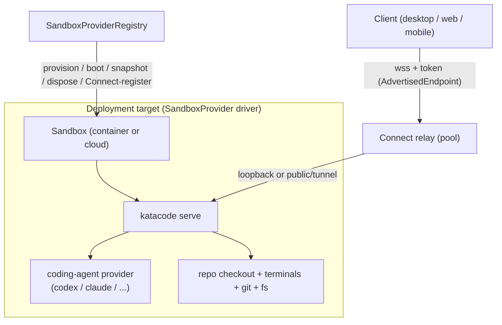

# Kata Environments — deployments (BYOC)

## Status

Approved.

## Goal

Evolve Kata Environments from a **configure** model to a **deploy** model. Today, to run a
Kata server remotely you SSH to a host, clone the repo, build/get the binary, and launch
`katacode` with CLI flags, then point a client at it (manually, or via Connect). This roadmap
adds a GUI for that: pick a repo and branch, pick where it runs — an **isolated container**
locally or a **bring-your-own cloud sandbox** — and Kata provisions it, reaches it, and joins
it to your Connect pool. You can start a session in any location and move it to another; in V1
a move starts a fresh session in the new location (with a warning), since live session
migration is deferred.

This is **free and open source** and **bring-your-own-account**: it connects to _your_ Docker
and _your_ cloud credentials. Kata provisions nothing and bills nothing. It is the foundation
for a future managed product (**Kata Cloud**, ~$20/mo one-click), which will provision and
manage infra on the user's behalf. That managed product is out of scope here; this roadmap
builds the open-source deploy layer both can stand on.

The product section this extends is **Environments** (Settings → Environments), where today you
configure remote Kata servers by URL + pairing token. Deployments add a second kind of entry
there: a deployment target you define and Kata launches, rather than a server you point at.

## Source of truth

- Existing remote architecture: [remote.md](/architecture/remote.md) — `ExecutionEnvironment`,
  `AccessEndpoint`, `AdvertisedEndpoint`, launch vs access separation, Connect relay.
- Existing Environments/Connect surface: [docs/cloud/index.md](/cloud/index.md) (Connect relay,
  Clerk auth, pairing), `packages/contracts/src/remoteAccess.ts`
  (`AdvertisedEndpoint`, `AdvertisedEndpointReachability: loopback | lan | private-network |
public`, `AdvertisedEndpointProviderKind: core | private-network | tunnel | manual`).
- Existing provider-instance pattern to mirror: [providers.md](/architecture/providers.md),
  `packages/contracts/src/providerInstance.ts` (open driver-kind slug, envelope config,
  registry, graceful unknown-driver downgrade), `packages/contracts/src/settings.ts`
  (`providerInstances`).
- Cursor cloud environment model: <https://cursor.com/docs/cloud-agent/setup>
  (resolution order, `install`/`start`/`terminals`, snapshots, agent-driven setup, secrets).
- UI reference comps (`docs/comps/cursor-cloud/`):
  - `SCR-20260627-hpes.png` — composer "Run on" dropdown (This Mac / Cloud / Worktree). Maps to the composer phase.
  - `SCR-20260627-hpyw.png` — Environments table, Defaults (branch prefix), Secrets. Maps to Settings + environment-config phases.
  - `SCR-20260627-hqeu.png` — Environment detail: Snapshot ID, Update Script, network access, Secrets, "Start Setup Agent", Setup Runs/History. Maps to environment-config + snapshot + agent-setup phases.

  Treat as interaction/IA references, not pixel targets; Kata branding and existing styling win on conflict.

- Prior art — AgentBox (`madarco/agentbox`, MIT, local checkout `/Volumes/EVO/repos/agentbox`):
  runs an agent box across **local Docker**, Vercel, Hetzner, Daytona, and E2B behind **one**
  `CloudBackend` SPI composed once by `createCloudProvider(backend)`. `sandbox-docker` sits
  alongside the cloud providers as a first-class driver — directly validates this roadmap's
  local-container + cloud under one SPI. Study `packages/core/src/cloud-backend.ts` (SPI),
  `packages/sandbox-cloud/src/cloud-provider.ts` (scaffolding),
  `packages/sandbox-docker/src/*` and `packages/sandbox-{vercel,hetzner}/src/backend.ts`.
  Pattern reference only; do not import or copy code (AGENTS.md reference-repo policy).

## Key decisions (locked during planning)

1. **Deployments extend Environments, not a new "Cloud" section.** A deployment target is a new
   kind of entry in Settings → Environments, alongside today's connect-by-URL entries. Both
   resolve to an `ExecutionEnvironment` the client connects to. The composer "Run on" picker
   chooses among all configured targets plus local/worktree.

2. **Bring-your-own-account (BYOC), free and open source.** The deploy layer connects to the
   user's own Docker and cloud credentials; Kata provisions nothing and bills nothing. A future
   managed **Kata Cloud** product (~$20/mo, one-click) builds on this foundation but is out of
   scope for this roadmap.

3. **One capability-based SandboxProvider SPI spans local-container and cloud.** A single
   `SandboxProvider` driver SPI mirrors the existing provider-instance pattern (open driver-kind
   slug, envelope config in a settings map, runtime registry, per-driver package) and follows
   AgentBox's shape (where `sandbox-docker` is a sibling of the cloud providers): a small set of
   **required** primitives (`validate`, `provision`, `exec`, `reachability`, `dispose`,
   `describe`) plus **optional** capabilities a driver may omit (`createSnapshot`/
   `deleteSnapshot`/`snapshotExists`, `renewTimeout`, `signedPreviewUrl`, `networkPolicy`,
   lifecycle pause/resume where supported). The registry degrades gracefully when a capability
   is absent. `describe()` advertises capabilities and reachability kind. Ephemeral behavior is
   the default; persistence is out of scope for this roadmap. The canonical required/optional
   split is defined in the Architecture "SandboxProvider driver SPI (shape)" section. Container
   is the first driver; Cloudflare is the first cloud driver; Vercel, Hetzner, and DigitalOcean
   are future BYOC cloud drivers (AgentBox proves all fit one SPI).

4. **Reachability reuses the existing `AdvertisedEndpoint` model; Connect is required for every
   deployment.** A deployed sandbox running `katacode serve` is a Kata server like any other and
   **auto-registers with Connect on provision** so every paired client (desktop, mobile, hosted
   web) reaches it with no per-client setup. This is the core convenience thesis of Connect.
   Reachability per driver maps onto the existing
   `AdvertisedEndpointReachability: loopback | lan | private-network | public`:
   - **local-container** — advertises a `loopback` endpoint (the deploying desktop reaches it
     via `localhost` port mapping); the existing relay "publish a local server" path fronts it
     for other clients.
   - **cloud (Cloudflare)** — advertises a `public` endpoint via the Cloudflare Sandbox tunnels
     API (`sandbox.tunnels.get(port)`): quick tunnel (`*.trycloudflare.com`) for dev, named
     tunnel on the user's zone for production. (The older `exposePort()` + `proxyToSandbox` +
     wildcard-DNS path was deprecated by Cloudflare in June 2026; this roadmap targets tunnels.)
   - **future ssh-tunnel drivers (Hetzner, DO)** — advertise via desktop-managed SSH forward +
     relay, reduced hosted-web support.
     The client connects over `wss` with the existing Kata WebSocket auth token (not a provider
     token) for any non-loopback path.

5. **Lifecycle — ephemeral + snapshot reuse.** Each sandbox session boots fresh (from a base
   snapshot where the driver supports it), runs an idempotent `install`, then disposes on
   idle/timeout. Work is preserved via git branch sync, not durable disk. Persistence is out of
   scope (future).

6. **Environment config home — repo file with saved-env fallback.** Resolution order:
   `.kata/environment.json` in the repo → saved per-repo environment in Settings (keyed by
   `RepositoryIdentity`) → provider base default. Committable and team-shareable; authored
   manually, by agent, or both. Secrets never in the repo file; stored via the reused
   `ServerSecretStore` path and injected as env vars.

7. **Move semantics (V1) — fresh session on move, with a warning.** Moving a session to a new
   location provisions the target, starts a **new** agent session there on the same repo/branch
   (via git branch sync), and warns the user that the prior session's in-flight state (provider
   process, terminals) does not carry over. Only the repo/branch carries over. Live session
   migration is deferred future work.

8. **Agent credentials — injected secrets, per session.** Provider auth and repo env secrets
   stored in Kata settings via the existing `ServerSecretStore` out-of-band file path (reusing
   the provider-instance `sensitive` + `valueRedacted` redaction) and injected as env vars at
   boot. No OAuth session forwarding in this roadmap.

## Relationship to Kata Code Connect

Connect is the **shared reachability and pooling layer** for every deployment, not a bolt-on.
Today a user connects to remote Kata servers two ways: manually (URL + pairing token) or via
the Connect relay pool (all your servers reachable from all your clients, no per-server setup).
A deployed sandbox is just another server in that pool: provision auto-registers it with
Connect, so every paired client sees it immediately. The "deploy" model and the "configure"
model coexist in Environments; both produce Connect-pool members.

Connect docs live at [docs/cloud/index.md](/cloud/index.md). This roadmap's deploy surface adds
docs at `docs/architecture/environments-deploy.md` and `docs/guides/environments-deploy/*` (not
clobbering the existing `docs/cloud/` Connect bundle).

## Architecture

A deployment is a new **launch method** that produces an `ExecutionEnvironment` (one running
`katacode serve`) and an **`AdvertisedEndpoint`** the client connects through. The existing
remote architecture's launch/access separation is preserved: a sandbox is _how the server comes
to exist_, Connect/loopback is _how the client reaches it_.



### Package layout (modular by design)

| Package                       | Role                                                                                                                                                                                                                                                                                                                 | Notes                                                                                                                                                                                                                                                                                                                 |
| ----------------------------- | -------------------------------------------------------------------------------------------------------------------------------------------------------------------------------------------------------------------------------------------------------------------------------------------------------------------- | --------------------------------------------------------------------------------------------------------------------------------------------------------------------------------------------------------------------------------------------------------------------------------------------------------------------- |
| `packages/sandbox-contracts`  | Schema-only contracts. **Re-exports** the settings-referenced contracts (`SandboxProviderDriverKind`, `SandboxProviderInstanceId`, `SandboxProviderInstanceConfig`) from `packages/contracts`, and **owns** `EnvironmentConfig` (`.kata/environment.json` schema), `SandboxSessionState`, `SandboxReachabilityKind`. | Mirrors `packages/contracts` discipline; unknown drivers round-trip without loss. Settings-referenced contracts live in `packages/contracts` (`sandboxProviderInstance.ts`) to keep it a dependency leaf (no `contracts` ⇄ `sandbox-contracts` cycle); the edge is one-directional `sandbox-contracts` → `contracts`. |
| `packages/sandbox`            | Driver SPI, `SandboxProviderRegistry`, environment-config resolver, session lifecycle orchestration, snapshot cache policy, Connect registration glue. Provider-agnostic.                                                                                                                                            | Consumed by `apps/server` and (later) Kata Agent. Mirrors AgentBox's `sandbox-cloud` scaffolding.                                                                                                                                                                                                                     |
| `packages/sandbox-docker`     | The local-container driver (Docker/OrbStack) implementing the SPI.                                                                                                                                                                                                                                                   | First driver (Phase 1).                                                                                                                                                                                                                                                                                               |
| `packages/sandbox-cloudflare` | The Cloudflare Sandbox SDK driver (RPC transport, tunnels API).                                                                                                                                                                                                                                                      | First cloud driver (Phase 2).                                                                                                                                                                                                                                                                                         |
| `apps/server`                 | Wires the registry into server layers; exposes `sandbox.*`/`environments.deploy.*` RPCs; owns secret storage/injection, git branch sync, and Connect registration on provision.                                                                                                                                      | No driver-specific logic beyond registration.                                                                                                                                                                                                                                                                         |
| `apps/web`                    | Settings → Environments UI for deployment targets + env config; composer "Run on" control; deployment/session status.                                                                                                                                                                                                | Reuses provider-settings form rendering where possible.                                                                                                                                                                                                                                                               |

The `SandboxProvider` driver SPI parallels `ProviderDriver`: a factory keyed by an open
`SandboxProviderDriverKind` slug, configured by an envelope in a `sandboxProviderInstances`
settings map, materialized by a registry that downgrades unknown drivers to "unavailable"
rather than crashing. The `packages/sandbox` (scaffolding) + `packages/sandbox-<provider>`
(driver) split mirrors AgentBox's `sandbox-cloud` + `sandbox-<provider>` layout.

### SandboxProvider driver SPI (shape, not final API)

Follows AgentBox's `CloudBackend` shape: required primitives every driver implements, plus
optional capabilities a driver may omit (registry checks presence and degrades gracefully).

Required: `kind`, `validate`, `provision`, `exec`, `reachability`, `dispose`, `describe`.

`reachability(handle, port)` resolves how the client reaches the Kata server port, per the
driver's declared reachability kind, and returns an `AdvertisedEndpoint`-shaped result
(loopback URL for container, tunnel URL for cloud). `describe()` returns a
`SandboxProviderDescriptor`: `{ kind, reachabilityKind, maxLifetimeMs?, supportsSnapshot,
supportsRenewTimeout, baseImages? }`; capability flags are true only when all of a capability's
methods are present.

Optional: `createSnapshot`/`deleteSnapshot`/`snapshotExists` (snapshot lifecycle),
`renewTimeout` (extend session), `signedPreviewUrl`, `networkPolicy`, `pause`/`resume`.

Exact method signatures are frozen in Phase 1 Milestone A's spec before driver implementation
begins.

### Environment configuration (`.kata/environment.json`)

Modeled on Cursor's `environment.json`. Indicative shape:

```jsonc
{
  "build": { "dockerfile": ".kata/Dockerfile", "context": ".." }, // optional
  "snapshot": "snapshot-...", // optional
  "install": "pnpm install", // idempotent
  "start": "", // optional long-lived processes
  "terminals": [], // optional named app processes
}
```

Resolution order (first match wins): repo `.kata/environment.json` → saved environment in
Settings (keyed by `RepositoryIdentity` canonical key, so local and remote clones share
config) → provider base default. Secrets never in the repo file; stored via `ServerSecretStore`
and injected as env vars.

## Phases

Phases 1–4 form the usable V1 spine (container + cloud + composer + move); 5–6 add Cursor-parity
polish. Phases are ordered by dependency. **Every phase ships a user-facing demo**, first proven
by a live walkthrough (`playwright-cli` / `agent-browser` against the running app) and then
encoded as a Playwright Electron e2e test tagged `@environments-deploy` (see Verification).

### Phase 1 — Container driver + foundations (local Docker/OrbStack)

**Goal.** Ship the first demoable surface: a user configures a local container deployment target
in Settings → Environments, provisions it, and runs a Kata session inside an isolated container
with its own ports — reached directly over loopback and auto-joined to the Connect pool. Also
builds the modular `SandboxProvider` substrate every later driver plugs into.

**Two milestones.** Phase 1 ships in two internal milestones. **Milestone A** is the non-demoable
gate that freezes the SPI; **Milestone B** is the user-facing demo. The phase is complete only
when its demo (AC-1.13) passes — there is no standalone foundations phase.

- **Milestone A — Foundations (gate, no standalone demo).** The modular substrate:
  `packages/sandbox-contracts` + `packages/sandbox` (SPI + registry + test-only stub), the
  `sandboxProviderInstances` settings field, the frozen capability-based SPI, and the
  container-feasibility spike. Detailed design lives in the Phase 1 Milestone A spec (AC-1.1 …
  AC-1.7). The SPI is frozen here before any driver ships; the spike gates Milestone B's risk.
- **Milestone B — Container driver (the phase demo).** Implement `packages/sandbox-docker`
  (`validate`/`provision`/`exec`/`reachability`/`dispose`/`describe`) against a local
  Docker/OrbStack runtime. Provision boots `katacode serve` in the container; reachability
  advertises a `loopback` endpoint (`localhost:port`). **Auto-register with Connect** so paired
  clients (mobile, hosted web, other desktops) reach it via the relay; the deploying desktop
  reaches it over loopback. Settings → Environments UI lists deployment targets, supports
  add/edit/remove, and stores credentials via the reused `ServerSecretStore` path. "Test
  connection" provisions + disposes a minimal container. A minimal **"Start session"** affordance
  on the deployment target opens a thread bound to the container (this is superseded by the
  composer "Run on" picker in Phase 4; it exists only so Milestone B's agent-turn demo is
  reachable without the composer).

**Demo & e2e (AC-1.13).** Add a container target → Test Connection (provision + dispose +
success) → Start session → `katacode serve` boots container-side and is reachable over
`localhost` → an agent turn completes container-side → a second paired client reaches it via
Connect → dispose removes it from the pool, and two concurrent containers don't collide.

**Acceptance criteria.** AC-1.1 … AC-1.13 (Milestone A gate AC-1.1 … AC-1.7; Milestone B
AC-1.8 … AC-1.12; demo AC-1.13).

### Phase 2 — Manual environment configuration & execution

**Goal.** Per-repo `.kata/environment.json` is resolved, executed in a sandbox, and secrets are
injected — manually authored.

**Requirements.**

- Implement the resolver (repo file → saved env → provider default).
- Execute `install` (idempotent) and optional `start`/`terminals` in a booted sandbox.
- Inject Kata-stored secrets as environment variables (redacted in logs, never in repo).
- Settings → Environments env editor (Update Script, network access, secrets), referencing comps
  `SCR-20260627-hqeu.png` / `hpyw.png`.

**Acceptance criteria.** AC-2.1 … AC-2.6 (incl. demo AC-2.6)

### Phase 3 — Cloud sandbox driver (Cloudflare, BYOC)

**Goal.** A user configures a Cloudflare cloud deployment target (their own account) and starts
a session in a cloud sandbox, reached via tunnel + Connect.

**Depends on a Cloudflare tunnels spike (a Phase 3-local tunnels spike) confirming
tunnel `wss`.** If refuted, re-plan onto the Connect relay fallback.

**Requirements.**

- Implement `packages/sandbox-cloudflare` against `@cloudflare/sandbox` (RPC transport, tunnels
  API) using the user's Cloudflare account/zone credentials (BYOC).
- Launch method: provision/boot a sandbox container, install Kata server, start `katacode
serve`. Access: `sandbox.tunnels.get(port)` (quick tunnel dev, named tunnel production on the
  user's zone), advertise a `public` endpoint, connect over `wss` + Kata token.
- Auto-register with Connect so all paired clients reach it.
- Explicit failure surfaces for provision/boot/connect (no silent fallback to local).

**Acceptance criteria.** AC-3.1 … AC-3.6 (incl. demo AC-3.6)

### Phase 4 — Composer: start in any location & move between locations

**Goal.** From the composer, start a session in any configured location and move it to another,
with the environment provisioned automatically from its repo config.

**Requirements.**

- Composer "Run on" control (This Mac / Worktree / Container / Cloud) per comp
  `SCR-20260627-hpes.png`, listing configured deployment targets.
- "Start in <location>": provision a sandbox from the resolved repo environment config, open a
  thread bound to it.
- "Move to <location>" (V1): provision the target, start a **new** session on the same
  repo/branch via git branch sync (`kata/env/<id>` working branch; commit WIP when dirty, push,
  clone in target), warn the user that in-flight session state does not carry over.
- Move-back: push from target, fetch locally, restore working branch.
- Session status (provisioning/ready/error/disposed) surfaced in the UI.

**Acceptance criteria.** AC-4.1 … AC-4.8 (incl. demo AC-4.8)

### Phase 5 — Snapshot save & reuse

**Goal.** Cache a snapshot after setup so subsequent boots are measurably faster, with safe
fallback.

**Requirements.**

- Capture a snapshot after a successful `install` (drivers that support it); persist its id
  with the saved env (Snapshot ID per comp `SCR-20260627-hqeu.png`).
- Boot subsequent sessions from the snapshot; re-run idempotent `install` to repair drift.
- Fallback to the base image when a snapshot is expired/invalid/inaccessible, with a visible
  warning (not a hard failure).

**Acceptance criteria.** AC-5.1 … AC-5.5 (incl. demo AC-5.5)

### Phase 6 — Agent-driven environment setup

**Goal.** An agent provisions the environment interactively, verifies it, then writes
`.kata/environment.json` and saves a snapshot.

**Requirements.**

- "Start Setup Agent" boots a base sandbox and runs an agent session in a shared terminal to
  install deps and verify build/tests.
- On success, the agent writes/updates `.kata/environment.json` (proposing a commit) and a
  snapshot is saved.
- Setup runs/history viewable per comp `SCR-20260627-hqeu.png`; a failed setup surfaces logs and
  does not write a broken config.

**Acceptance criteria.** AC-6.1 … AC-6.5 (incl. demo AC-6.5)

## Acceptance criteria

Each criterion is observable via a test, command, API response, or manual UAT step. Phase specs
may add finer criteria but must not weaken these.

**Demo & e2e — standing rule (every phase).** Each phase ends in a user-facing demo, first
proven by a live walkthrough (`playwright-cli open` / `agent-browser` against the running app,
capturing snapshots per the AGENTS.md Feature Validation workflow and the `kata-code-e2e-testing`
skill), then encoded as a Playwright Electron e2e test under `e2e/tests/` tagged
`@environments-deploy`, passing via `vp run e2e --project desktop-dev --grep @environments-deploy`.
A slice that cannot be fully automated because it needs real paid cloud infra (Phase 3's live
tunnel) falls back to a recorded manual UAT with the live walkthrough as evidence; everything
else is e2e-automated. A phase is not complete until its demo AC passes.

**Phase 1 — Container driver + foundations**

_Milestone A — Foundations gate (no standalone demo; detailed in the Phase 1 Milestone A spec):_

1. **AC-1.1** `packages/sandbox-contracts` and `packages/sandbox` build and pass `vp run
typecheck`; `vp check` is clean. Both resolve via subpath exports.
2. **AC-1.2** A unit test decodes a `sandboxProviderInstances` map containing a
   valid-but-unregistered driver kind (a well-formed slug) and asserts the envelope round-trips
   (encode∘decode is identity) with no data loss.
3. **AC-1.3** A unit test builds a `SandboxProviderRegistry` with the stub driver and asserts:
   (a) a stub instance materializes as available; (b) an unknown-driver instance is unavailable
   with reason `unknown-driver` and does not throw; (c) a `disabled` instance is unavailable
   with reason `disabled`; (d) an instance whose `config` fails the stub's decode is unavailable
   with reason `invalid-config`.
4. **AC-1.4** With `sandboxProviderInstances` present in `ServerSettings` (default `{}` and a
   populated unknown-driver entry), the server boots unchanged: existing settings tests pass and
   no production driver is registered.
5. **AC-1.5** `describe()` capability flags match method presence: a unit test asserts
   that for the stub driver, `supportsSnapshot === (createSnapshot && deleteSnapshot &&
snapshotExists all present)` and likewise for `renewTimeout`, across at least one driver
   variant with the capability and one without. (A capability flag is true only when all of its
   methods are present.)
6. **AC-1.6** SPI freeze (process + drift guard): `SandboxProvider` required members exist with
   the documented shapes, covered by a type-level conformance test (the stub satisfies the
   interface). The actual freeze is the process rule (no required-signature change without a spec
   amendment); this test is a drift guard.
7. **AC-1.7** Container spike delivered: `scripts/sandbox-spike/container-reachability.ts`
   exists and **typechecks under `vp run typecheck`** (raw Docker Engine API over the Unix socket
   via Node built-ins; no Docker client npm dependency). The **Spike findings** section records
   pass/fail (or a "blocked: needs local Docker" outcome) for provision, port publish to
   `localhost`, sustained `ws`/`wss`, and long-lived process, with the verified Engine API cited.
   No credentials required; runnable locally and in CI. A refutation blocks Milestone B until
   re-planned. (This gates Milestone B's risk, not Milestone A's merge.)

_Milestone B — Container driver:_

8. **AC-1.8** A user can add a local container deployment target in Settings → Environments and
   any credentials persist via the reused `ServerSecretStore` path (no plaintext in settings).
9. **AC-1.9** "Test connection" provisions a minimal container and disposes it, returning a
   visible success; invalid config returns a visible, specific failure.
10. **AC-1.10** Starting a session in a container boots `katacode serve` inside it and the
    deploying desktop reaches it over `localhost` (loopback); an agent turn completes
    container-side.
11. **AC-1.11** The container deployment **auto-registers with Connect** on provision and a
    second paired client (e.g. mobile or hosted web) can reach it via the relay with no manual
    setup.
12. **AC-1.12** Disposing the container releases it and the deployment disappears from the
    Connect pool; a container with its own published ports does not collide with a second
    concurrent container (isolation verified).
13. **AC-1.13 (Demo & e2e)** The Milestone B demo flow (AC-1.8 … AC-1.12) is proven by a
    `playwright-cli`/`agent-browser` walkthrough against the running desktop app, then encoded
    as a Playwright Electron e2e test under `e2e/tests/` tagged `@environments-deploy`, passing
    via `vp run e2e --project desktop-dev --grep @environments-deploy`.

**Phase 2 — Manual environment config**

13. **AC-2.1** Given a repo with `.kata/environment.json`, the resolver selects it over a saved
    env and over the provider default (unit test covering all three orderings and the
    `RepositoryIdentity`-keyed saved env).
14. **AC-2.2** Running setup in a booted sandbox invokes `install`; re-invoking it unchanged
    succeeds and a non-zero exit surfaces as an explicit error. User-script idempotency is the
    user's responsibility.
15. **AC-2.3** When `start`/`terminals` are configured, the corresponding processes appear in
    the sandbox process list; when the sets are empty, the launcher reports the empty set and no
    such process appears.
16. **AC-2.4** Kata-stored secrets are injected as env vars visible to `install`/`start`; secret
    values are not written to the repo and are redacted in logs.
17. **AC-2.5** The saved-environment editor persists edits and reflects them on next boot, per
    comps `SCR-20260627-hqeu.png` / `hpyw.png`.
18. **AC-2.6 (Demo & e2e)** Configure a repo's `.kata/environment.json` + saved-env editor →
    boot a sandbox → assert `install` runs, `start`/`terminals` processes appear, and secrets are
    injected but redacted in logs. Proven by a `playwright-cli` walkthrough, then an e2e test
    tagged `@environments-deploy`.

**Phase 3 — Cloud sandbox driver (Cloudflare)**

19. **AC-3.1** Launching the Cloudflare driver boots `katacode serve` inside the sandbox and the
    server becomes reachable via a tunnel URL (integration/UAT).
20. **AC-3.2** The client connects over `wss` (quick tunnel dev, named tunnel production) using
    the required Kata auth token; an unauthenticated connection is rejected.
21. **AC-3.3** The cloud deployment appears as an `ExecutionEnvironment` and a coding agent turn
    completes cloud-side (manual UAT; e2e where feasible).
22. **AC-3.4** The cloud deployment **auto-registers with Connect** and a paired client other
    than the deploying one reaches it via the relay.
23. **AC-3.5** Provision/boot/connect failures surface explicit errors; the client does not
    silently fall back to a local environment.
24. **AC-3.6 (Demo & e2e)** Configure a Cloudflare target (BYOC creds) → start a session → boots
    in cloud, reachable via tunnel over `wss`, agent turn completes cloud-side, Connect-visible.
    Settings/config validation is e2e-automated (tagged `@environments-deploy`); the live-tunnel
    - cloud agent-turn slice uses a recorded manual UAT (needs the user's paid Cloudflare
      infra), per the standing rule.

**Phase 4 — Composer start/move**

25. **AC-4.1** The composer "Run on" control offers This Mac / Worktree / Container / Cloud
    (configured targets) per comp `SCR-20260627-hpes.png`.
26. **AC-4.2** "Start in <location>" provisions a sandbox from the resolved repo environment
    config and opens a thread bound to that environment.
27. **AC-4.3** "Move to <location>" with a dirty working tree commits WIP to `kata/env/<id>`,
    pushes, and clones in the target; the target checkout contains the WIP commit. If the repo
    has no writable push remote, the move is blocked with an explicit error before any teardown.
28. **AC-4.4** "Move back" pushes from the target and fetches locally so the local branch
    contains target-side commits.
29. **AC-4.5** A move **starts a new session** in the target and surfaces a warning that the
    prior session's in-flight state does not carry over (V1 move semantics).
30. **AC-4.6** Session status (provisioning/ready/error/disposed) is visible and updates on
    state change.
31. **AC-4.7** Disposal/idle-timeout with un-pushed target-side WIP either auto-commits and
    pushes to `kata/env/<id>` before teardown, or surfaces an explicit blocking warning before
    release. WIP is never discarded silently.
32. **AC-4.8 (Demo & e2e)** The headline demo: "Run on" picker → Start in a container/cloud →
    Move to another location (fresh session + warning) → Move back; session status updates
    throughout. Proven by a `playwright-cli` walkthrough, then an e2e test tagged
    `@environments-deploy`.

**Phase 5 — Snapshots**

33. **AC-5.1** A snapshot is captured after a successful `install` (driver permitting) and its
    id is persisted with the saved environment.
34. **AC-5.2** A subsequent session reaches **ready** (boot + `install` repair-drift) in less
    wall-clock time than the first cold session for the same repo; both timings recorded in the
    demo. Measured as **time-to-ready, not cold-boot time**: for disk-image drivers (container,
    Hetzner/DO) the snapshot boot is faster; for Cloudflare it is a directory restore, so the
    win is skipping `install` re-execution, not a faster container start. (Target revisable in
    the Phase 5 spec against measured baselines.)
35. **AC-5.3** Booting from the snapshot still re-invokes `install` unchanged to repair drift,
    surfacing a non-zero exit as an explicit error.
36. **AC-5.4** An expired/invalid/inaccessible snapshot falls back to the base image with a
    visible warning and a successful boot (not a hard failure).
37. **AC-5.5 (Demo & e2e)** After a successful `install`, a snapshot is captured and its id
    persisted; the next session boots faster (time-to-ready, AC-5.2); an expired/invalid
    snapshot falls back to base with a visible warning. Proven by a `playwright-cli` walkthrough,
    then an e2e test tagged `@environments-deploy`.

**Phase 6 — Agent-driven setup**

38. **AC-6.1** "Start Setup Agent" boots a base sandbox and runs an agent session whose progress
    is visible in a shared terminal.
39. **AC-6.2** On a successful setup, the agent writes/updates `.kata/environment.json` and
    proposes a commit containing it.
40. **AC-6.3** A snapshot is saved at the end of a successful agent-driven setup and is reused
    on the next boot (ties to AC-5.2).
41. **AC-6.4** Setup runs/history are viewable per comp `SCR-20260627-hqeu.png`; a failed setup
    surfaces logs and does not write a broken config.
42. **AC-6.5 (Demo & e2e)** "Start Setup Agent" → agent installs deps in a shared terminal,
    verifies build/tests → on success writes `.kata/environment.json` (proposes a commit) and a
    snapshot; a failed setup surfaces logs and writes no config. Proven by a `playwright-cli`
    walkthrough, then an e2e test tagged `@environments-deploy`.

## Sequencing

- **Hard order:** 1 → 2 → 4. Each depends on the prior. (Phase 2's env config is exercised
  by the composer in 4.) Phase 1 is the merged foundations+container-driver phase (Milestone A
  freezes the SPI, Milestone B ships the first demo).
- **3 (cloud)** depends on 1 and 2 and a Cloudflare tunnels spike; it can proceed in parallel
  with the container driver once the SPI is frozen, but lands after 1.
- **5** depends on 2 (needs `install`) and is best validated after 1 or 3.
- **6** depends on 2, a running driver, and 5.
- Parallelizable: once the SPI is frozen (Phase 1 Milestone A), driver scaffolding can proceed
  alongside later work.

## Constraints

- Reuse the existing `ExecutionEnvironment` / launch / access / `AdvertisedEndpoint` model; do
  not fork the runtime for deployments.
- Mirror the provider-instance pattern (open driver-kind slug, envelope config, registry,
  graceful unknown-driver downgrade). Contracts packages stay schema-only.
- **Every deployment auto-registers with Connect on provision.** A deployed Kata server is a
  Connect-pool member like any other.
- Required Kata WebSocket auth token for any non-loopback environment.
- Secrets via `ServerSecretStore` (out-of-band `0o600` files); never in settings plaintext, never
  in repos, never logged in clear text.
- Fail loud: provision/boot/connect/setup failures surface explicit errors, never silent fallback
  to local.
- BYOC: connect to the user's own credentials and infra; Kata provisions nothing and bills
  nothing in this roadmap.
- Honor fork branding/identity: `.kata/` config dir, `kata/env/<id>` branch prefix, `KATACODE_*`
  env, `~/.katacode` state. No upstream `t3`/`cursor` product strings in Kata surfaces.

## Out of scope (deferred to later specs)

- **Managed Kata Cloud product** (~$20/mo one-click, Kata-provisioned-and-billed infra). This
  roadmap is the open-source BYOC foundation; the managed product builds on it later.
- **Other cloud drivers (Vercel, Hetzner, DigitalOcean).** The SPI accommodates them; Cloudflare
  is the first cloud driver. Vercel (`public-route`, native public URL, free Hobby tier) is the
  simplest future cloud driver; Hetzner/DO (`ssh-tunnel`, ephemeral-capable) suit persistent
  unattended agents. All are the user's choice under BYOC.
- **Live session migration.** V1 move starts a fresh session with a warning; carrying in-flight
  provider/terminal/orchestration state across locations is deferred.
- **Persistent cloud workspaces / durable disk.** Ephemeral + snapshot reuse only.
- **Multi-repo environments / repo groups.** One repo per deployment in V1.
- **OAuth/session forwarding for provider auth.** Injected API-key/token secrets only.
- **Team/shared environments, usage/billing dashboards, network egress allowlists** as full
  features (network-access control may appear as a stored setting in Phase 2 without a full
  enforcement engine).

## Risks and mitigations

- **Connect registration per deployment.** Every container/cloud deployment must join the
  Connect pool. Mitigation: provision's final step is Connect registration, reusing the existing
  "publish a local server" relay path for loopback targets and the tunnel URL for cloud; an
  unregistered deployment is treated as a failed provision, not a silent success.
- **Sandbox lifetime limits.** Cloud sandboxes are ephemeral with provider-imposed caps.
  Mitigation: surface remaining lifetime; rely on git branch sync so disposal never loses pushed
  work (AC-4.7); fast boot via snapshots (Phase 5).
- **Container driver port/isolation correctness.** The whole point is no port collisions.
  Mitigation: AC-1.5 verifies two concurrent containers don't collide; the container driver
  allocates isolated port mappings.
- **Secret handling.** Injecting provider/API secrets into a sandbox is sensitive. Mitigation:
  reuse `ServerSecretStore` + the provider-instance redaction; inject only at boot as env vars;
  never log; never commit; redact in API/logs; scope per instance/repo.
- **Cloudflare tunnels feasibility (highest cloud risk).** Reachability depends on the tunnels
  API that superseded the deprecated `exposePort()`. Mitigation: a tunnels spike gates Phase 3;
  the Connect relay is the re-plan fallback.
- **SPI churn.** Freezing the SPI too late forces rework in `sandbox-docker`. Mitigation: lock
  the SPI in Phase 1 Milestone A's spec before driver implementation; validate the shape against
  AgentBox's `CloudBackend`.

## Prior art / references

- **AgentBox** (`madarco/agentbox`, MIT; local checkout `/Volumes/EVO/repos/agentbox`). A working
  multi-provider agent-sandbox tool with **local Docker as a first-class sibling** of Vercel,
  Hetzner, Daytona, and E2B behind one `CloudBackend` SPI. Most relevant before Phase 1 Milestone A:
  - `packages/core/src/cloud-backend.ts` — the SPI (required + optional capabilities).
  - `packages/sandbox-cloud/src/cloud-provider.ts` — `createCloudProvider(backend)` scaffolding
    (workspace/git seeding, snapshot/checkpoint restore with stale-snapshot fallback, credential
    injection, lifecycle re-ensure on wake).
  - `packages/sandbox-docker/src/*` — the local-container driver this roadmap's Phase 1 mirrors.
  - `packages/sandbox-{vercel,hetzner}/src/backend.ts` — two cloud reachability models.
    Pattern reference only; do not import or copy code. It is a different product; adapt, don't
    transplant.

## Verification (roadmap-level)

- **Demo-first, then e2e (every phase).** Each phase ends in a user-facing demo, proven by a
  live walkthrough (`playwright-cli open` / `agent-browser` against the running app, capturing
  snapshots per the AGENTS.md Feature Validation workflow and the `kata-code-e2e-testing` skill),
  then encoded as a Playwright Electron e2e test under `e2e/tests/` tagged `@environments-deploy`,
  passing via `vp run e2e --project desktop-dev --grep @environments-deploy`. This is the standing
  rule codified as each phase's demo AC (AC-1.13, AC-2.6, AC-3.6, AC-4.8, AC-5.5, AC-6.5).
- **Where full automation isn't possible** (Phase 3's live Cloudflare tunnel + cloud agent turn,
  which need the user's paid infra), the demo is a recorded manual UAT with the live walkthrough
  as evidence; the settings/config-validation slice stays e2e-automated.
- Per-phase specs carry detailed test plans. At minimum each phase satisfies its ACs via unit
  tests (contracts/resolver/registry), integration/UAT against a real container (Phase 1, no
  credentials) and a real Cloudflare sandbox (Phase 3, user credentials), plus the per-phase e2e
  test above.
- CI parity gates (`vp check`, `vp run typecheck`, `vp run test`, `vp run release:smoke`) pass
  for every phase before completion (per AGENTS.md).

## Key files (anticipated, not exhaustive)

- New: `packages/contracts/src/sandboxProviderInstance.ts` (settings-referenced sandbox
  contracts — kept in `contracts` to avoid a `contracts` ⇄ `sandbox-contracts` cycle),
  `packages/sandbox-contracts/src/*`, `packages/sandbox/src/*`,
  `packages/sandbox-docker/src/*`, `packages/sandbox-cloudflare/src/*`.
- Edit: `packages/contracts/src/settings.ts` (`sandboxProviderInstances`),
  `apps/server/src/serverLayers.ts` (registry wiring), `apps/server/src/wsServer.ts` /
  contracts `ws.ts` (`environments.deploy.*`/`sandbox.*` RPCs), Connect registration glue in
  `apps/server/src/relay/` + `apps/desktop/src/backend/`.
- Web: `apps/web/src/components/settings/*` (deployment targets + env panels),
  `apps/web/src/components/chat/Composer*` (Run-on control), session status surfaces.
- Docs: new `docs/architecture/environments-deploy.md`, `docs/guides/environments-deploy/*`,
  update `docs/architecture/index.md`, `docs/specs/index.md` (do not clobber `docs/cloud/`).

## Build handoff

- **Approved scope:** six phases (Phase 1 merges the former foundations phase into the
  container-driver phase as two milestones); **BYOC, free and open source**; container driver
  first (Docker/OrbStack), Cloudflare cloud driver second; one capability-based SandboxProvider
  SPI (AgentBox-shaped, local + cloud under one SPI); ephemeral + snapshot; repo-file-first env
  config; full Kata server in sandbox reached via Connect (loopback for container, tunnel for
  cloud) + Kata token; injected secrets; git branch-sync move with **fresh-session-on-move +
  warning** in V1; every deployment auto-registers with Connect; **every phase ships a
  user-facing demo proven by walkthrough then encoded as `@environments-deploy` e2e.**
- **Non-goals:** managed Kata Cloud product, other cloud drivers, live session migration,
  persistent disk, multi-repo, OAuth forwarding, billing.
- **Required verification:** each phase's ACs + CI parity gates; `@environments-deploy` e2e tag.
- **Blocking questions for the Phase 1 Milestone A spec:** final SPI method signatures;
  exact `.kata/environment.json` schema fields; secret-storage generalization (reuse
  `ServerSecretStore` + provider-instance redaction); container-spike result (AC-1.7).
