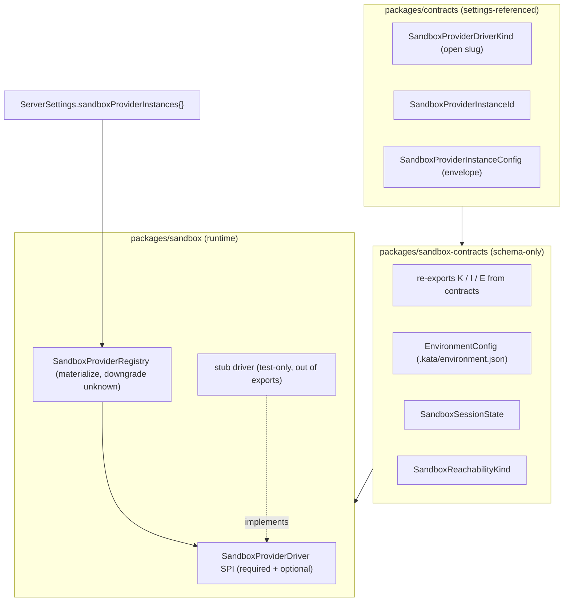

<!-- Path-slug note: this file's path/tag retain the historical `phase-0` slug for link
     stability. Phase 0 was merged into Phase 1 as Milestone A (see master roadmap). The
     document content uses the Phase 1 Milestone A scheme throughout. -->

# Kata Environments / Deployments Phase 1 — Milestone A: SandboxProvider foundations

## Status

Approved — Milestone A (the foundations gate) of [Phase 1](/specs/2026-06-27-kata-environments-deployments-design.md). Milestone A has no standalone demo; the user-facing Phase 1 demo is Milestone B (the container driver).

## Goal

Establish the modular sandbox-provider substrate. Milestone A ships the schema-only contracts,
the capability-based `SandboxProvider` driver SPI, a registry that materializes instances from
settings and downgrades unknown drivers gracefully, the `sandboxProviderInstances` settings
field, a test-only stub driver, and a recorded local-container feasibility spike. No production
driver is registered and the server boots unchanged. This is the gate that freezes the SPI
before the container driver (Milestone B) ships.

This is the first per-phase spec under the
[Kata Environments — deployments (BYOC) roadmap](/specs/2026-06-27-kata-environments-deployments-design.md).
It implements roadmap Phase 1 Milestone A and freezes the SPI shape every later phase depends on.

## Source of truth

- Master roadmap: [2026-06-27-kata-environments-deployments-design.md](/specs/2026-06-27-kata-environments-deployments-design.md)
  (Phase 1 Milestone A requirements, AC-1.1…AC-1.7; capability-based SandboxProvider SPI; container-first).
- Existing provider-instance pattern to mirror: `packages/contracts/src/providerInstance.ts`
  (`ProviderDriverKind` open slug, `ProviderInstanceId`, `ProviderInstanceConfig` envelope,
  `defaultInstanceIdForDriver`), `packages/contracts/src/settings.ts`
  (`providerInstances` map, whole-map patch).
- Existing `AdvertisedEndpoint` / reachability model to reuse:
  `packages/contracts/src/remoteAccess.ts`
  (`AdvertisedEndpointReachability: loopback | lan | private-network | public`,
  `AdvertisedEndpointProviderKind`), `packages/shared/src/advertisedEndpoint.ts`.
- Secret-storage infra to reuse: `apps/server/src/auth/ServerSecretStore.ts` (out-of-band
  `0o600` file store), `apps/server/src/serverSettings.ts`
  (`materializeProviderEnvironmentSecrets` / `persistProviderEnvironmentSecrets` redaction).
- Prior-art SPI shape: AgentBox `packages/core/src/cloud-backend.ts` and
  `packages/sandbox-docker/src/*` (`/Volumes/EVO/repos/agentbox`; pattern reference only).
- Container runtime for the spike: local Docker or OrbStack; no credentials required.

## Locked decisions (from roadmap + planning)

1. **New packages, no server wiring.** Phase 1 Milestone A adds `packages/sandbox-contracts` and
   `packages/sandbox`, plus `sandboxProviderInstances` in `ServerSettings`. No
   `environments.deploy.*`/`sandbox.*` RPCs, no registry wiring into running server layers. The
   server boots unchanged (AC-1.4).
2. **Distinct from `apps/server/src/cloud/`.** That directory is **Kata Code Connect** (relay
   CLI state, endpoints, environment keys) — a different concern. Phase 1 Milestone A does not touch it.
   The new packages are `@kata-sh/code-sandbox-contracts` and `@kata-sh/code-sandbox`.
3. **Capability-based SPI.** Required primitives + optional capabilities; registry checks
   presence and degrades gracefully. Frozen in this spec (see SPI section).
4. **Cycle-free package layout — settings-referenced contracts live in `packages/contracts`.**
   `packages/contracts/src/settings.ts` must reference `SandboxProviderInstanceId`,
   `SandboxProviderInstanceConfig`, and `SandboxProviderDriverKind` for the
   `sandboxProviderInstances` field. To keep `packages/contracts` a dependency leaf and avoid a
   `contracts` ⇄ `sandbox-contracts` cycle, those schemas are **defined in `packages/contracts`**
   in a new `sandboxProviderInstance.ts` module beside `providerInstance.ts`:
   `SandboxProviderDriverKind` (open slug), `SandboxProviderInstanceId`,
   `SandboxProviderInstanceConfig` (envelope), `SandboxProviderInstanceConfigMap`, and
   `defaultInstanceIdForSandboxDriver`. `packages/sandbox-contracts` **re-exports** all of them
   from `@kata-sh/code-contracts` so every later phase keeps a single import surface
   (`@kata-sh/code-sandbox-contracts`), and additionally owns the sandbox-only schemas with no
   settings dependency: `EnvironmentConfig`, `SandboxSessionState`, `SandboxReachabilityKind`.
   The dependency edge is one-directional (`sandbox-contracts` → `contracts`).
   `ProviderInstanceEnvironment` is reused (not redefined) for the `environment` field,
   single-sourcing the redaction contract. Distinct brand strings
   (`"SandboxProviderDriverKind"`, `"SandboxProviderInstanceId"`) keep the type systems separate.

5. **Secret-storage bar reuses existing infra.** Sandbox credentials and env secrets use the
   same `sensitive` + `valueRedacted` envelope and `ServerSecretStore` out-of-band file path as
   `providerInstances`. No plaintext in settings JSON. The existing
   `materializeProviderEnvironmentSecrets` / `persistProviderEnvironmentSecrets` helpers are
   hardcoded to iterate `settings.providerInstances`; a later phase generalizes them to also
   walk `sandboxProviderInstances` (extract to a shared helper — no duplication). Phase 1 Milestone A only
   fixes the contract shape so that generalization is mechanical and ships no writer for the
   field, so "no plaintext in settings" is a contract decision here, not yet an enforced/tested
   invariant.
6. **Container spike is a throwaway script + recorded findings.** Lives under
   `scripts/sandbox-spike/`, not shipped as product code. Findings recorded in this spec. No
   credentials needed; runnable on the dev machine and in CI.

## Current state (verified)

- `ServerSettings` (`packages/contracts/src/settings.ts`) carries
  `providerInstances: Record<ProviderInstanceId, ProviderInstanceConfig>` with a whole-map patch
  field and decodes unknown driver kinds without loss (documented invariant in
  `providerInstance.ts`).
- `AdvertisedEndpoint` + `AdvertisedEndpointReachability` (`loopback | lan | private-network |
public`) already exist in `packages/contracts/src/remoteAccess.ts` — Phase 1 Milestone A's
  `SandboxReachabilityKind` maps onto these, not a new axis.
- `ServerSecretStore` persists secrets as `<secretsDir>/<name>.bin` (dir `0o700`, files `0o600`,
  atomic temp-write+rename) and backs provider-instance sensitive env vars via redaction in
  `serverSettings.ts`.
- Packages use subpath `exports` pointing at `src/*.ts`, `tsgo --noEmit` for typecheck,
  `vite-plus` (`vp test`) for tests, `effect` from the workspace catalog. New packages follow
  the same conventions. `pnpm-workspace.yaml` already globs `packages/*`.
- `apps/server/src/cloud/` exists and is Kata Code Connect; out of scope here.

## Architecture

Two new packages, mirroring the AgentBox split (contracts vs scaffolding) and the existing Kata
provider layering (schema-only contracts vs runtime registry). Reachability maps onto the
existing `AdvertisedEndpointReachability` model.



### `packages/contracts/src/sandboxProviderInstance.ts` (settings-referenced contracts)

Defined in `packages/contracts` (not `sandbox-contracts`) because `settings.ts` references them;
placing them here keeps `packages/contracts` a dependency leaf. Mirrors `providerInstance.ts`
discipline: no runtime logic, open branded slugs, unknown drivers round-trip.

- `SandboxProviderDriverKind` — open branded slug (same slug rules as `ProviderDriverKind`:
  starts with a letter, `[a-zA-Z0-9_-]`, 1..64 chars; distinct brand string
  `"SandboxProviderDriverKind"`). Not a closed union; unknown kinds parse successfully and the
  registry marks them unavailable.
- `SandboxProviderInstanceId` — user-defined routing-key slug, branded separately (distinct brand
  string `"SandboxProviderInstanceId"`, not reusing the existing `ProviderInstanceId` brand, so
  the type systems cannot be confused).
- `defaultInstanceIdForSandboxDriver(kind)` — canonical back-compat instance id (mirrors the
  provider helper; renamed from the provider `defaultInstanceIdForDriver` so the two coexist).
- `SandboxProviderInstanceConfig` — envelope: `{ driver, displayName?, enabled?, environment?,
config? }` where `config` is `Schema.Unknown` (driver owns its schema) and `environment`
  reuses the **same** `ProviderInstanceEnvironment` shape (`name`, `value`, `sensitive`,
  `valueRedacted?`) so the existing secret redaction path applies unchanged. Reused in-package
  (no new dependency), single-sourcing the redaction contract.
- `SandboxProviderInstanceConfigMap` — `Record<SandboxProviderInstanceId, SandboxProviderInstanceConfig>`.

### `packages/sandbox-contracts` (schema-only)

Re-exports the settings-referenced contracts above from `@kata-sh/code-contracts` so every later
phase has a single sandbox import surface, and owns the sandbox-only schemas that `settings.ts`
does not reference. Mirrors `providerInstance.ts` discipline: no runtime logic, unknown drivers
round-trip. Exports (each as a subpath export):

- **Re-exported from `@kata-sh/code-contracts`:** `SandboxProviderDriverKind`,
  `SandboxProviderInstanceId`, `SandboxProviderInstanceConfig`, `SandboxProviderInstanceConfigMap`,
  `defaultInstanceIdForSandboxDriver`.
- `EnvironmentConfig` — schema for `.kata/environment.json`: `{ build?: { dockerfile, context? },
snapshot?, install?, start?, terminals? }`. All fields optional; unknown fields tolerated
  (forward-compat). Schema only; no resolver logic here (resolver is Phase 2).
- `SandboxSessionState` — literal union: `provisioning | ready | error | disposed` (plus
  `unknown` for forward-compat). Used by later phases; defined now so the contract is stable.
- `SandboxReachabilityKind` — maps onto the existing `AdvertisedEndpointReachability`:
  `loopback` (local-container) | `public` (cloud tunnel) | `private-network` (future ssh/tailnet).
  Phase 1 Milestone A defines the literal; drivers map it to an `AdvertisedEndpoint` in later phases.

The `environment` field reuses the provider env shape deliberately: it lets a later phase
generalize the existing `materializeProviderEnvironmentSecrets`-style logic to also walk the
sandbox map (those helpers are currently hardcoded to `settings.providerInstances`). No second
redaction implementation. Because the envelope is defined in `packages/contracts`
(`sandboxProviderInstance.ts`), it imports `ProviderInstanceEnvironment` in-package with no new
dependency. **`packages/sandbox-contracts` depends on `@kata-sh/code-contracts`** to re-export
the settings-referenced contracts; the edge is one-directional (`sandbox-contracts` →
`contracts`), so `packages/contracts` stays a dependency leaf and no cycle forms.

### `packages/sandbox` (runtime SPI + registry)

#### SandboxProviderDriver SPI (frozen shape)

Required (every driver implements): `kind`, `validate`, `provision`, `exec`, `reachability`,
`dispose`, `describe`.

| Member                       | Purpose                                                                                                                                                                     |
| ---------------------------- | --------------------------------------------------------------------------------------------------------------------------------------------------------------------------- |
| `kind`                       | `SandboxProviderDriverKind` identity.                                                                                                                                       |
| `validate(config)`           | Credential/connectivity check ("Test connection").                                                                                                                          |
| `provision(req)`             | Create/boot a sandbox, apply base image/snapshot, run `install`.                                                                                                            |
| `exec(handle, cmd, opts?)`   | Run a command in the sandbox.                                                                                                                                               |
| `reachability(handle, port)` | Resolve how the client reaches a port, per `describe().reachabilityKind`; returns an `AdvertisedEndpoint`-shaped result (loopback URL for container, tunnel URL for cloud). |
| `dispose(handle)`            | Tear down the sandbox.                                                                                                                                                      |
| `describe()`                 | Capabilities, `reachabilityKind`, limits, which optional members exist.                                                                                                     |

Optional (driver may omit; registry exposes presence via `describe()` and callers guard with
capability checks): `createSnapshot` / `deleteSnapshot` / `snapshotExists` (snapshot lifecycle,
Phase 5), `renewTimeout` (extend session, Phase 3/4), `signedPreviewUrl` (Phase 4),
`networkPolicy` (later), `pause` / `resume` (where supported).

`describe()` returns a `SandboxProviderDescriptor`: `{ kind, reachabilityKind, maxLifetimeMs?,
supportsSnapshot, supportsRenewTimeout, baseImages? }`. Each boolean capability flag is `true`
only when **all** of that capability's methods are present (e.g. `supportsSnapshot` requires
`createSnapshot` AND `deleteSnapshot` AND `snapshotExists`). Flags must agree with method
presence (asserted in tests).

`SandboxProviderError` is a tagged Effect error with a `reason` and optional `cause`, so
failures are explicit (no silent fallback — roadmap constraint).

This SPI is **frozen by this spec**. Later phases may add optional capabilities but must not
change required signatures without a spec amendment.

#### SandboxProviderRegistry

- Built from a `SandboxProviderInstanceConfigMap` plus registered drivers keyed by
  `SandboxProviderDriverKind`.
- `materialize()` produces, per instance id, either an **available** materialized instance
  (driver found, config decodes) or an **unavailable** record carrying the reason
  (`unknown-driver` | `disabled` | `invalid-config`). Never throws on unknown driver (mirrors
  `ProviderInstanceRegistry` and the contract invariant).
- `get(instanceId)` returns the materialized instance or an unavailable marker.
- `list()` returns all materialized instances (available + unavailable) for UI/diagnostics.
- No process/resource lifecycle in Phase 1 Milestone A (no real driver runs); the registry is pure
  resolution over config + driver set.

#### Stub driver (test-only)

An in-memory driver implementing the full required SPI plus a configurable subset of optional
capabilities, used to test the registry and capability-presence logic. It is **not** declared in
`package.json#exports` at all — it lives under `packages/sandbox/src/testing/` and is imported
only via a relative path from co-located tests. Keeping it out of `exports` is what actually
prevents accidental production registration (a subpath export would remain importable in
production).

### `ServerSettings.sandboxProviderInstances`

Add to `ServerSettings` (and `ServerSettingsPatch` as a whole-map optional field, matching
`providerInstances`):

```
sandboxProviderInstances: Schema.Record(SandboxProviderInstanceId, SandboxProviderInstanceConfig)
  .pipe(Schema.withDecodingDefault(Effect.succeed({})))
```

`SandboxProviderInstanceId` and `SandboxProviderInstanceConfig` are imported from the new
`./sandboxProviderInstance.ts` module (same package), so `settings.ts` gains no cross-package
dependency.

Decoding an unknown driver kind in this map must succeed and round-trip the envelope verbatim
(AC-1.2). No server-layer reads this field yet (AC-1.4). **Connect auto-registration is a
Phase 1+ enforced constraint** (roadmap key decision 4; tested by AC-1.4 for containers and
AC-3.4 for cloud), not a Phase 1 Milestone A invariant — Phase 1 Milestone A ships no driver and no provision path.

### Container feasibility spike (gates Phase 1 risk, not Phase 1 Milestone A merge)

A throwaway script `scripts/sandbox-spike/container-reachability.ts` (run locally; no
credentials) that:

**Transport (pinned).** The spike talks to the Docker/OrbStack daemon over the **raw Docker
Engine HTTP API on the Unix socket** (`/var/run/docker.sock`, or `$DOCKER_HOST`) using Node's
built-in `http`/`undici` over a socket path — **no Docker client npm dependency** (`dockerode`
et al.). This keeps Phase 1 Milestone A dependency-free (no lockfile/`allowBuilds` churn) and adds the script
to the existing `@kata-sh/code-scripts` package, which already compiles under `vp run typecheck`.
The Engine API endpoints exercised (`POST /containers/create`, `POST /containers/{id}/start`,
`GET /containers/{id}/json`, `DELETE /containers/{id}`) are cited in **Spike findings** as the
verified runtime API surface. Phase 1's `packages/sandbox-docker` may later adopt a typed client;
that is a Phase 1 decision, not a Phase 1 Milestone A dependency.

**Lint directive required.** This repo enforces an `nodeBuiltinImport` lint rule: any module
importing Node built-ins (`node:http`, `node:net`, etc.) must suppress it with
`// @effect-diagnostics nodeBuiltinImport:off` (every existing script under `scripts/` does
this — see `release-smoke.ts`, `resolve-connect-public-config.ts`). The spike must carry the
same directive or `vp check` fails. The `ws`/`wss` client side needs no dependency: `@types/node`
(v24) declares a global `WebSocket` (via `undici-types`), and `http.request({ socketPath })` is
typed, so the host-side script typechecks with zero new imports beyond Node built-ins.

1. Provisions a container via the local Docker/OrbStack Engine API.
2. Starts a trivial listener (HTTP + WebSocket) on a port inside the container.
3. Publishes/maps that port to `localhost` on the host.
4. Opens a `ws`/`wss` connection to `localhost:<port>` and exchanges a message.
5. Confirms a long-lived server process (a `katacode serve`-equivalent stub) runs cleanly
   inside the container and is reachable after the port mapping.

Findings (pass/fail per step and the verified runtime API surface) are recorded in this spec's
**Spike findings** section. A refutation blocks Phase 1 until container reachability is
re-planned. Unlike a cloud spike, this needs no credentials and runs in CI.

## Acceptance criteria

1. **AC-1.1** `packages/sandbox-contracts` and `packages/sandbox` build and pass
   `vp run typecheck`; `vp check` is clean. Both are added to the workspace and resolve via
   subpath exports.
2. **AC-1.2** A unit test decodes a `sandboxProviderInstances` map containing a
   **valid-but-unregistered** driver kind (a well-formed slug matching
   `/^[a-zA-Z][a-zA-Z0-9_-]*$/`, not one the registry knows) and asserts the envelope
   round-trips (encode∘decode is identity) with no data loss. This exercises registry-unknown
   decoding, not schema-rejection of a malformed slug (which fails decode by design).
3. **AC-1.3** A unit test builds a `SandboxProviderRegistry` with the stub driver registered and
   asserts: (a) a stub instance materializes as available; (b) an unknown-driver instance is
   unavailable with reason `unknown-driver` and does not throw; (c) a `disabled` instance is
   unavailable with reason `disabled`; (d) an instance whose `config` fails the stub's decode is
   unavailable with reason `invalid-config`.
4. **AC-1.4** With `sandboxProviderInstances` present in `ServerSettings` (default `{}` and a
   populated unknown-driver entry), the server boots unchanged: existing server/settings tests
   pass and no production sandbox driver is registered.
5. **AC-1.5** `describe()` capability flags match method presence: a unit test asserts that for
   the stub driver, `supportsSnapshot === (createSnapshot && deleteSnapshot && snapshotExists
all present)` and likewise for `renewTimeout`, across at least one driver variant with the
   capability and one without. (A capability flag is true only when all of its methods are
   present.)
6. **AC-1.6** SPI freeze (process + drift guard): `SandboxProvider` required members (`kind`,
   `validate`, `provision`, `exec`, `reachability`, `dispose`, `describe`) exist with the
   documented shapes, covered by a type-level conformance test (the stub satisfies the
   interface) so an accidental change to a required signature breaks the build. The actual
   freeze is the process rule (no required-signature change without a spec amendment); this test
   is a drift guard, not a substitute.
7. **AC-1.7** Container spike delivered: `scripts/sandbox-spike/container-reachability.ts`
   exists and **typechecks under `vp run typecheck`** (it lives in `@kata-sh/code-scripts` and
   talks to the Docker Engine API over the Unix socket via Node built-ins — no Docker client npm
   dependency — so "typechecks" means its imports resolve and it compiles). The **Spike findings**
   section records pass/fail for provision, port publish to `localhost`, sustained `ws`/`wss`, and
   long-lived process, with the verified Docker Engine API endpoints cited. If Docker/OrbStack is unavailable in the run
   environment, a "blocked: needs local Docker" finding satisfies this AC (the script still
   must typecheck); Milestone B is then blocked until the spike actually runs. No credentials
   required; the script is runnable locally and in CI. A refutation blocks Milestone B until
   re-planned. (This gates Milestone B's risk, not Milestone A's merge.)

> The master roadmap lists Phase 1 Milestone A's gate as AC-1.1 … AC-1.7 — identical numbering
> to this spec, so there is no roadmap/spec AC reconciliation gap.

## Implementation plan

1. **Add `packages/contracts/src/sandboxProviderInstance.ts`** — the settings-referenced
   contracts (`SandboxProviderDriverKind`, `SandboxProviderInstanceId`,
   `SandboxProviderInstanceConfig`, `SandboxProviderInstanceConfigMap`,
   `defaultInstanceIdForSandboxDriver`), reusing in-package `ProviderInstanceEnvironment` for
   `environment`. Add a `./sandboxProviderInstance` subpath export to
   `packages/contracts/package.json` and re-export from `src/index.ts`. Keeps `packages/contracts`
   a dependency leaf. _(AC-1.1, AC-1.2)_
2. **Scaffold `packages/sandbox-contracts`** — package.json (subpath exports, `effect` catalog,
   `tsgo`/`vp test`, **dependency on `@kata-sh/code-contracts`**), `tsconfig`, and modules:
   `instance.ts` (**re-exports** the settings-referenced contracts from `@kata-sh/code-contracts`),
   `environmentConfig.ts`, `sessionState.ts`, `reachability.ts`, `index.ts`. The sandbox-only
   schemas (`EnvironmentConfig`, `SandboxSessionState`, `SandboxReachabilityKind`) are defined
   here. _(AC-1.1, AC-1.2)_
3. **Scaffold `packages/sandbox`** — package.json/tsconfig; `SandboxProviderDriver.ts` (SPI
   types + `SandboxProviderError`), `SandboxProviderRegistry.ts`, `descriptor.ts`, a test-only
   `testing/stubDriver.ts` (out of `exports`), `index.ts`. _(AC-1.3, AC-1.5, AC-1.6)_
4. **Add `sandboxProviderInstances`** to `ServerSettings` and `ServerSettingsPatch`
   (`packages/contracts/src/settings.ts`), importing the types from `./sandboxProviderInstance.ts`
   (same package), with default `{}` and whole-map patch. _(AC-1.4)_
5. **Tests** — contracts round-trip (incl. unknown driver), registry materialization
   (available/unknown/disabled/invalid-config), descriptor↔method-presence agreement, settings
   decode with unknown sandbox driver, type-level SPI conformance. _(AC-1.2, AC-1.3, AC-1.4,
   AC-1.5, AC-1.6)_
6. **Container spike** — `scripts/sandbox-spike/container-reachability.ts`; run; record
   findings. _(AC-1.7)_
7. **Gate** — `vp check`, `vp run typecheck`, `vp run test`; record results. _(AC-1.1)_

Steps 1–3 can proceed in order then 4 (settings depends on step 1); the SPI work in step 3 can
proceed in parallel with steps 1–2 once the contract names are fixed; step 6 is independent of
1–5 and can run anytime (no credentials).

## Out of scope

- Any `environments.deploy.*`/`sandbox.*` RPC or server-layer registry wiring (Phase 1+).
- The Docker/OrbStack driver implementation (`packages/sandbox-docker`) beyond the throwaway
  spike script (Phase 1).
- The `.kata/environment.json` resolver and execution (Phase 2) — Phase 1 Milestone A defines the schema
  only.
- The Cloudflare driver (`packages/sandbox-cloudflare`) (Phase 3).
- Any UI (Settings/composer) — Phase 1+.
- Touching `apps/server/src/cloud/` (Kata Code Connect).
- Generalizing the secret-redaction helpers to walk `sandboxProviderInstances` (a later phase;
  Phase 1 Milestone A only fixes the contract shape).

## Risks and mitigations

- **SPI mis-design forces later churn.** Mitigation: validate the required/optional split
  against AgentBox's `CloudBackend` (and its `sandbox-docker` driver) before finalizing; lock
  with a type-level conformance test (AC-1.6).
- **Reachability/`AdvertisedEndpoint` mapping drift.** Mitigation: `SandboxReachabilityKind`
  maps onto the existing `AdvertisedEndpointReachability` literals rather than introducing a
  parallel axis; a test asserts the **forward** mapping is total (every `SandboxReachabilityKind`
  maps to some `AdvertisedEndpointReachability` literal) — not the reverse (the existing `lan`
  literal is intentionally unused by any V1 sandbox kind).
- **Contract drift from `providerInstance.ts`.** Mitigation: import/reuse the existing
  `ProviderInstanceEnvironment` schema rather than redefining it, so the secret path stays
  single-sourced.
- **Spike can't run without Docker/OrbStack.** Mitigation: the spike is local and needs no
  credentials; if Docker is unavailable in a given environment, AC-1.7 is satisfied by the
  committed + typechecking script and a "blocked: needs local Docker" finding, and Phase 1
  cannot complete until the spike runs (it gates Phase 1 risk, not Phase 1 Milestone A merge).
- **Spike adding a heavyweight dependency.** Mitigation: the spike uses the raw Docker Engine
  HTTP API over the Unix socket via Node built-ins — no `dockerode`/client package — so Phase 1 Milestone A
  adds no lockfile or `allowBuilds` churn. A typed client is a Phase 1 (`sandbox-docker`) choice.

## Spike findings

_To be completed when `scripts/sandbox-spike/container-reachability.ts` runs (AC-1.7)._

- Provision (local container): _pending_
- Port publish to `localhost`: _pending_
- Sustained `ws`/`wss` to `localhost:<port>`: _pending_
- Long-lived server process runs cleanly + reachable: _pending_
- Verified Docker/OrbStack runtime API surface: _pending_
- Phase 1 gate decision: _pending_

## Build handoff

- **Approved scope:** two new packages (`sandbox-contracts`, `sandbox`), `sandboxProviderInstances`
  settings field, test-only stub driver, frozen capability-based SandboxProvider SPI,
  container-spike script + findings. No server wiring, no driver, no UI.
- **Non-goals:** RPCs, registry wiring, Docker driver, Cloudflare driver, resolver, UI, Connect
  changes, secret-redaction generalization.
- **Required verification:** AC-1.1…AC-1.7 + CI parity (`vp check`, `vp run typecheck`,
  `vp run test`).
- **Blocking questions:** none — all Phase 1 Milestone A decisions locked. The spike result feeds Phase 1
  planning, not Phase 1 Milestone A completion.
