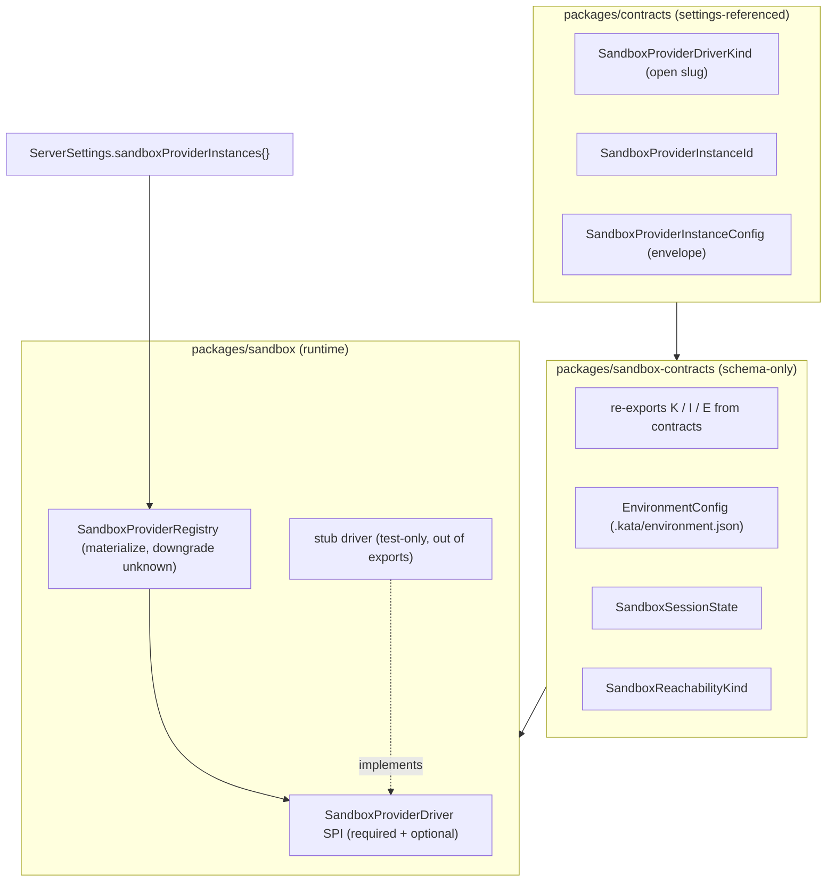
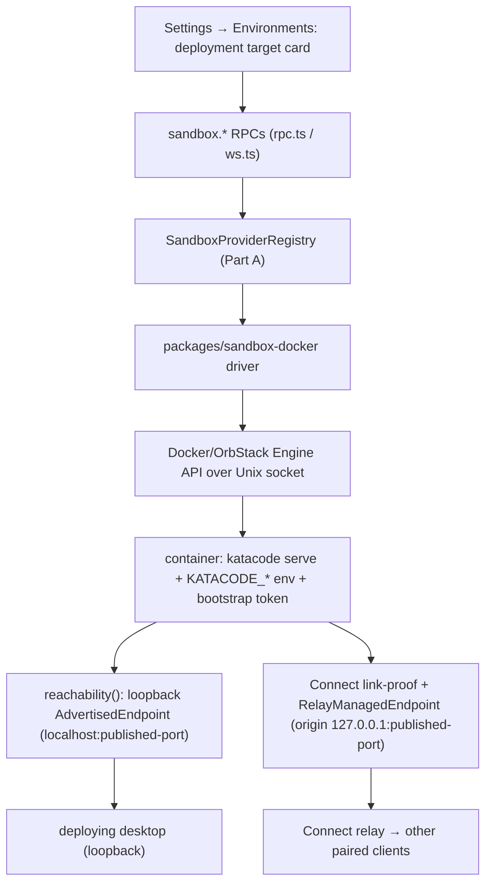

# Kata Environments / Deployments Phase 1 — Container driver + foundations

## Status

This is the Phase 1 deep-dive (one spec per phase; see the
[roadmap](/specs/2026-06-27-kata-environments-deployments-design.md)). It has two parts:

- **Part A — Foundations (Approved + frozen).** The non-demoable substrate: contracts, the
  capability-based `SandboxProvider` SPI, registry, `sandboxProviderInstances` settings field,
  test-only stub, and the container-feasibility spike. Part A freezes the SPI before the driver
  ships.
- **Part B — Container driver + demo (Implemented).** The `packages/sandbox-docker` driver,
  generalized secret redaction, `sandbox.*` RPCs, server provision + Connect auto-registration,
  the Settings → Environments UI, and the Phase 1 demo (AC-1.13). The single-client demo flow is
  e2e-automated under `@environments-deploy`; the two-client reachability slice (AC-1.11) is
  recorded as manual UAT per the roadmap standing rule. A strict quality review pass landed
  driver-routing, idempotency, and fail-loud fixes (see the [Build completion
  report](#build-completion-report-2026-06-29)).

Phase 1 is complete only when its demo (AC-1.13) passes. Part A and Part B ship together as one
phase; Part A is an internal checkpoint (SPI freeze), not a standalone deliverable. The three
Part B open questions were resolved during implementation: one `docker` kind (works against
Docker Desktop or OrbStack via `$DOCKER_HOST`), `validate` pulls a missing image, and the relay
managed endpoint fronts the loopback origin (no per-container `cloudflared` tunnel in Phase 1).

## Goal

Ship the first demoable surface of the deployments roadmap: a user configures a local container
deployment target in Settings → Environments, provisions it, and runs a Kata session inside an
isolated container with its own ports, reached directly over loopback and auto-joined to the
Connect pool. To get there, Part A first establishes the modular `SandboxProvider` substrate
(schema-only contracts + SPI + registry + settings field + stub + spike) and freezes the SPI;
Part B implements the container driver on that substrate, wires the UI and Connect registration,
and proves the flow end to end.

This is the first per-phase deep-dive under the
[Kata Environments — deployments (BYOC) roadmap](/specs/2026-06-27-kata-environments-deployments-design.md).
It implements roadmap Phase 1.

## Source of truth

- Master roadmap: [2026-06-27-kata-environments-deployments-design.md](/specs/2026-06-27-kata-environments-deployments-design.md)
  (Phase 1 Part A requirements, AC-1.1…AC-1.7; capability-based SandboxProvider SPI; container-first).
- Existing provider-instance pattern to mirror: `packages/contracts/src/providerInstance.ts`
  (`ProviderDriverKind` open slug, `ProviderInstanceId`, `ProviderInstanceConfig` envelope,
  `defaultInstanceIdForDriver`), `packages/contracts/src/settings.ts`
  (`providerInstances` map, whole-map patch).
- Existing `AdvertisedEndpoint` / reachability model to reuse:
  `packages/contracts/src/remoteAccess.ts`
  (`AdvertisedEndpointReachability: loopback | lan | private-network | public`,
  `AdvertisedEndpointProviderKind`), `packages/shared/src/advertisedEndpoint.ts`.
- Secret-storage infra to reuse: `apps/server/src/auth/ServerSecretStore.ts` (out-of-band
  `0o600` file store), `apps/server/src/serverSettings.ts`
  (`materializeProviderEnvironmentSecrets` / `persistProviderEnvironmentSecrets` redaction).
- Prior-art SPI shape: AgentBox `packages/core/src/cloud-backend.ts` and
  `packages/sandbox-docker/src/*` (`/Volumes/EVO/repos/agentbox`; pattern reference only).
- Container runtime for the spike: local Docker or OrbStack; no credentials required.

## Locked decisions (from roadmap + planning)

1. **New packages, no server wiring.** Phase 1 Part A adds `packages/sandbox-contracts` and
   `packages/sandbox`, plus `sandboxProviderInstances` in `ServerSettings`. No
   `environments.deploy.*`/`sandbox.*` RPCs, no registry wiring into running server layers. The
   server boots unchanged (AC-1.4).
2. **Distinct from `apps/server/src/cloud/`.** That directory is **Kata Code Connect** (relay
   CLI state, endpoints, environment keys) — a different concern. Phase 1 Part A does not touch it.
   The new packages are `@kata-sh/code-sandbox-contracts` and `@kata-sh/code-sandbox`.
3. **Capability-based SPI.** Required primitives + optional capabilities; registry checks
   presence and degrades gracefully. Frozen in this spec (see SPI section).
4. **Cycle-free package layout — settings-referenced contracts live in `packages/contracts`.**
   `packages/contracts/src/settings.ts` must reference `SandboxProviderInstanceId`,
   `SandboxProviderInstanceConfig`, and `SandboxProviderDriverKind` for the
   `sandboxProviderInstances` field. To keep `packages/contracts` a dependency leaf and avoid a
   `contracts` ⇄ `sandbox-contracts` cycle, those schemas are **defined in `packages/contracts`**
   in a new `sandboxProviderInstance.ts` module beside `providerInstance.ts`:
   `SandboxProviderDriverKind` (open slug), `SandboxProviderInstanceId`,
   `SandboxProviderInstanceConfig` (envelope), `SandboxProviderInstanceConfigMap`, and
   `defaultInstanceIdForSandboxDriver`. `packages/sandbox-contracts` **re-exports** all of them
   from `@kata-sh/code-contracts` so every later phase keeps a single import surface
   (`@kata-sh/code-sandbox-contracts`), and additionally owns the sandbox-only schemas with no
   settings dependency: `EnvironmentConfig`, `SandboxSessionState`, `SandboxReachabilityKind`.
   The dependency edge is one-directional (`sandbox-contracts` → `contracts`).
   `ProviderInstanceEnvironment` is reused (not redefined) for the `environment` field,
   single-sourcing the redaction contract. Distinct brand strings
   (`"SandboxProviderDriverKind"`, `"SandboxProviderInstanceId"`) keep the type systems separate.

5. **Secret-storage bar reuses existing infra.** Sandbox credentials and env secrets use the
   same `sensitive` + `valueRedacted` envelope and `ServerSecretStore` out-of-band file path as
   `providerInstances`. No plaintext in settings JSON. The existing
   `materializeProviderEnvironmentSecrets` / `persistProviderEnvironmentSecrets` helpers are
   hardcoded to iterate `settings.providerInstances`; a later phase generalizes them to also
   walk `sandboxProviderInstances` (extract to a shared helper — no duplication). Phase 1 Part A only
   fixes the contract shape so that generalization is mechanical and ships no writer for the
   field, so "no plaintext in settings" is a contract decision here, not yet an enforced/tested
   invariant.
6. **Container spike is a throwaway script + recorded findings.** Lives under
   `scripts/sandbox-spike/`, not shipped as product code. Findings recorded in this spec. No
   credentials needed; runnable on the dev machine and in CI.

## Current state (verified)

- `ServerSettings` (`packages/contracts/src/settings.ts`) carries
  `providerInstances: Record<ProviderInstanceId, ProviderInstanceConfig>` with a whole-map patch
  field and decodes unknown driver kinds without loss (documented invariant in
  `providerInstance.ts`).
- `AdvertisedEndpoint` + `AdvertisedEndpointReachability` (`loopback | lan | private-network |
public`) already exist in `packages/contracts/src/remoteAccess.ts` — Phase 1 Part A's
  `SandboxReachabilityKind` maps onto these, not a new axis.
- `ServerSecretStore` persists secrets as `<secretsDir>/<name>.bin` (dir `0o700`, files `0o600`,
  atomic temp-write+rename) and backs provider-instance sensitive env vars via redaction in
  `serverSettings.ts`.
- Packages use subpath `exports` pointing at `src/*.ts`, `tsgo --noEmit` for typecheck,
  `vite-plus` (`vp test`) for tests, `effect` from the workspace catalog. New packages follow
  the same conventions. `pnpm-workspace.yaml` already globs `packages/*`.
- `apps/server/src/cloud/` exists and is Kata Code Connect; out of scope here.

## Part A — Foundations

_Approved. Covers the non-demoable substrate: contracts, the capability-based SandboxProvider SPI,
registry, the `sandboxProviderInstances` settings field, a test-only stub driver, and the
container-feasibility spike. Satisfies AC-1.1 … AC-1.7 and freezes the SPI before Part B ships a
real driver on it._

## Architecture

Two new packages, mirroring the AgentBox split (contracts vs scaffolding) and the existing Kata
provider layering (schema-only contracts vs runtime registry). Reachability maps onto the
existing `AdvertisedEndpointReachability` model.



### `packages/contracts/src/sandboxProviderInstance.ts` (settings-referenced contracts)

Defined in `packages/contracts` (not `sandbox-contracts`) because `settings.ts` references them;
placing them here keeps `packages/contracts` a dependency leaf. Mirrors `providerInstance.ts`
discipline: no runtime logic, open branded slugs, unknown drivers round-trip.

- `SandboxProviderDriverKind` — open branded slug (same slug rules as `ProviderDriverKind`:
  starts with a letter, `[a-zA-Z0-9_-]`, 1..64 chars; distinct brand string
  `"SandboxProviderDriverKind"`). Not a closed union; unknown kinds parse successfully and the
  registry marks them unavailable.
- `SandboxProviderInstanceId` — user-defined routing-key slug, branded separately (distinct brand
  string `"SandboxProviderInstanceId"`, not reusing the existing `ProviderInstanceId` brand, so
  the type systems cannot be confused).
- `defaultInstanceIdForSandboxDriver(kind)` — canonical back-compat instance id (mirrors the
  provider helper; renamed from the provider `defaultInstanceIdForDriver` so the two coexist).
- `SandboxProviderInstanceConfig` — envelope: `{ driver, displayName?, enabled?, environment?,
config? }` where `config` is `Schema.Unknown` (driver owns its schema) and `environment`
  reuses the **same** `ProviderInstanceEnvironment` shape (`name`, `value`, `sensitive`,
  `valueRedacted?`) so the existing secret redaction path applies unchanged. Reused in-package
  (no new dependency), single-sourcing the redaction contract.
- `SandboxProviderInstanceConfigMap` — `Record<SandboxProviderInstanceId, SandboxProviderInstanceConfig>`.

### `packages/sandbox-contracts` (schema-only)

Re-exports the settings-referenced contracts above from `@kata-sh/code-contracts` so every later
phase has a single sandbox import surface, and owns the sandbox-only schemas that `settings.ts`
does not reference. Mirrors `providerInstance.ts` discipline: no runtime logic, unknown drivers
round-trip. Exports (each as a subpath export):

- **Re-exported from `@kata-sh/code-contracts`:** `SandboxProviderDriverKind`,
  `SandboxProviderInstanceId`, `SandboxProviderInstanceConfig`, `SandboxProviderInstanceConfigMap`,
  `defaultInstanceIdForSandboxDriver`.
- `EnvironmentConfig` — schema for `.kata/environment.json`: `{ build?: { dockerfile, context? },
snapshot?, install?, start?, terminals? }`. All fields optional; unknown fields tolerated
  (forward-compat). Schema only; no resolver logic here (resolver is Phase 2).
- `SandboxSessionState` — literal union: `provisioning | ready | error | disposed` (plus
  `unknown` for forward-compat). Used by later phases; defined now so the contract is stable.
- `SandboxReachabilityKind` — maps onto the existing `AdvertisedEndpointReachability`:
  `loopback` (local-container) | `public` (cloud tunnel) | `private-network` (future ssh/tailnet).
  Phase 1 Part A defines the literal; drivers map it to an `AdvertisedEndpoint` in later phases.

The `environment` field reuses the provider env shape deliberately: it lets a later phase
generalize the existing `materializeProviderEnvironmentSecrets`-style logic to also walk the
sandbox map (those helpers are currently hardcoded to `settings.providerInstances`). No second
redaction implementation. Because the envelope is defined in `packages/contracts`
(`sandboxProviderInstance.ts`), it imports `ProviderInstanceEnvironment` in-package with no new
dependency. **`packages/sandbox-contracts` depends on `@kata-sh/code-contracts`** to re-export
the settings-referenced contracts; the edge is one-directional (`sandbox-contracts` →
`contracts`), so `packages/contracts` stays a dependency leaf and no cycle forms.

### `packages/sandbox` (runtime SPI + registry)

#### SandboxProviderDriver SPI (frozen shape)

Required (every driver implements): `kind`, `validate`, `provision`, `exec`, `reachability`,
`dispose`, `describe`.

| Member                       | Purpose                                                                                                                                                                     |
| ---------------------------- | --------------------------------------------------------------------------------------------------------------------------------------------------------------------------- |
| `kind`                       | `SandboxProviderDriverKind` identity.                                                                                                                                       |
| `validate(config)`           | Credential/connectivity check ("Test connection").                                                                                                                          |
| `provision(req)`             | Create/boot a sandbox, apply base image/snapshot, run `install`.                                                                                                            |
| `exec(handle, cmd, opts?)`   | Run a command in the sandbox.                                                                                                                                               |
| `reachability(handle, port)` | Resolve how the client reaches a port, per `describe().reachabilityKind`; returns an `AdvertisedEndpoint`-shaped result (loopback URL for container, tunnel URL for cloud). |
| `dispose(handle)`            | Tear down the sandbox.                                                                                                                                                      |
| `describe()`                 | Capabilities, `reachabilityKind`, limits, which optional members exist.                                                                                                     |

Optional (driver may omit; registry exposes presence via `describe()` and callers guard with
capability checks): `createSnapshot` / `deleteSnapshot` / `snapshotExists` (snapshot lifecycle,
Phase 5), `renewTimeout` (extend session, Phase 3/4), `signedPreviewUrl` (Phase 4),
`networkPolicy` (later), `pause` / `resume` (where supported).

`describe()` returns a `SandboxProviderDescriptor`: `{ kind, reachabilityKind, maxLifetimeMs?,
supportsSnapshot, supportsRenewTimeout, baseImages? }`. Each boolean capability flag is `true`
only when **all** of that capability's methods are present (e.g. `supportsSnapshot` requires
`createSnapshot` AND `deleteSnapshot` AND `snapshotExists`). Flags must agree with method
presence (asserted in tests).

`SandboxProviderError` is a tagged Effect error with a `reason` and optional `cause`, so
failures are explicit (no silent fallback — roadmap constraint).

This SPI is **frozen by this spec**. Later phases may add optional capabilities but must not
change required signatures without a spec amendment.

#### SandboxProviderRegistry

- Built from a `SandboxProviderInstanceConfigMap` plus registered drivers keyed by
  `SandboxProviderDriverKind`.
- `materialize()` produces, per instance id, either an **available** materialized instance
  (driver found, config decodes) or an **unavailable** record carrying the reason
  (`unknown-driver` | `disabled` | `invalid-config`). Never throws on unknown driver (mirrors
  `ProviderInstanceRegistry` and the contract invariant).
- `get(instanceId)` returns the materialized instance or an unavailable marker.
- `list()` returns all materialized instances (available + unavailable) for UI/diagnostics.
- No process/resource lifecycle in Phase 1 Part A (no real driver runs); the registry is pure
  resolution over config + driver set.

#### Stub driver (test-only)

An in-memory driver implementing the full required SPI plus a configurable subset of optional
capabilities, used to test the registry and capability-presence logic. It is **not** declared in
`package.json#exports` at all — it lives under `packages/sandbox/src/testing/` and is imported
only via a relative path from co-located tests. Keeping it out of `exports` is what actually
prevents accidental production registration (a subpath export would remain importable in
production).

### `ServerSettings.sandboxProviderInstances`

Add to `ServerSettings` (and `ServerSettingsPatch` as a whole-map optional field, matching
`providerInstances`):

```
sandboxProviderInstances: Schema.Record(SandboxProviderInstanceId, SandboxProviderInstanceConfig)
  .pipe(Schema.withDecodingDefault(Effect.succeed({})))
```

`SandboxProviderInstanceId` and `SandboxProviderInstanceConfig` are imported from the new
`./sandboxProviderInstance.ts` module (same package), so `settings.ts` gains no cross-package
dependency.

Decoding an unknown driver kind in this map must succeed and round-trip the envelope verbatim
(AC-1.2). No server-layer reads this field yet (AC-1.4). **Connect auto-registration is a
Phase 1+ enforced constraint** (roadmap key decision 4; tested by AC-1.4 for containers and
AC-3.4 for cloud), not a Phase 1 Part A invariant — Phase 1 Part A ships no driver and no provision path.

### Container feasibility spike (gates Part B's risk, not Part A's merge)

A throwaway script `scripts/sandbox-spike/container-reachability.ts` (run locally; no
credentials) that:

**Transport (pinned).** The spike talks to the Docker/OrbStack daemon over the **raw Docker
Engine HTTP API on the Unix socket** (`/var/run/docker.sock`, or `$DOCKER_HOST`) using Node's
built-in `http`/`undici` over a socket path — **no Docker client npm dependency** (`dockerode`
et al.). This keeps Phase 1 Part A dependency-free (no lockfile/`allowBuilds` churn) and adds the script
to the existing `@kata-sh/code-scripts` package, which already compiles under `vp run typecheck`.
The Engine API endpoints exercised (`POST /containers/create`, `POST /containers/{id}/start`,
`GET /containers/{id}/json`, `DELETE /containers/{id}`) are cited in **Spike findings** as the
verified runtime API surface. Phase 1's `packages/sandbox-docker` may later adopt a typed client;
that is a Phase 1 decision, not a Phase 1 Part A dependency.

**Lint directive required.** This repo enforces an `nodeBuiltinImport` lint rule: any module
importing Node built-ins (`node:http`, `node:net`, etc.) must suppress it with
`// @effect-diagnostics nodeBuiltinImport:off` (every existing script under `scripts/` does
this — see `release-smoke.ts`, `resolve-connect-public-config.ts`). The spike must carry the
same directive or `vp check` fails. The `ws`/`wss` client side needs no dependency: `@types/node`
(v24) declares a global `WebSocket` (via `undici-types`), and `http.request({ socketPath })` is
typed, so the host-side script typechecks with zero new imports beyond Node built-ins.

1. Provisions a container via the local Docker/OrbStack Engine API.
2. Starts a trivial listener (HTTP + WebSocket) on a port inside the container.
3. Publishes/maps that port to `localhost` on the host.
4. Opens a `ws`/`wss` connection to `localhost:<port>` and exchanges a message.
5. Confirms a long-lived server process (a `katacode serve`-equivalent stub) runs cleanly
   inside the container and is reachable after the port mapping.

Findings (pass/fail per step and the verified runtime API surface) are recorded in this spec's
**Spike findings** section. A refutation blocks Phase 1 until container reachability is
re-planned. Unlike a cloud spike, this needs no credentials and runs in CI.

## Acceptance criteria

1. **AC-1.1** `packages/sandbox-contracts` and `packages/sandbox` build and pass
   `vp run typecheck`; `vp check` is clean. Both are added to the workspace and resolve via
   subpath exports.
2. **AC-1.2** A unit test decodes a `sandboxProviderInstances` map containing a
   **valid-but-unregistered** driver kind (a well-formed slug matching
   `/^[a-zA-Z][a-zA-Z0-9_-]*$/`, not one the registry knows) and asserts the envelope
   round-trips (encode∘decode is identity) with no data loss. This exercises registry-unknown
   decoding, not schema-rejection of a malformed slug (which fails decode by design).
3. **AC-1.3** A unit test builds a `SandboxProviderRegistry` with the stub driver registered and
   asserts: (a) a stub instance materializes as available; (b) an unknown-driver instance is
   unavailable with reason `unknown-driver` and does not throw; (c) a `disabled` instance is
   unavailable with reason `disabled`; (d) an instance whose `config` fails the stub's decode is
   unavailable with reason `invalid-config`.
4. **AC-1.4** With `sandboxProviderInstances` present in `ServerSettings` (default `{}` and a
   populated unknown-driver entry), the server boots unchanged: existing server/settings tests
   pass and no production sandbox driver is registered.
5. **AC-1.5** `describe()` capability flags match method presence: a unit test asserts that for
   the stub driver, `supportsSnapshot === (createSnapshot && deleteSnapshot && snapshotExists
all present)` and likewise for `renewTimeout`, across at least one driver variant with the
   capability and one without. (A capability flag is true only when all of its methods are
   present.)
6. **AC-1.6** SPI freeze (process + drift guard): `SandboxProvider` required members (`kind`,
   `validate`, `provision`, `exec`, `reachability`, `dispose`, `describe`) exist with the
   documented shapes, covered by a type-level conformance test (the stub satisfies the
   interface) so an accidental change to a required signature breaks the build. The actual
   freeze is the process rule (no required-signature change without a spec amendment); this test
   is a drift guard, not a substitute.
7. **AC-1.7** Container spike delivered: `scripts/sandbox-spike/container-reachability.ts`
   exists and **typechecks under `vp run typecheck`** (it lives in `@kata-sh/code-scripts` and
   talks to the Docker Engine API over the Unix socket via Node built-ins — no Docker client npm
   dependency — so "typechecks" means its imports resolve and it compiles). The **Spike findings**
   section records pass/fail for provision, port publish to `localhost`, sustained `ws`/`wss`, and
   long-lived process, with the verified Docker Engine API endpoints cited. If Docker/OrbStack is unavailable in the run
   environment, a "blocked: needs local Docker" finding satisfies this AC (the script still
   must typecheck); Part B is then blocked until the spike actually runs. No credentials
   required; the script is runnable locally and in CI. A refutation blocks Part B until
   re-planned. (This gates Part B's risk, not Part A's merge.)

> The master roadmap lists Phase 1 Part A's gate as AC-1.1 … AC-1.7 — identical numbering
> to this spec, so there is no roadmap/spec AC reconciliation gap.

## Implementation plan

1. **Add `packages/contracts/src/sandboxProviderInstance.ts`** — the settings-referenced
   contracts (`SandboxProviderDriverKind`, `SandboxProviderInstanceId`,
   `SandboxProviderInstanceConfig`, `SandboxProviderInstanceConfigMap`,
   `defaultInstanceIdForSandboxDriver`), reusing in-package `ProviderInstanceEnvironment` for
   `environment`. Add a `./sandboxProviderInstance` subpath export to
   `packages/contracts/package.json` and re-export from `src/index.ts`. Keeps `packages/contracts`
   a dependency leaf. _(AC-1.1, AC-1.2)_
2. **Scaffold `packages/sandbox-contracts`** — package.json (subpath exports, `effect` catalog,
   `tsgo`/`vp test`, **dependency on `@kata-sh/code-contracts`**), `tsconfig`, and modules:
   `instance.ts` (**re-exports** the settings-referenced contracts from `@kata-sh/code-contracts`),
   `environmentConfig.ts`, `sessionState.ts`, `reachability.ts`, `index.ts`. The sandbox-only
   schemas (`EnvironmentConfig`, `SandboxSessionState`, `SandboxReachabilityKind`) are defined
   here. _(AC-1.1, AC-1.2)_
3. **Scaffold `packages/sandbox`** — package.json/tsconfig; `SandboxProviderDriver.ts` (SPI
   types + `SandboxProviderError`), `SandboxProviderRegistry.ts`, `descriptor.ts`, a test-only
   `testing/stubDriver.ts` (out of `exports`), `index.ts`. _(AC-1.3, AC-1.5, AC-1.6)_
4. **Add `sandboxProviderInstances`** to `ServerSettings` and `ServerSettingsPatch`
   (`packages/contracts/src/settings.ts`), importing the types from `./sandboxProviderInstance.ts`
   (same package), with default `{}` and whole-map patch. _(AC-1.4)_
5. **Tests** — contracts round-trip (incl. unknown driver), registry materialization
   (available/unknown/disabled/invalid-config), descriptor↔method-presence agreement, settings
   decode with unknown sandbox driver, type-level SPI conformance. _(AC-1.2, AC-1.3, AC-1.4,
   AC-1.5, AC-1.6)_
6. **Container spike** — `scripts/sandbox-spike/container-reachability.ts`; run; record
   findings. _(AC-1.7)_
7. **Gate** — `vp check`, `vp run typecheck`, `vp run test`; record results. _(AC-1.1)_

Steps 1–3 can proceed in order then 4 (settings depends on step 1); the SPI work in step 3 can
proceed in parallel with steps 1–2 once the contract names are fixed; step 6 is independent of
1–5 and can run anytime (no credentials).

## Out of scope

- Any `environments.deploy.*`/`sandbox.*` RPC or server-layer registry wiring (Phase 1+).
- The Docker/OrbStack driver implementation (`packages/sandbox-docker`) beyond the throwaway
  spike script (Phase 1).
- The `.kata/environment.json` resolver and execution (Phase 2) — Phase 1 Part A defines the schema
  only.
- The Cloudflare driver (`packages/sandbox-cloudflare`) (Phase 3).
- Any UI (Settings/composer) — Phase 1+.
- Touching `apps/server/src/cloud/` (Kata Code Connect).
- Generalizing the secret-redaction helpers to walk `sandboxProviderInstances` (a later phase;
  Phase 1 Part A only fixes the contract shape).

## Risks and mitigations

- **SPI mis-design forces later churn.** Mitigation: validate the required/optional split
  against AgentBox's `CloudBackend` (and its `sandbox-docker` driver) before finalizing; lock
  with a type-level conformance test (AC-1.6).
- **Reachability/`AdvertisedEndpoint` mapping drift.** Mitigation: `SandboxReachabilityKind`
  maps onto the existing `AdvertisedEndpointReachability` literals rather than introducing a
  parallel axis; a test asserts the **forward** mapping is total (every `SandboxReachabilityKind`
  maps to some `AdvertisedEndpointReachability` literal) — not the reverse (the existing `lan`
  literal is intentionally unused by any V1 sandbox kind).
- **Contract drift from `providerInstance.ts`.** Mitigation: import/reuse the existing
  `ProviderInstanceEnvironment` schema rather than redefining it, so the secret path stays
  single-sourced.
- **Spike can't run without Docker/OrbStack.** Mitigation: the spike is local and needs no
  credentials; if Docker is unavailable in a given environment, AC-1.7 is satisfied by the
  committed + typechecking script and a "blocked: needs local Docker" finding, and Phase 1
  cannot complete until the spike runs (it gates Phase 1 risk, not Phase 1 Part A merge).
- **Spike adding a heavyweight dependency.** Mitigation: the spike uses the raw Docker Engine
  HTTP API over the Unix socket via Node built-ins — no `dockerode`/client package — so Phase 1 Part A
  adds no lockfile or `allowBuilds` churn. A typed client is a Phase 1 (`sandbox-docker`) choice.

## Spike findings

_Recorded 2026-06-27 from a live run of `scripts/sandbox-spike/container-reachability.ts`
against OrbStack (Docker Engine REST API over `/var/run/docker.sock`). Image
`node:22-alpine` (auto-pulled by the spike if absent)._

- Provision (local container): **pass** — `POST /containers/create` + `POST /containers/{id}/start`.
- Port publish to `localhost`: **pass** — `HostConfig.PortBindings` `HostPort: 0` (ephemeral host port), resolved via `GET /containers/{id}/json` `NetworkSettings.Ports["3000/tcp"][0].HostPort`.
- Sustained `ws` to `localhost:<port>`: **pass** — host global `WebSocket` (Node 24) to `ws://localhost:<hostPort>/ws`; in-container hand-rolled RFC 6455 echo (Node built-ins only, no `ws` npm package in the image).
- Long-lived server process runs cleanly + reachable: **pass** — in-container `node /tmp/srv.mjs` served `/healthz` 200 after readiness poll.
- Verified Docker/OrbStack runtime API surface: **Docker Engine REST API over Unix socket** — `GET /_ping`, `POST /images/create`, `GET /images/{name}/json`, `POST /containers/create`, `POST /containers/{id}/start`, `GET /containers/{id}/json`, `DELETE /containers/{id}?force=true`. No `dockerode`; Node built-ins only.
- Phase 1 gate decision: **unblocked** — raw-socket transport is viable for provision + port mapping + reachability. `packages/sandbox-docker` (Part B) reuses this transport; no `docker` CLI fallback needed.

## Part A build handoff (foundations slice)

- **Approved scope:** two new packages (`sandbox-contracts`, `sandbox`), `sandboxProviderInstances`
  settings field, test-only stub driver, frozen capability-based SandboxProvider SPI,
  container-spike script + findings. No server wiring, no driver, no UI.
- **Part A non-goals (deferred to Part B or later phases):** RPCs, registry wiring, Docker
  driver, Cloudflare driver, resolver, UI, Connect changes, secret-redaction generalization.
- **Required verification:** AC-1.1…AC-1.7 + CI parity (`vp check`, `vp run typecheck`,
  `vp run test`).
- **Blocking questions:** none — all Part A decisions locked. The spike result feeds Part B
  planning, not Part A completion.

---

## Part B — Container driver + demo

\_Drafted. Builds on Part A's frozen SPI. Restates AC-1.8 … AC-1.13 from the roadmap
for self-containment; the roadmap remains authoritative on conflicts. Blocked on Part A landing

- the AC-1.7 spike finding + the three open questions below.\_

### Sequencing constraint

**Part B is blocked on Part A landing first.** Part A ships the SPI + registry +
`sandboxProviderInstances` settings field + the container-feasibility spike. Part B's driver
implements the frozen SPI; its UI writes the new settings field; its transport choice is gated
by the spike findings (AC-1.7). No Part B code is written until Part A is merged and the spike
has run (or recorded its "blocked" finding, in which case Part B is blocked too).

### Locked decisions (Part B)

1. **Transport: raw Docker Engine HTTP API over the Unix socket, zero npm deps.**
   `packages/sandbox-docker` reuses the same transport Part A's spike pins
   (`scripts/sandbox-spike/container-reachability.ts`): `http.request({ socketPath })` against
   `/var/run/docker.sock` (or `$DOCKER_HOST`), no `dockerode`. This keeps Phase 1 dependency-free
   and consistent with the spike. If the spike (AC-1.7) refutes raw-socket viability for a
   required primitive (e.g. streaming exec logs), Part B falls back to shelling out to the
   `docker`/`orb` CLI (AgentBox's proven path) — a runtime binary dependency, still no npm dep.
   That fallback is a spec amendment, recorded against the spike finding. No typed client
   (`dockerode`) in Phase 1.
2. **Per-deployment Connect link, not shared with the desktop.** Each container runs its own
   `katacode serve` with its own `EnvironmentId` and its own keypair
   (`getOrCreateEnvironmentKeyPairFromSecretStore`). The relay link proof is bound to an
   `environmentId`, so each deployment mints its own link. The container's `reachability()`
   returns a loopback `AdvertisedEndpoint`; auto-registration constructs a
   `RelayManagedEndpoint` with `RelayManagedEndpointOrigin({ localHttpHost: "127.0.0.1",
localHttpPort: <published-port> })` and goes through the existing link-proof path so other
   paired clients reach it via the relay. Honors roadmap key decision 4 (every deployment
   auto-registers with Connect on provision).
3. **Driver config form reuses `ProviderSettingsForm` + `makeProviderSettingsSchema`.** The
   container driver's config (image, optional resource limits, optional extra env) is a
   `Schema.Struct` annotated with `providerSettingsForm` controls, rendered by the existing
   `ProviderSettingsForm` — no new form primitive.
4. **Settings UI mirrors the provider-instance list, surfaced under the existing
   Connections/Environments panel.** Deployment targets are a new kind of entry in
   Settings → Environments (roadmap key decision 1), implemented as an `AddProviderInstanceDialog`-shaped
   "Add deployment target" dialog + a `ProviderInstanceCard`-shaped card, writing to
   `sandboxProviderInstances` via `useUpdateSettings` (whole-map patch, matching
   `providerInstances`). No new top-level settings section.
5. **Minimal "Start session" affordance on the deployment card, superseded by the composer in
   Phase 4.** Exists only so the Phase 1 demo (agent turn completes container-side, AC-1.10) is
   reachable without the composer "Run on" picker. Removed/absorbed when Phase 4 lands.
6. **Phase 1 container driver does not implement snapshots.** `describe().supportsSnapshot ===
false`; `createSnapshot`/`deleteSnapshot`/`snapshotExists` absent. Snapshots are Phase 5.
   `describe().supportsRenewTimeout === false` for Phase 1 as well.

### Architecture (Part B)



#### `packages/sandbox-docker` (the driver)

Implements the frozen `SandboxProviderDriver` SPI from Part A against a local Docker/OrbStack
runtime, over the raw Engine HTTP API (decision B1).

- `kind` — `SandboxProviderDriverKind.make("docker")` (or `"orbstack"` — see open question below).
- `validate(config)` — reach the daemon (`GET /_ping` on the socket), confirm the configured
  image is present (`GET /images/{id}/json`, pulling on first use is a Phase 1 decision). Returns
  success/failure with a specific reason; powers "Test connection" (AC-1.9).
- `provision(req)` — `POST /containers/create` with `KATACODE_*` env + the bootstrap token, port
  mapping `HostPort: 0` for the katacode port (Docker assigns an ephemeral host port),
  `POST /containers/{id}/start`, then poll `GET /containers/{id}/json` + the readiness URL
  (mirrors `waitForHttpReady` in `DesktopBackendManager.ts`) until `katacode serve` is ready.
  Returns a handle carrying `containerId`, the published host port, the in-container
  `EnvironmentId` (read from the server descriptor), and the bootstrap token.
- `exec(handle, cmd, opts?)` — `POST /containers/{id}/exec` + `POST /exec/{execId}/start` (HTTP
  hijacked stream). Phase 1 uses exec for `install`-free smoke flows; full env-config `install`
  is Phase 2.
- `reachability(handle, port)` — `createAdvertisedEndpoint` (from
  `packages/shared/src/advertisedEndpoint.ts`) with `reachability: "loopback"`, a new sandbox
  `AdvertisedEndpointProvider` (`kind: "manual"`, or a new core provider id),
  `httpBaseUrl: http://localhost:<published-port>`. This is the endpoint the deploying desktop
  connects to directly.
- `dispose(handle)` — `DELETE /containers/{id}?force=true` + remove the Connect link (see below).
- `describe()` — `{ kind, reachabilityKind: "loopback", supportsSnapshot: false,
supportsRenewTimeout: false, baseImages?: [<configured image>] }`.

The `KATACODE_*` env + bootstrap token passed into the container mirror
`DesktopBackendConfiguration.resolveBackendStartConfig` / `DesktopBackendBootstrap`
(`packages/contracts/src/desktopBootstrap.ts`): `KATACODE_PORT`, `KATACODE_MODE=desktop`,
`KATACODE_NO_BROWSER`, `KATACODE_HOST`, and `desktopBootstrapToken` as the non-loopback auth
credential. The in-container `katacode serve` starts with this bootstrap payload, so it is a
Kata server like any other.

#### Connect auto-registration glue (server-side, in `apps/server`)

A new server-side service (e.g. `apps/server/src/sandbox/` or `apps/server/src/environments/`)
owns provision orchestration and the Connect registration final step. On a successful
`provision()`, before returning "ready", it:

1. Reads the in-container server descriptor to get the container's `EnvironmentId`.
2. `getOrCreateEnvironmentKeyPairFromSecretStore` for that `environmentId`
   (`apps/server/src/cloud/environmentKeys.ts`).
3. Constructs `RelayManagedEndpointOrigin({ localHttpHost: "127.0.0.1", localHttpPort:
<published-port> })` + a `RelayManagedEndpoint` and runs the link-proof path
   (`apps/server/src/cloud/http.ts` `reconcileDesiredCloudLink`) so the relay fronts the
   loopback origin for other paired clients.
4. (Optional in Phase 1) `CloudManagedEndpointRuntime.applyConfig` with a tunnel config if a
   public tunnel is wanted; the loopback-only path is the Phase 1 default (other clients go via
   the relay's managed endpoint, not a per-container tunnel).

`apps/server/src/cloud/` itself is not modified (out of scope per Part A); Part B calls its
existing entry points. `dispose()` removes the link (the relay's unlink path).

#### RPC surface (added to `packages/contracts/src/rpc.ts` + `apps/server/src/ws.ts`)

Following the established `Ws…Rpc = Rpc.make(WS_METHODS.x, { payload, success, error, stream? })`
pattern, registered in `WsRpcGroup` with an auth scope entry:

- `sandbox.listInstances` (read) → the materialized `SandboxProviderRegistry.list()`
  (available + unavailable, for UI diagnostics).
- `sandbox.upsertInstance` / `sandbox.removeInstance` (operate) → whole-map patch to
  `sandboxProviderInstances` (mirrors `providerInstances` patching; credentials via the
  `ServerSecretStore` redaction path, generalized to also walk `sandboxProviderInstances` —
  see "Secret-redaction generalization" below).
- `sandbox.testConnection` (operate, **streaming**) → `validate(config)` + a minimal
  `provision`+`dispose` round-trip, streaming progress events (follows
  `cloudInstallRelayClient`'s `Stream.callback` pattern). Powers AC-1.9.
- `sandbox.startSession` (operate) → `provision(req)` + Connect registration; returns the
  `ExecutionEnvironmentDescriptor` + loopback `AdvertisedEndpoint` for the client to bind a
  thread to. Powers AC-1.10.
- `sandbox.disposeSession` (operate) → `dispose(handle)` + Connect unlink.

#### Settings UI (in `apps/web/src/components/settings/`)

- An "Add deployment target" dialog mirroring `AddProviderInstanceDialog.tsx`: pick driver
  (Phase 1: only `docker`; the open-slug design means unknown drivers parse and show
  "unavailable"), fill label + auto-derived `SandboxProviderInstanceId`, render the driver config
  via `ProviderSettingsForm`.
- A deployment-target card mirroring `ProviderInstanceCard.tsx`: display name, driver config,
  env vars (`ProviderEnvironmentSection`), and the Part B controls: **Test connection**
  (streams `sandbox.testConnection` progress), **Start session** (the minimal affordance,
  decision B5), **Dispose**.
- Surfaced under the existing `ConnectionsSettings.tsx` (Environments panel) as a new entry
  kind alongside the URL/pairing entries.
- Writes go through `useUpdateSettings` against `sandboxProviderInstances`.

#### Secret-redaction generalization (the one Part A explicitly deferred)

Part A fixed the contract shape (`environment` reuses `ProviderInstanceEnvironment`) but left
`materializeProviderEnvironmentSecrets` / `persistProviderEnvironmentSecrets` hardcoded to
`settings.providerInstances`. Part B generalizes them to also walk `sandboxProviderInstances` —
extracted to a shared helper over both maps, no duplication (AGENTS.md maintainability). This is
in-scope for Part B because the UI writes sandbox instance env vars and they must round-trip
through the redaction path (AC-1.8: no plaintext in settings).

### Implementation plan (Part B)

1. **Land Part A first** (separate work): `packages/contracts/src/sandboxProviderInstance.ts`,
   `packages/sandbox-contracts`, `packages/sandbox` (SPI + registry + stub),
   `sandboxProviderInstances` settings field, and run the spike (AC-1.7). Part B starts only
   after the SPI is frozen and the spike finding is recorded.
2. **`packages/sandbox-docker` driver** — implement `validate`/`provision`/`exec`/`reachability`/
   `dispose`/`describe` over the raw Engine API; unit tests against the registry's stub-shaped
   contract + a Docker-available integration test guarded by daemon presence. _(AC-1.9, AC-1.10,
   AC-1.12)_
3. **Generalize secret redaction** to walk both `providerInstances` and `sandboxProviderInstances`
   via a shared helper. _(AC-1.8)_
4. **RPCs** — add `sandbox.*` to `rpc.ts` + `WsRpcGroup` + auth scopes; handlers in
   `apps/server/src/ws.ts` delegating to the new sandbox service module; `testConnection`
   streaming. _(AC-1.9, AC-1.10)_
5. **Server provision orchestration + Connect registration** — the sandbox service module's
   `startSession`/`disposeSession` wiring the driver to `environmentKeys` +
   `reconcileDesiredCloudLink` + `CloudManagedEndpointRuntime`. _(AC-1.11)_
6. **Settings UI** — "Add deployment target" dialog + card + Test connection + Start session +
   Dispose, under `ConnectionsSettings`. _(AC-1.8, AC-1.10)_
7. **Demo walkthrough → e2e** — `playwright-cli` walkthrough of the full flow, then encode as
   `e2e/tests/environments-deploy/container-deploy.spec.ts` tagged `@environments-deploy`
   (add the tag to `e2e/src/config/tags.ts`). _(AC-1.13)_
8. **Gate** — `vp check`, `vp run typecheck`, `vp run test`, `vp run e2e --project
desktop-dev --grep @environments-deploy`. _(AC-1.1 gate still applies)_

### Acceptance criteria (Part B — restated from the roadmap)

8. **AC-1.8** A user can add a local container deployment target in Settings → Environments and
   any credentials persist via the reused `ServerSecretStore` path (no plaintext in settings).
9. **AC-1.9** "Test connection" provisions a minimal container and disposes it, returning a
   visible success; invalid config returns a visible, specific failure.
10. **AC-1.10** Starting a session in a container boots `katacode serve` inside it and the
    deploying desktop reaches it over `localhost` (loopback); an agent turn completes
    container-side.
11. **AC-1.11** The container deployment **auto-registers with Connect** on provision and a
    second paired client (e.g. mobile or hosted web) can reach it via the relay with no manual
    setup.
12. **AC-1.12** Disposing the container releases it and the deployment disappears from the
    Connect pool; a container with its own published ports does not collide with a second
    concurrent container (isolation verified).
13. **AC-1.13 (Demo & e2e)** The Part B demo flow (AC-1.8 … AC-1.12) is proven by a
    `playwright-cli`/`agent-browser` walkthrough against the running desktop app, then encoded
    as a Playwright Electron e2e test under `e2e/tests/` tagged `@environments-deploy`, passing
    via `vp run e2e --project desktop-dev --grep @environments-deploy`. The single-client flow
    (add target → test connection → start session → agent turn completes → dispose) is fully
    e2e-automated; the "second paired client reaches it via Connect" slice (AC-1.11) has no
    existing two-client harness and falls back to a recorded manual UAT per the roadmap standing
    rule, with the live walkthrough as evidence.

### Demo & e2e plan

- **New tag:** add `environmentsDeploy: "@environments-deploy"` to `e2e/src/config/tags.ts`.
- **New flow helpers** in `e2e/src/flows/settings.ts`: `openEnvironmentsSettings(page)`,
  `addDeploymentTarget(page, { label, image })`, `runTestConnection(page)` (assert streaming
  progress + success), `startContainerSession(page)`, `disposeContainerSession(page)`.
- **New spec** `e2e/tests/environments-deploy/container-deploy.spec.ts`, composing
  `authenticatedAppWindow` + the new flows. The agent-turn slice reuses `agentChat.ts`
  (`selectComposerModel` + `sendAgentInstruction` + `expectAssistantReply`) bound to the
  container `EnvironmentId`.
- **Prereqs (fail loud):** the test requires a reachable Docker/OrbStack daemon; assert it up
  front (mirror `assertAgentPrerequisites`) and fail with a clear message if absent — do not
  silently skip.
- **Two-client slice:** manual UAT (a second paired client, e.g. mobile or a second desktop
  profile, confirms the deployment appears in its Connect pool and reaches it). Record a
  walkthrough as evidence in the PR.

### Risks and mitigations (Part B)

- **Raw-socket transport insufficiency.** The Engine API's hijacked exec stream and attach
  endpoints are more awkward over raw `http` than via a typed client. Mitigation: the AC-1.7
  spike is the gate; if a primitive is infeasible raw, fall back to the `docker` CLI (decision
  B1) via a spec amendment. No `dockerode` in Phase 1.
- **Connect link per deployment churn.** Minting a keypair + link per container is heavier than
  reusing the desktop's. Mitigation: the relay proof is bound to `environmentId` by design, so
  per-deployment is correct, not a shortcut; keys are cheap (ed25519 in `ServerSecretStore`).
- **Two-client e2e gap.** No existing harness drives two paired clients. Mitigation: encode the
  single-client flow as e2e (the bulk of the demo) and record the two-client reachability as
  manual UAT per the standing rule; a two-client harness is a follow-up, not a Phase 1 blocker.
- **Port isolation.** Two concurrent containers must not collide. Mitigation: `HostPort: 0` lets
  Docker assign ephemeral host ports; `reachability()` resolves the published port per handle;
  AC-1.12 verifies two concurrent containers.
- **`docker` vs `orbstack` driver kind.** OrbStack exposes a Docker-compatible API but users may
  think of it as a distinct runtime. Open question (below): one `docker` kind that works against
  either via `$DOCKER_HOST`, or two kinds. Lean: one `docker` kind for Phase 1 (OrbStack is
  Docker-API-compatible); revisit if the spike shows a divergence.

### Open questions (Part B, to resolve before Part B implementation)

- **Driver kind slug:** `docker` (works against Docker Desktop or OrbStack via `$DOCKER_HOST`) or
  separate `docker` + `orbstack` kinds? Lean: one `docker` kind for Phase 1.
- **Image pull on first provision:** pull automatically if the configured image is absent, or
  fail `validate` with a specific "image not present" reason and let the user pull? Lean: fail
  loud with a specific reason (roadmap fail-loud constraint); a "pull image" affordance is a
  small Phase 1 addition if the walkthrough shows it's needed.
- **Tunnel for non-deploying clients in Phase 1:** loopback-only + relay managed endpoint (no
  per-container `cloudflared` tunnel) is the default; is that sufficient for AC-1.11, or does the
  relay need a tunnel per deployment? Lean: relay managed endpoint suffices (it already fronts
  loopback origins); confirm against `ManagedEndpointRuntime` during implementation.

### Part B build handoff

- **Scope:** `packages/sandbox-docker` driver, generalized secret redaction, `sandbox.*` RPCs +
  handlers, server provision/Connect orchestration, Settings → Environments deployment-target
  UI (dialog + card + Test connection + Start session + Dispose), and the `@environments-deploy`
  e2e test. No composer (Phase 4), no env-config `install` execution (Phase 2), no snapshots
  (Phase 5), no cloud driver (Phase 3).
- **Blocked on:** Part A merged + AC-1.7 spike finding recorded.
- **Required verification:** AC-1.8 … AC-1.13 + CI parity + `vp run e2e --project desktop-dev
--grep @environments-deploy` (single-client) + manual UAT (two-client reachability).

## Build completion report (2026-06-29)

Part B is implemented on `feat/kata-cloud` (Part A foundations + Part B driver/RPC/UI/e2e).

**Delivered:**

- `packages/sandbox-contracts` — `reachability`, `sessionState`, `environmentConfig` schemas
  plus re-exports of the contracts-layer sandbox-instance schemas (cycle-avoidance documented in
  `packages/contracts/src/sandboxProviderInstance.ts`).
- `packages/sandbox` — the frozen `SandboxProvider` SPI (`SandboxProviderDriver.ts`),
  `SandboxProviderRegistry` with graceful unknown-driver degradation, and a test stub driver.
- `packages/sandbox-docker` — `DockerSandboxProvider` over the raw Docker Engine HTTP API
  (`dockerEngine.ts`, no `dockerode`), config schema, and a smoke script.
- `apps/server/src/sandbox/SandboxService.ts` — `sandbox.listInstances` /
  `testConnection` (streaming) / `startSession` (provision + Connect auto-registration) /
  `disposeSession` RPC handlers, wired into `apps/server/src/ws.ts`.
- `apps/web/src/components/settings/SandboxDeploymentSettings.tsx` — Settings → Environments
  deployment-target UI (add dialog, target card, Test connection / Start session / Dispose).
- `e2e/tests/environments-deploy/container-deploy.spec.ts` tagged `@environments-deploy`, with
  flow helpers in `e2e/src/flows/settings.ts` and the `environmentsDeploy` tag in
  `e2e/src/config/tags.ts`.
- Generalized `ServerSecretStore` redaction to `sandboxProviderInstances` (AC-1.8).

**Open questions resolved during implementation:** one `docker` kind (OrbStack via
`$DOCKER_HOST`); `validate` pulls a missing image (404 → `images/create`); the relay managed
endpoint fronts the loopback origin, so no per-container `cloudflared` tunnel in Phase 1.

**Strict quality review pass (2026-06-29).** An adversarial two-reviewer review of the
`feat/kata-cloud` diff landed fixes on `b3b7f25bc` / `8af7d6bf9` / `5fa629c89`:

- `disposeSession` now routes through the driver stored alongside the handle in
  `runningSessions` instead of hardcoding `DockerSandboxProvider` (correctness for future
  non-Docker drivers).
- `startSession` guards against concurrent calls for the same `instanceId` (double-click during
  the up-to-60s provision window) that would orphan containers.
- `registryError` passes the reason through verbatim; a disabled instance surfaces as
  `disabled`, not coerced to `invalid-config`.
- `resolveConfig` dropped the silent try/catch fallback so malformed config fails loudly
  (AGENTS.md fail-loud) instead of running the wrong container.
- `DockerSandboxProvider.provision` uses `req.image` as the authoritative image (SPI contract),
  removing the driver-specific image cast from the service layer.
- `dispose` logs a warning on daemon errors instead of silently swallowing them.
- The settings UI deduped busy-state cleanup behind a `withBusy` helper and inlined the RPC
  client consistently with `ConnectionsSettings.tsx`.
- `scripts/release-smoke.ts` was missing the three new sandbox packages from its manifest
  fixture (broke `release:smoke` with `ERR_PNPM_WORKSPACE_PKG_NOT_FOUND`); added them.

**Deferred work filed:** [#18](https://github.com/gannonh/kata-code/issues/18) reclaim orphaned
containers on server restart, [#19](https://github.com/gannonh/kata-code/issues/19) share the
Docker config schema between the web UI and driver. Both recorded in the
[deferred-work registry](/specs/deferred-work.md).

**Verification:** `vp run typecheck` 0 errors, `vp check` 0 errors, `vp run test` repo-green
across all packages, `vp run release:smoke` passed. The two-client AC-1.11 slice remains manual
UAT per the spec standing rule.

**Known follow-ups:** the deferred-work items above; a dedicated architecture note for the
sandbox SPI / deployment-target layer is not yet in `docs/architecture/` (future OKF pass).
