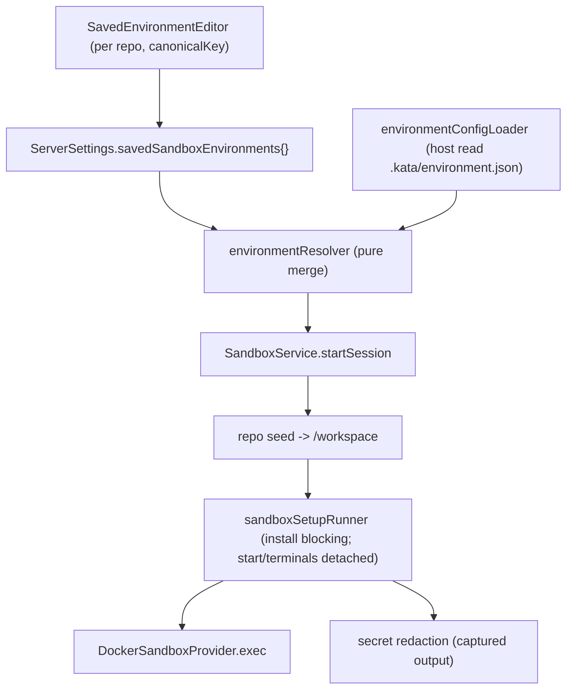

# Kata Environments / Deployments Phase 2 — Manual environment configuration & execution

## Status

Approved.

This is the Phase 2 deep-dive (one spec per phase; see the
[roadmap](/specs/2026-06-27-kata-environments-deployments-design.md)). It implements roadmap
Phase 2 ("Manual environment configuration & execution") and builds directly on the
[Phase 1 foundation](/specs/2026-06-27-kata-environments-deployments-phase-1-design.md) (the
frozen `SandboxProvider` SPI, the `SandboxProviderRegistry`, the container driver, the
`sandbox.*` RPCs, and Connect auto-registration).

## Goal

Make `.kata/environment.json` real. Phase 1 boots `katacode serve` in a container with no repo
inside it; Phase 2 resolves a per-repo environment config, seeds the repo into the sandbox, runs
the configured setup (`install`, then `start`/`terminals`), and injects Kata-stored secrets as
environment variables with redaction in logs. It also adds a saved-environment editor to the
existing deployment-target card so a repo's config can be authored and persisted in Settings.

Resolution order (first match wins, per the roadmap): repo `.kata/environment.json` → saved
per-repo environment in Settings (keyed by `RepositoryIdentity.canonicalKey`) → provider base
default. `build` and `snapshot` fields are **resolved but not executed** in Phase 2 (custom image
build stays deferred; snapshots are Phase 5). The container always boots the configured base
image.

## Source of truth

- Master roadmap:
  [2026-06-27-kata-environments-deployments-design.md](/specs/2026-06-27-kata-environments-deployments-design.md)
  (Phase 2 requirements, AC-2.1 … AC-2.6; resolution order; secrets via `ServerSecretStore`).
- Phase 1 deep-dive:
  [2026-06-27-kata-environments-deployments-phase-1-design.md](/specs/2026-06-27-kata-environments-deployments-phase-1-design.md)
  (frozen SPI, registry, container driver, `sandbox.*` RPCs, Connect registration).
- `EnvironmentConfig` schema (already shipped in Phase 1):
  `packages/sandbox-contracts/src/environmentConfig.ts`
  (`build?`, `snapshot?`, `install?`, `start?`, `terminals?`; all optional, unknown fields
  tolerated).
- Driver SPI: `packages/sandbox/src/SandboxProviderDriver.ts`
  (`provision`, `exec(handle, cmd, { cwd? })` returns `{ exitCode, stdout, stderr }`,
  `reachability`, `dispose`, `describe`). **Frozen** — Phase 2 adds no required member.
- Container driver: `packages/sandbox-docker/src/DockerSandboxProvider.ts`
  (`exec` over the Docker Engine exec API; `provision` boots `Cmd: ["sh","-c", command]`).
- Server orchestration: `apps/server/src/sandbox/SandboxService.ts`
  (`startSession` provision + Connect registration; `runningSessions` map).
- Repository identity: `packages/contracts/src/environment.ts`
  (`RepositoryIdentity.canonicalKey` — the saved-env keying surface).
- Secret infra (already generalized to sandbox in Phase 1):
  `apps/server/src/serverSettings.ts`
  (`materializeSandboxProviderEnvironmentSecrets` / `persistInstanceEnvironmentSecrets` over both
  maps), `apps/server/src/auth/ServerSecretStore.ts`.
- Existing Settings UI to extend: `apps/web/src/components/settings/SandboxDeploymentSettings.tsx`
  (the Phase 1 deployment-target card, currently ~810 lines).
- UI reference comps: `docs/comps/cursor-cloud/SCR-20260627-hqeu.png` (Update Script, network
  access, Secrets), `SCR-20260627-hpyw.png` (Defaults, Secrets). Interaction/IA references only;
  Kata branding and existing styling win on conflict.

## Locked decisions (from planning)

1. **Repo seeding is in Phase 2, via a new optional SPI capability.** Phase 2 copies the active
   repo working tree into the sandbox at a known path (`/workspace`) before resolve+install, so
   `install`/`start`/`terminals` run against real files. Full git branch-sync + move semantics
   remain Phase 4. The seed is a bounded working-tree archive (skip the VCS metadata dir and
   `node_modules`; respect ignored paths), not a clone, so Phase 2 needs no push remote.

   **Transport — the frozen `exec` cannot carry file bytes.** The frozen SPI exposes only
   `validate`/`provision`/`exec`/`reachability`/`dispose`/`describe`; `exec` has no stdin,
   `provision` has no files/volume field, and `dockerEngine.dockerRequest` today sends only a
   JSON string body (`Content-Type: application/json`) and reads responses as utf8 — there is no
   path to place repo bytes inside the container. Phase 2 therefore **adds a new optional SPI
   capability** `copyInto(handle, archive, destPath)` (permitted by the frozen-SPI rule, which
   allows new _optional_ members via spec amendment — this spec is that amendment). The container
   driver implements `copyInto` via `PUT /containers/{id}/archive` (tar stream), which requires a
   bounded extension to `dockerEngine.ts` to send a **binary** body with `Content-Type:
application/x-tar`. `describe()` advertises `supportsCopyInto`; a driver lacking it cannot be
   seeded (cloud drivers in Phase 3 seed via their own mechanism — git clone or native upload —
   so the capability is genuinely driver-specific, not portable through `exec`).

2. **Resolver reads host-side, pre-provision.** The resolver reads
   `<repoRoot>/.kata/environment.json` from the host working tree before/at provision, merges it
   with the saved per-repo environment (keyed by `RepositoryIdentity.canonicalKey`) and the
   provider default, then drives provision and the `install`/`start` commands. Resolution is a
   pure function over already-read inputs; the host-side file read and the saved-env lookup are
   the only I/O.

3. **Repo binding is an explicit `startSession` input.** Phase 1's `startSession(instanceId,
settings, options)` carries no repo, and the deployment target is not repo-scoped. Phase 2
   adds a required **repo selection** input — `{ repoRoot, repositoryIdentity }` (the host path to
   read `.kata/environment.json` from, plus the `RepositoryIdentity` whose `canonicalKey` keys
   the saved-env lookup) — to the start entry point. The composer-driven "Run on" repo binding is
   still Phase 4; Phase 2 supplies the repo through the minimal "Start session" affordance the
   Phase 1 card already exposes (which knows the active repo). Without this input AC-2.6 is
   unverifiable.

4. **Provider default is an empty no-op config.** The resolution chain's terminal fallback is an
   empty `EnvironmentConfig` (`{}`) — no `install`/`start`/`terminals`. It is **not** derived from
   `DEFAULT_DOCKER_CONFIG` (which is a `DockerSandboxConfig` of `image`/`command`/`port`, a
   different shape with no setup fields). When nothing is configured, setup is a no-op and the
   container just boots `katacode serve` as in Phase 1.

5. **Long-lived processes use detached `exec` (no new member for this).** `install` runs as a
   blocking `exec`. `start` and the `terminals` entries run as **detached** background commands
   through the existing `exec` primitive (e.g. `setsid sh -c '<cmd>' >logfile 2>&1 &`), each
   tracked by a server-side process record keyed on name/command (no pid — the frozen `exec`
   returns none). The only SPI change in Phase 2 is the optional `copyInto` capability for
   seeding (decision 1); the long-lived-process path adds no member. Process presence is verified
   by listing container processes (AC-2.3), which also serves as the feasibility proof that a
   detached process survives the `exec` return (see Risks).

6. **`build`/`snapshot` resolve but do not execute.** The resolver parses and round-trips
   `build` and `snapshot`, but execution ignores them: the container always boots the configured
   base image, with no custom image build and no snapshot capture/restore. Phase 5 wires
   snapshots; custom-image build stays deferred.

7. **Saved-env editor extends the deployment-target card.** The saved-environment editor
   (install/update script, `start`/`terminals`, a stored network-access setting, and secrets via
   the existing redaction path) is added to the existing `SandboxDeploymentSettings` surface,
   not a new top-level section. Because `SandboxDeploymentSettings.tsx` is already ~810 lines,
   the editor is **extracted into its own component** (`SavedEnvironmentEditor.tsx`) rather than
   growing that file.

8. **Buffered exec + redaction, with two required driver fixes.** Phase 2 uses the buffered
   `exec` result, applies secret-value redaction to captured output before surfacing/logging, and
   raises an explicit error on a non-zero `install` exit. Live streaming exec logs are deferred.
   Two Docker-driver implementation fixes are required (signatures unchanged, so the freeze
   holds): (a) the driver's `exec` currently **ignores `opts.cwd`** — Phase 2 must set
   `WorkingDir` from `cwd` so `install` runs in `/workspace`; (b) the driver's `exec` returns the
   **raw multiplexed Docker stream** (8-byte frame headers, `stderr` folded into `stdout` and
   currently returned as `""`) — Phase 2 must demultiplex the frames and populate `stdout`/
   `stderr` cleanly before capture/redaction. `exitCode` is already read correctly from
   `/exec/{id}/json`.

## Current state (verified)

- `EnvironmentConfig` (`packages/sandbox-contracts/src/environmentConfig.ts`) already defines
  `build` / `snapshot` / `install` / `start` / `terminals`. Phase 1 shipped the schema; Phase 2
  adds the resolver + execution. No contract change needed for the repo-file shape.
- The driver SPI signature is `exec(handle, command, { cwd? })` returning
  `{ exitCode, stdout, stderr }` (`SandboxProviderDriver.ts`), but the Docker implementation
  (`DockerSandboxProvider.exec`) currently (a) **ignores `opts` entirely** (no `WorkingDir` set,
  so `cwd` is dropped) and (b) returns `stdout: startRes.body` (the raw multiplexed Engine
  stream with frame headers) and `stderr: ""` (always empty). `exitCode` is read correctly. Phase
  2 fixes both in the driver (decision 6) without changing the frozen signature. `dockerEngine.ts`
  sends only a JSON string body and reads utf8 — Phase 2 extends it to also send a binary tar body
  for `copyInto` (decision 1).
- Secret redaction is **already generalized** to `sandboxProviderInstances`
  (`materializeSandboxProviderEnvironmentSecrets` in `serverSettings.ts`). The deployment-target
  card already round-trips per-instance env vars through the `ServerSecretStore` path. Phase 2
  adds a **saved-env** secret surface keyed by repo; it reuses the same
  `ProviderInstanceEnvironment` redaction shape.
- `RepositoryIdentity.canonicalKey` (`packages/contracts/src/environment.ts`) is the stable
  per-repo key (local and remote clones of the same repo share it).
- `SandboxService.startSession` provisions and Connect-registers but passes `env: [bootstrap
token]` only and runs no `install`. Phase 2 extends `startSession` (or a sibling) to resolve +
  seed + inject + run setup.
- No `savedSandboxEnvironments` field exists in `ServerSettings` yet; Phase 2 adds it.

## Architecture

Phase 2 adds a host-side resolver + loader, a setup runner that seeds the repo and executes the
config, a saved-env settings field, and a saved-env editor component. No driver SPI change.



### `packages/sandbox/src/environmentResolver.ts` (pure)

A pure function over already-read inputs — no I/O, independently testable.

```
resolveEnvironmentConfig(input: {
  repoFileConfig?: EnvironmentConfig
  savedEnvConfig?: EnvironmentConfig
  providerDefault: EnvironmentConfig
}): ResolvedEnvironmentConfig
```

- **Merge semantics: first-match-wins per field**, in order `repoFileConfig` → `savedEnvConfig`
  → `providerDefault`. A field present (non-`undefined`) in an earlier source wins outright; the
  resolver does not deep-merge arrays (`terminals` from the winning source replaces, it does not
  concatenate). This makes resolution predictable and matches the roadmap's "first match wins".
- `ResolvedEnvironmentConfig` carries the resolved `install` / `start` / `terminals` plus the
  parsed-but-not-executed `build` / `snapshot` (round-tripped for forward-compat and Phase 5),
  and a `provenance` map recording which source each field came from (for diagnostics/tests).
- Lives in `packages/sandbox` (not the server) so it is reusable by the future Kata Agent and
  unit-testable with no server context.

### `apps/server/src/sandbox/environmentConfigLoader.ts` (host I/O)

- Takes the `{ repoRoot, repositoryIdentity }` repo-selection input (locked decision 7).
- Reads `<repoRoot>/.kata/environment.json` if present; decodes via the `EnvironmentConfig`
  schema. **Fail loud**: a present-but-malformed file surfaces an explicit error (no silent
  fallback to saved-env/default), consistent with the AGENTS.md fail-loud rule. An _absent_ file
  is the normal "no repo config" case (not an error) and the resolver falls through to saved-env.
- Looks up the saved per-repo environment from `ServerSettings.savedSandboxEnvironments` by
  `repositoryIdentity.canonicalKey`.
- Hands `(repoFileConfig?, savedEnvConfig?, providerDefault)` to the resolver. The provider
  default is an empty `EnvironmentConfig` (`{}`) — a no-op setup (locked decision 8), not derived
  from `DEFAULT_DOCKER_CONFIG`.

### `apps/server/src/sandbox/sandboxSetupRunner.ts` (execution)

Orchestrates, after `provision()` returns a ready handle:

1. **Seed** the repo working tree into the sandbox at `/workspace` via the driver's `copyInto`
   capability (tar archive built host-side). Bounded copy: skip the VCS metadata dir (`.git`/
   `.jj`) and `node_modules`, honor `.gitignore`, and enforce a concrete cap (default: 256 MB /
   50k files) that fails loud rather than silently truncating. Surface seed failures explicitly.
2. **Inject secrets** — the resolved env vars (materialized from `ServerSecretStore` via the
   existing path) are passed at provision as container env (so they are visible to `install` and
   `start`). Secret _values_ are recorded for redaction.
3. **`install`** — blocking `exec(handle, install, { cwd: "/workspace" })`. Capture
   `{ stdout, stderr, exitCode }`; **redact** every injected secret value from the captured text
   before logging/surfacing; a non-zero exit raises an explicit `SetupFailed` error. User-script
   idempotency is the user's responsibility (re-running unchanged should succeed — AC-2.2).
4. **`start` / `terminals`** — each launched **detached** via `exec` (`setsid sh -c '<cmd>'
   > …/<name>.log 2>&1 &`) and recorded in a server-side `SetupProcessRecord` (`{ name, command }`— no pid; the frozen`exec`returns none, and AC-2.3 verifies presence via`ps`, not pid).
   > When the sets are empty, the runner records and reports the empty set and starts no process
   > (AC-2.3).
5. Setup process records are attached to the `runningSessions` entry so `disposeSession` tears
   them down with the container (the container removal reaps the processes; the records are
   cleared).

A small `redactSecrets(text, secretValues)` helper (shared, in `packages/sandbox` or
`apps/server/src/sandbox`) does literal-value replacement of each non-empty secret value with a
`***` placeholder. It is unit-tested independently (AC-2.4).

### `ServerSettings.savedSandboxEnvironments`

A new whole-map field on `ServerSettings` (and `ServerSettingsPatch`), mirroring
`sandboxProviderInstances`:

```
savedSandboxEnvironments: Record<RepositoryCanonicalKey, SavedSandboxEnvironment>
  default {}
```

`RepositoryCanonicalKey` is **not** an existing branded type — `RepositoryIdentity.canonicalKey`
is a `TrimmedNonEmptyString` (`packages/contracts/src/environment.ts`). Phase 2 introduces a
branded `RepositoryCanonicalKey` (distinct brand string) for the map key so the saved-env map
cannot be keyed by an arbitrary string; the brand is derived from `RepositoryIdentity.canonicalKey`.

`SavedSandboxEnvironment` (new contract in `packages/contracts`, beside
`sandboxProviderInstance.ts` to keep `contracts` a leaf) carries:

- the saved `EnvironmentConfig` fields a user edits (`install`, `start`, `terminals`),
- an optional `networkAccess` stored setting (a literal/string the UI persists; **no enforcement
  engine in Phase 2** — it is a recorded preference per the roadmap's "may appear as a stored
  setting in Phase 2 without a full enforcement engine"),
- `environment?: ReadonlyArray<ProviderInstanceEnvironment>` — secrets, reusing the **same**
  redaction shape as provider/sandbox instances so the existing `ServerSecretStore` path applies
  unchanged.

Secret env vars in saved environments are materialized/persisted through the existing
`materializeInstanceEnvironmentSecrets` / `persistInstanceEnvironmentSecrets` helpers, extended
to also walk `savedSandboxEnvironments` (the helpers are already generic over an instances map;
Phase 2 adds the third map, no duplicated redaction logic).

### `apps/web/src/components/settings/SavedEnvironmentEditor.tsx`

Extracted component (keeps `SandboxDeploymentSettings.tsx` from growing past ~810 lines):

- Per-repo editor: Update/install script, `start`, `terminals` (add/remove named entries),
  network-access setting, and secrets (`ProviderEnvironmentSection`-shaped, redacted).
- Keyed by `RepositoryIdentity.canonicalKey`; writes through `useUpdateSettings` against
  `savedSandboxEnvironments` (whole-map patch, matching `sandboxProviderInstances`).
- Rendered within the existing deployment-target surface under Settings → Environments,
  referencing comps `SCR-20260627-hqeu.png` / `hpyw.png`.

### RPC surface

The existing `sandbox.*` group gains the resolve/run wiring inside `startSession` (no repo config
required to start; when present it drives setup). If a UI affordance needs an explicit
"resolve preview" or "run setup" call separate from start, add `sandbox.resolveEnvironment` (read)
returning the resolved config + provenance — optional, only if the editor needs a live preview.
Saved-env reads/writes go through the existing settings RPCs (whole-map patch), not a new method.

## Acceptance criteria

Each criterion is observable via a test, command, API response, or manual UAT step. These bind
the roadmap's AC-2.1 … AC-2.6 to concrete verification; Phase 2 must not weaken them.

1. **AC-2.1** A resolver unit test covers all three orderings — repo file over saved-env, saved-env
   over provider default, and repo file over both — and the `RepositoryIdentity.canonicalKey`-keyed
   saved-env lookup. The test asserts per-field provenance (each resolved field reports the source
   it came from) and that `terminals` from the winning source replaces rather than concatenates.
   Pure-function test, no sandbox.
2. **AC-2.2** Booting a sandbox with a resolved `install` runs it (blocking `exec` in
   `/workspace`); re-invoking the same `install` unchanged succeeds, and a non-zero `install`
   exit surfaces as an explicit `SetupFailed` error (not swallowed, no silent fallback).
   Integration test guarded by Docker/OrbStack presence (fail loud if the daemon is absent, do
   not skip silently).
3. **AC-2.3** When `start`/`terminals` are configured, the corresponding processes appear in the
   sandbox process list (verified via `exec` of a process listing, e.g. `ps`); when both sets are
   empty, the runner reports the empty set and no such process appears. This `ps` assertion
   doubles as the feasibility proof that a detached process survives the `exec` return (the
   Phase-2 detached-exec spike, see Risks).
4. **AC-2.4** Kata-stored secrets are injected as environment variables visible to `install` and
   `start` (asserted by an `install`/`exec` step that reads the env var); the secret value is not
   written into the seeded repo, and every injected secret value is redacted (replaced with a
   placeholder) in captured/logged setup output. A `redactSecrets` unit test asserts a known
   secret value never appears in clear text in the redacted output.
5. **AC-2.5** The saved-environment editor persists edits keyed by
   `RepositoryIdentity.canonicalKey` (round-trips through `savedSandboxEnvironments`) and the
   persisted config is the one resolved on the next boot for the same repo (asserted by an editor
   write followed by a resolve that reflects the edit). Secret edits round-trip through the
   `ServerSecretStore` redaction path with no plaintext in settings JSON.
6. **AC-2.6 (Demo & e2e)** Configure a repo's `.kata/environment.json` + the saved-env editor →
   boot a sandbox → assert `install` ran, `start`/`terminals` processes appear, and secrets are
   injected but redacted in logs. Proven first by a `playwright-cli`/`agent-browser` walkthrough
   against the running desktop app (snapshots per the AGENTS.md Feature Validation workflow and
   the `kata-code-e2e-testing` skill), then encoded as a Playwright Electron e2e test under
   `e2e/tests/` tagged `@environments-deploy`, passing via
   `vp run e2e --project desktop-dev --grep @environments-deploy`. The Docker-dependent slice
   asserts the daemon up front and fails loud if absent.

## Implementation plan

0. **Detached-exec spike (gate, like AC-1.7).** Before building the runner, prove a detached
   process (`setsid sh -c '<cmd>' >log 2>&1 &`) launched through the Docker driver's `exec`
   survives the `exec` return and is visible in `ps`, and that the `exec` return does not block
   on the backgrounded child. Record the finding in a **Spike findings** section. A refutation
   forces an optional `spawn` SPI capability instead (re-plan). _(AC-2.3)_

1. **`SavedSandboxEnvironment` contract** — add `packages/contracts/src/savedSandboxEnvironment.ts`
   (a branded `RepositoryCanonicalKey`; config fields + `networkAccess?` + `environment?` reusing
   `ProviderInstanceEnvironment`), subpath export, re-export from `sandbox-contracts` if a single
   import surface is wanted. Add `savedSandboxEnvironments` to `ServerSettings` +
   `ServerSettingsPatch` (default `{}`, whole-map patch). _(AC-2.5)_
   1b. **`copyInto` optional SPI capability + driver fixes** — add the optional `copyInto` member to
   `SandboxProviderDriver.ts` (+ `supportsCopyInto` in `describe()`), implement it in the Docker
   driver via `PUT /containers/{id}/archive` (extend `dockerEngine.ts` for a binary tar body),
   and fix the driver `exec` to honor `opts.cwd` (`WorkingDir`) and demultiplex the stream into
   clean `stdout`/`stderr`. _(AC-2.2, AC-2.3, AC-2.4 seeding + cwd + clean output)_
2. **Resolver** — `packages/sandbox/src/environmentResolver.ts` (pure merge + provenance) and its
   unit tests. _(AC-2.1)_
3. **Loader** — `apps/server/src/sandbox/environmentConfigLoader.ts` (host read of
   `.kata/environment.json` with fail-loud decode; saved-env lookup by `canonicalKey`; provider
   default). _(AC-2.1, AC-2.2)_
4. **Setup runner** — `apps/server/src/sandbox/sandboxSetupRunner.ts` (seed → inject → blocking
   `install` → detached `start`/`terminals` → process records) and `redactSecrets` helper +
   tests. _(AC-2.2, AC-2.3, AC-2.4)_
5. **Wire into `startSession`** — resolve + seed + run setup after provision, before/after
   Connect registration as appropriate; attach process records to `runningSessions`; dispose
   tears them down. _(AC-2.2, AC-2.3)_
6. **Secret-map generalization** — extend the materialize/persist helpers to also walk
   `savedSandboxEnvironments` (shared helper, no duplication). _(AC-2.4, AC-2.5)_
7. **Saved-env editor** — `SavedEnvironmentEditor.tsx`, wired into `SandboxDeploymentSettings`,
   writing `savedSandboxEnvironments` via `useUpdateSettings`. _(AC-2.5)_
8. **Demo walkthrough → e2e** — `playwright-cli` walkthrough, then extend
   `e2e/tests/environments-deploy/` with a Phase 2 spec (new flow helpers for the saved-env
   editor + setup assertions) tagged `@environments-deploy`. _(AC-2.6)_
9. **Gate** — `vp check`, `vp run typecheck`, `vp run test`, `vp run e2e --project desktop-dev
--grep @environments-deploy`, `vp run release:smoke`. _(all)_

Steps 1–2 are independent of the server (contracts + pure resolver) and can land first; 3–6 are
server-side and depend on 1–2; 7 depends on 1; 8 depends on the rest.

## Sequencing

- Hard dependency: Phase 1 (merged, #20) provides the SPI, registry, driver, RPCs, and Connect
  registration this phase extends.
- Within Phase 2: contracts + resolver (no server) → loader + runner + startSession wiring →
  secret-map generalization → editor → demo/e2e.
- Phase 4 (composer start/move) consumes this phase's resolver and saved-env config; Phase 5
  (snapshots) consumes the parsed-but-not-executed `snapshot` field. Neither blocks Phase 2.

## Constraints

- Add exactly one new **optional** SPI member (`copyInto`, for seeding) under the frozen-SPI
  rule that permits optional additions via spec amendment; change no required signature. The
  detached-process path adds no member (it goes through `exec`).
- The two Docker-driver `exec` fixes (honor `cwd` → `WorkingDir`; demultiplex the stream and
  populate `stderr`) are implementation fixes, not signature changes — the freeze holds.
- Reuse the existing `ServerSecretStore` + `ProviderInstanceEnvironment` redaction path for saved-
  env secrets; never store secrets in the repo file, in settings plaintext, or in clear text in
  logs.
- Fail loud: malformed `.kata/environment.json`, seed failures, and non-zero `install` exits
  surface explicit errors with no silent fallback to a default environment.
- Honor fork branding: `.kata/` config dir, `KATACODE_*` env, `~/.katacode` state.
- Keep `packages/contracts` a dependency leaf (new contract defined there if `settings.ts`
  references it).
- Keep new units focused: the resolver is pure and I/O-free; the saved-env editor is its own
  component (do not grow `SandboxDeploymentSettings.tsx`).

## Out of scope (deferred)

- **Custom image build execution** from `config.build` (parsed, not executed in Phase 2).
- **Snapshot capture/restore** (`config.snapshot` parsed, not executed — Phase 5).
- **Composer "Run on" / move between locations** (Phase 4); Phase 2's repo seed is a bounded
  working-tree copy, not git branch-sync.
- **Live streaming exec logs** (buffered exec + redaction in Phase 2).
- **Network-access enforcement engine** (Phase 2 stores the setting only).
- **Multi-repo environments** (one repo per deployment).
- **OAuth/session forwarding** for provider auth (injected secrets only).

## Risks and mitigations

- **Repo seeding cost / large working trees.** Copying a big tree into the container is slow and
  can blow size limits. Mitigation: bounded copy (skip the VCS metadata dir and `node_modules`,
  respect ignored paths); surface seed failures explicitly; a size/time cap with a clear error
  rather than a silent partial copy.
- **Detached process survival through `exec` (unproven).** The driver `exec` runs `POST
/exec/{id}/start` with `Detach: false` and reads the hijacked stream to EOF; a `setsid … &`
  child should outlive the outer `sh` (PID 1 keeps the container alive), but this is asserted,
  not proven. Mitigation: the Phase-2 detached-exec spike (implementation plan step 0) gates the
  runner; a refutation forces an optional `spawn` SPI capability.
- **Detached process orphaning.** `start`/`terminals` are background processes. Mitigation: track
  `SetupProcessRecord`s on the session; `dispose` removes the container (reaping the processes)
  and clears the records; a failed start surfaces explicitly.
- **Seeding is driver-specific, not portable via `exec`.** `copyInto` is a real new optional
  capability; the Docker tar path does not generalize to cloud drivers (Phase 3 seeds via git
  clone or native upload). Mitigation: `copyInto` is optional and gated by
  `describe().supportsCopyInto`; the setup runner depends on the capability, not a transport.
- **Secret redaction completeness.** A leaked secret in `install` output is a security failure.
  Mitigation: redact every injected secret value (literal replacement) before any logging or
  surfacing; unit-test the redactor (AC-2.4); never log raw captured output before redaction.
- **`SandboxDeploymentSettings.tsx` already large (~810 lines).** Mitigation: extract the saved-
  env editor into `SavedEnvironmentEditor.tsx` rather than growing the file (AGENTS.md
  maintainability).
- **Resolver merge ambiguity.** "First match wins per field" must be unambiguous for arrays.
  Mitigation: the resolver replaces (does not concatenate) `terminals`; provenance is recorded
  and asserted (AC-2.1).
- **`install` idempotency is the user's responsibility.** A non-idempotent user script can fail
  on re-run. Mitigation: the spec states this explicitly (AC-2.2); Kata surfaces the non-zero
  exit loudly rather than masking it.

## Key files (anticipated, not exhaustive)

- New: `packages/contracts/src/savedSandboxEnvironment.ts` (incl. branded `RepositoryCanonicalKey`),
  `packages/sandbox/src/environmentResolver.ts`,
  `apps/server/src/sandbox/environmentConfigLoader.ts`,
  `apps/server/src/sandbox/sandboxSetupRunner.ts`,
  `apps/web/src/components/settings/SavedEnvironmentEditor.tsx`,
  `e2e/tests/environments-deploy/environment-config.spec.ts`.
- Edit: `packages/contracts/src/settings.ts` (`savedSandboxEnvironments`),
  `packages/sandbox/src/SandboxProviderDriver.ts` (optional `copyInto` + `supportsCopyInto`),
  `packages/sandbox-docker/src/DockerSandboxProvider.ts` (`copyInto`, `exec` `cwd` + demux),
  `packages/sandbox-docker/src/dockerEngine.ts` (binary tar body support),
  `apps/server/src/serverSettings.ts` (materialize/persist over the third map),
  `apps/server/src/sandbox/SandboxService.ts` (repo-selection input; resolve + seed + run setup in
  `startSession`; process records in `runningSessions`),
  `apps/web/src/components/settings/SandboxDeploymentSettings.tsx` (mount the editor),
  `e2e/src/flows/settings.ts` (saved-env + setup flow helpers).

## Verification

- Unit: resolver orderings + provenance (AC-2.1), `redactSecrets` (AC-2.4), saved-env settings
  round-trip incl. secret redaction (AC-2.5).
- Integration (Docker-guarded, fail loud if absent): `install` blocking run + non-zero exit error
  (AC-2.2), `start`/`terminals` process presence + empty-set reporting (AC-2.3), secret env var
  visible to `install`/`start` and absent from the seeded repo (AC-2.4).
- Demo-first then e2e: `playwright-cli` walkthrough then `@environments-deploy` e2e (AC-2.6).
- CI parity: `vp check`, `vp run typecheck`, `vp run test`, `vp run release:smoke` green before
  completion (per AGENTS.md).

## Build handoff

- **Approved scope:** host-side `.kata/environment.json` resolver (repo file → saved-env by
  `canonicalKey` → provider default) + provenance; bounded repo seed into `/workspace`; blocking
  `install` + detached `start`/`terminals` via the frozen `exec` (no SPI change); Kata-stored
  secret injection with log redaction; `savedSandboxEnvironments` settings field + extracted
  `SavedEnvironmentEditor` on the deployment-target card; `build`/`snapshot` resolved but not
  executed; Phase 2 e2e tagged `@environments-deploy`.
- **Non-goals:** custom image build, snapshots, composer/move, streaming logs, network-access
  enforcement, multi-repo, OAuth forwarding.
- **Required verification:** AC-2.1 … AC-2.6 + CI parity + `@environments-deploy` e2e.
- **Blocking questions:** none — all Phase 2 decisions locked in planning. Two items gate Build
  internally, not the spec: (1) the detached-exec spike (plan step 0) must pass or the runner
  re-plans onto an optional `spawn` capability; (2) resolve-in-`startSession` vs a separate
  `sandbox.resolveEnvironment` preview RPC is a Build choice gated by whether the editor needs a
  live preview.

## Spike findings (detached-exec)

_To be recorded during Build (implementation plan step 0), before the setup runner is built._
Record pass/fail for: a `setsid`-detached process survives the driver `exec` return; the `exec`
return does not block on the backgrounded child; the process is visible via an `exec` `ps`. A
refutation forces an optional `spawn` SPI capability (re-plan).
